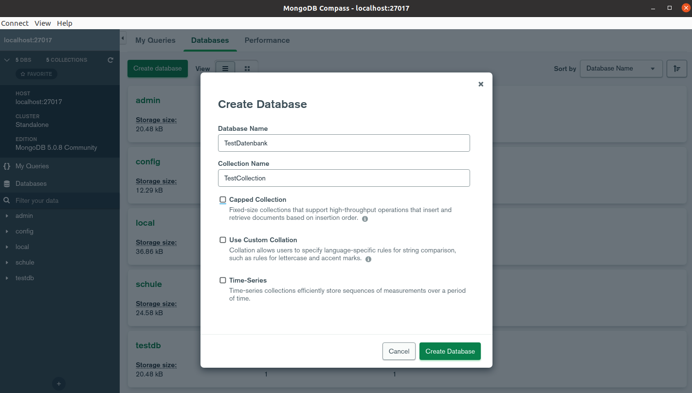
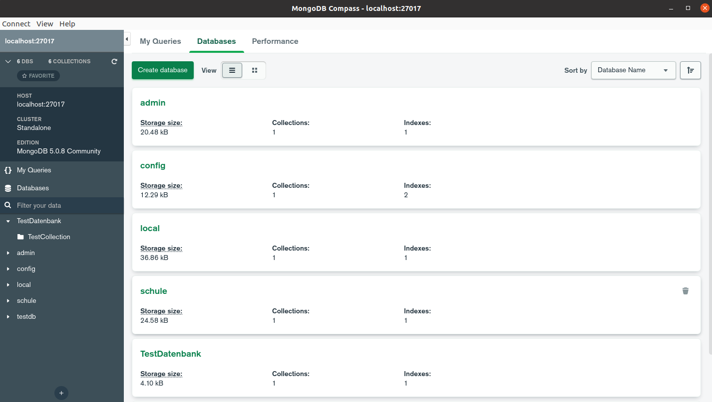
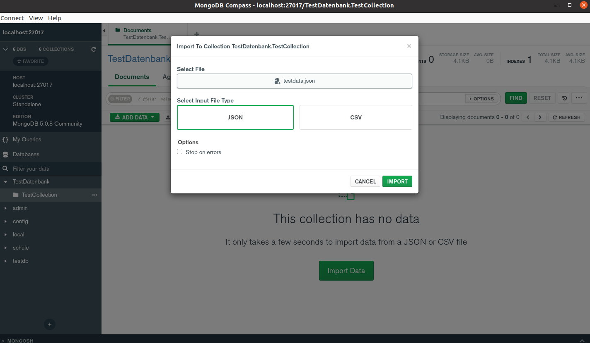
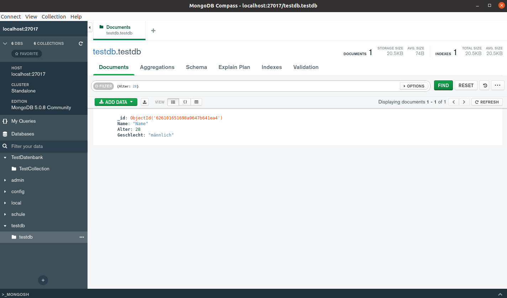

# Übung - Erste Schritte mit MongoDB

## Befehle

### MongoDB Befehlszeile starten

Normales MongoDB:

```bash
mongo
```

MongoDB Shell:
```bash
mongosh
```

### Datenbank

Alle Datenbanken anzeigen:
```sql
show dbs
```

Datenbank erstellen:
```sql
use datenbankname
```

Ausgewählte Datenbank anzeigen:
```sql
db
```

Ausgewählte Datenbank löschen:
```sql
db.dropDatabase()
```

### Collection

Collection erstellen:  
Auf der Webseite von MongoDB gibt es eine [Liste aller Optionen](https://www.mongodb.com/docs/manual/reference/method/db.createCollection/).
```sql
db.createCollection("collectionname", {options})
```

Collections anzeigen:
```sql
show collections
```

Collection löschen:
```sql
db.collectionname.drop()
```

### Document

Document erstellen:
```
db.collectionname.insertOne({key: value, key: value, ...})
```

Document suchen:
```sql
db.collectionname.find({key: value})
```

Document löschen:
```sql
db.collectionname.remove(key: value)
```

## Übung

1. Erstellen Sie eine Datenbank Ihrer Wahl

```sql
use schule
```

2. Erstellen Sie eine Collection in Ihrer Datenbank

```sql
db.createCollection("schueler", {capped: true, size:6142800, max: 10000})
```

3. Fügen Sie Dokumente in Ihrer Collection hinzu, suchen Sie sie und löschen Sie sie

```sql
db.schueler.insertOne({Name: "Max", Nachname: "Mustermann", Alter: 18, Geschlecht: "männlich"})
```
  
```sql
db.schueler.find({Name: "Max", Nachname: "Mustermann"})
```
  
```sql
db.schueler.remove({Name: "Max", Nachname: "Mustermann"})
```

### MongoDB Compass

Installieren Sie ein GUI-Client-Programm um auf MongoDB zuzugreifen und testen Sie die Software aus

* Download:
```bash
wget https://downloads.mongodb.com/compass/mongodb-compass_1.31.1_amd64.deb
```

* Software installieren:
```bash
sudo dpkg -i mongodb-compass_1.31.1_amd64.deb
```

* Software starten:
```bash
mongodb-compass
```

* Software Testen:

  * Datenbank erstellen
    

  * Alle Datenbanken anzeigen
    

  * Daten aus JSON-Datei importieren
    

  * Daten in einer Collection suchen
    
