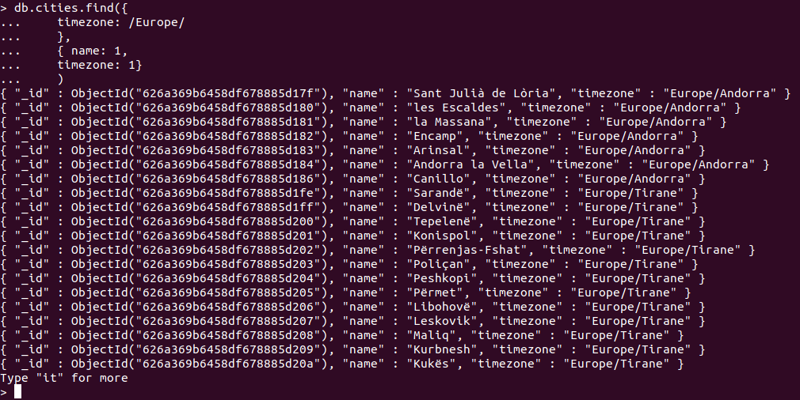

# MongoDB - Import/Export/Backup/Restore und Queries

## Auftrag 1: Import

**Aufgabe:**  
Importieren Sie die Datei [mongo_cities1000.json](https://moodle.bztf.ch/pluginfile.php/162881/mod_resource/content/1/site/03_uebungen/data/mongo_cities1000.json)

**Lösung:**  
```
mongoimport --uri="mongodb://localhost:27017"  --db=cities --collection=cities --file=mongo_cities1000.json --legacy
```

## Auftrag 2: Queries

**Aufgabe:**  
Listen Sie alle Städte aus der Timezone "Europa" (alle Zeitzonen von Europa) auf.

**Lösung:**  
```
db.cities.find({
    timezone: /Europe/
    },
    { name: 1,
    timezone: 1}
    )
```



Standardmässig werden nur die ersten 20 Einträge angezeigt. Möchte man manuell mehr anzeigen lassen, kann man ```ìt```(steht für iterate) eingeben, wodurch immer die nächsten 20 Einträge angezeigt werden.  
Wieviele Einträge angezeigt werden, wird über die Variable ```DBQuery.shellBatchSize```definiert und kann wie folgt geändert werden. Beispiel, um 100 Einträge anzuzeigen:
```
DBQuery.shellBatchSize = 100
```

## Auftrag 3: Aggregate an einem Beispiel

**Aufgabe:**  
Führen Sie die folgende Query auf Ihrer Datenbank aus:

```
db.cities.aggregate([
    {
    $match: {
        'timezone': {
        $eq: 'Europe/London'
        }
    }
    },
    {
    $group: {
        _id: 'averagePopulation',
        avgPop: {
        $avg: '$population'
        }
    }
    }
])
```

Was macht die Query?

**Lösung:**  

Die Ausgabe von dieser Query sieht wie folgt aus:
```
{ "_id" : "averagePopulation", "avgPop" : 23226.22149712092 }
```

Das *\$match* filtert nach Documents, welche eine bestimmte Bedingung erfüllen und gibt diese zur Weiterverarbeitung an *\$group* weiter.  
In diesem Beispiel werden nach Documents mit der Zeitzone 'Europe/London' gefiltert.

Das *\$group* gruppiert die Werte.  
In diesem Beispiel wird die ID: "averagePopulation" gesetzt und der Durchschnitt von '\$population' berechnet, welcher dann als Wert "avgPop" ausgegeben wird.

## Auftrag 4: Sort an einem Beispiel

**Aufgabe:**  
Führen Sie die folgende Query auf Ihrer Datenbank aus:

```
db.cities.aggregate([
    {
    $match: {
        'timezone': {
        $eq: 'Europe/London'
        }
    }
    },
    {
    $sort: {
        population: -1
    }
    },
    {
    $project: {
        _id: 0,
        name: 1,
        population: 1
    }
    }
])
```

Was macht die Query?

**Lösung:**  

Die Ausgabe von dieser Query sieht wie folgt aus:

```
{ "name" : "City of London", "population" : 7556900 }
{ "name" : "London", "population" : 7556900 }
{ "name" : "Birmingham", "population" : 984333 }
{ "name" : "Glasgow", "population" : 610268 }
{ "name" : "Liverpool", "population" : 468945 }
{ "name" : "Leeds", "population" : 455123 }
{ "name" : "Sheffield", "population" : 447047 }
{ "name" : "Edinburgh", "population" : 435791 }
{ "name" : "Bristol", "population" : 430713 }
{ "name" : "Manchester", "population" : 395515 }
{ "name" : "Teesside", "population" : 365323 }
{ "name" : "Leicester", "population" : 339239 }
{ "name" : "Islington", "population" : 319143 }
{ "name" : "Coventry", "population" : 308313 }
{ "name" : "Hull", "population" : 302296 }
{ "name" : "Cardiff", "population" : 302139 }
{ "name" : "Bradford", "population" : 299310 }
{ "name" : "Belfast", "population" : 274770 }
{ "name" : "Stoke-on-Trent", "population" : 260419 }
{ "name" : "Wolverhampton", "population" : 252791 }
Type "it" for more
```

Das *\$match* filtert nach Documents, welche eine bestimmte Bedingung erfüllen.  
In diesem Beispiel werden nach Documents mit der Zeitzone 'Europe/London' gefiltert.

Das *\$sort* sortiert die Documents nach einem bestimmten Wert. Wird dieser auf *1* gesetzt, wird aufsteigend sortiert. Wird der Wert auf *-1* gesetzt, wird absteigend sortiert.  
In diesem Beispiel werden die Documents nach dem Attribut "population" absteigend sortiert.

Das *\$project* gibt an, welche Attribute ausgegeben werden sollen. Werte mit *0* werden nicht ausgegeben und Werte mit *1* werden ausgegeben.  
In diesem Beispiel werden die Werte "name" und "population" ausgegeben.

## Auftrag 5: Backup und Restore einrichten und durchführen

**Aufgabe:**  
Führen Sie von Hand (oder über Bash-Script) ein Backup und ein Restore für Ihre Testdatenbank durch

**Lösung:**  

**Benutzer-Authentifizierung ist aktiviert:**  

Backup:
```bash
sudo mongodump --host=localhost --port=27017 --db=cities --username=vagrant --authenticationDatabase=admin --out=/opt/backup/mongodump-2022-05-04
```

Restore:
```bash
sudo mongorestore --uri="mongodb://vagrant@localhost:27017/?authSource=admin" --nsInclude=cities.* /opt/backup/mongodump-2022-05-04
```

**Benutzer-Authentifizierung ist deaktiviert:**  

Backup:
```bash
sudo mongodump --host=localhost --port=27017 --db=cities --out=/opt/backup/mongodump-2022-05-04
```

Restore:
```bash
sudo mongorestore --uri="mongodb://localhost:27017" --nsInclude=cities.* /opt/backup/mongodump-2022-05-04
```
