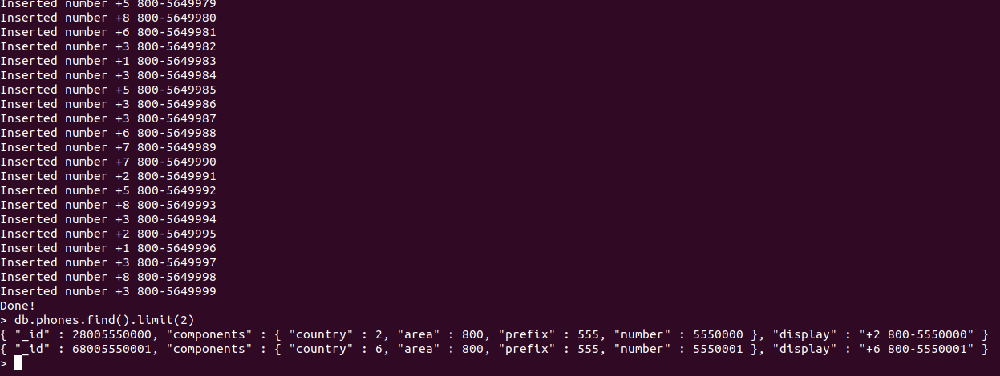

# Übung - Indexierung und Performance

## Vorbereitung

Neue Datenbank erstellen:

```
use phone
```

Um Testdaten zu erzeugen, habe ich diese Funktion Importiert:

```js
populatePhones = function(area, start, stop) {
    for(var i = start; i < stop; i++) {
    var country = 1 + ((Math.random() * 8) << 0);
    var num = (country * 1e10) + (area * 1e7) + i;
    var fullNumber = "+" + country + " " + area + "-" + i;
    db.phones.insert({
        _id: num,
        components: {
        country: country,
        area: area,
        prefix: (i * 1e-4) << 0,
        number: i
        },
        display: fullNumber
    });
    print("Inserted number " + fullNumber);
    }
    print("Done!");
}
```

## Daten generieren

Funktion aufrufen, um Testdaten zu generieren:
```js
populatePhones(800, 5550000, 5650000) // Dauert eine Weile
```

Es werden nun ganz viele Telefonnummern erzeugt. Die Ortsnetzkennzahl (ONKz) ist dabei 800 und die Teilnehmerrufnummer (RufNr) ist dabei zwischen 5550000 und 5650000.

Daten kontrollieren:
```js
db.phones.find().limit(2)
```

Ausgabe:  


## Indices auslesen

Alle Indices aller bestehenden Collections auslesen:
```js
db.getCollectionNames().forEach(function(collection) {
     print("Indexes for the " + collection + " collection:");
     printjson(db[collection].getIndexes());
});
```

Ausgabe:
```
Indexes for the phones collection:
[ { "v" : 2, "key" : { "_id" : 1 }, "name" : "_id_" } ]
```

## Austesten

Aktuelle Performance (ohne Indices) testen:
```js
db.phones.explain("executionStats").find({display: "+1 800-5650001"})
```

Ausgabe:
```json
{
	"explainVersion" : "1",
	"queryPlanner" : {
		"namespace" : "phones.phones",
		"indexFilterSet" : false,
		"parsedQuery" : {
			"display" : {
				"$eq" : "+1 800-5650001"
			}
		},
		"maxIndexedOrSolutionsReached" : false,
		"maxIndexedAndSolutionsReached" : false,
		"maxScansToExplodeReached" : false,
		"winningPlan" : {
			"stage" : "COLLSCAN",
			"filter" : {
				"display" : {
					"$eq" : "+1 800-5650001"
				}
			},
			"direction" : "forward"
		},
		"rejectedPlans" : [ ]
	},
	"executionStats" : {
		"executionSuccess" : true,
		"nReturned" : 0,
		"executionTimeMillis" : 41,
		"totalKeysExamined" : 0,
		"totalDocsExamined" : 100000,
		"executionStages" : {
			"stage" : "COLLSCAN",
			"filter" : {
				"display" : {
					"$eq" : "+1 800-5650001"
				}
			},
			"nReturned" : 0,
			"executionTimeMillisEstimate" : 3,
			"works" : 100002,
			"advanced" : 0,
			"needTime" : 100001,
			"needYield" : 0,
			"saveState" : 100,
			"restoreState" : 100,
			"isEOF" : 1,
			"direction" : "forward",
			"docsExamined" : 100000
		}
	},
	"command" : {
		"find" : "phones",
		"filter" : {
			"display" : "+1 800-5650001"
		},
		"$db" : "phones"
	},
	"serverInfo" : {
		"host" : "m141vm",
		"port" : 27017,
		"version" : "5.0.8",
		"gitVersion" : "c87e1c23421bf79614baf500fda6622bd90f674e"
	},
	"serverParameters" : {
		"internalQueryFacetBufferSizeBytes" : 104857600,
		"internalQueryFacetMaxOutputDocSizeBytes" : 104857600,
		"internalLookupStageIntermediateDocumentMaxSizeBytes" : 104857600,
		"internalDocumentSourceGroupMaxMemoryBytes" : 104857600,
		"internalQueryMaxBlockingSortMemoryUsageBytes" : 104857600,
		"internalQueryProhibitBlockingMergeOnMongoS" : 0,
		"internalQueryMaxAddToSetBytes" : 104857600,
		"internalDocumentSourceSetWindowFieldsMaxMemoryBytes" : 104857600
	},
	"ok" : 1
}
```

> [!NOTE|style:callout]
> Zu beachten:
> * Ausführungszeit in Milliseconds (executionTimeMillis)
> * Anzahl durchsuchten Documents (totalDocsExamind)
> * Typ des Scans (stage)

## Index erfassen

Index erfassen:
```js
db.phones.createIndex(
  { display : 1 },
  { unique : true, dropDups : true } // soll unique sein, also droppen wir Duplikate
)
```

Ausgabe:
```json
{
	"numIndexesBefore" : 1,
	"numIndexesAfter" : 2,
	"createdCollectionAutomatically" : false,
	"ok" : 1
}
```

Danach nochmals die aktuelle Performance testen:
```js
db.phones.explain("executionStats").find({display: "+1 800-5650001"})
```

Neue Ausgabe:
```json
{
	"explainVersion" : "1",
	"queryPlanner" : {
		"namespace" : "phones.phones",
		"indexFilterSet" : false,
		"parsedQuery" : {
			"display" : {
				"$eq" : "+1 800-5650001"
			}
		},
		"maxIndexedOrSolutionsReached" : false,
		"maxIndexedAndSolutionsReached" : false,
		"maxScansToExplodeReached" : false,
		"winningPlan" : {
			"stage" : "FETCH",
			"inputStage" : {
				"stage" : "IXSCAN",
				"keyPattern" : {
					"display" : 1
				},
				"indexName" : "display_1",
				"isMultiKey" : false,
				"multiKeyPaths" : {
					"display" : [ ]
				},
				"isUnique" : true,
				"isSparse" : false,
				"isPartial" : false,
				"indexVersion" : 2,
				"direction" : "forward",
				"indexBounds" : {
					"display" : [
						"[\"+1 800-5650001\", \"+1 800-5650001\"]"
					]
				}
			}
		},
		"rejectedPlans" : [ ]
	},
	"executionStats" : {
		"executionSuccess" : true,
		"nReturned" : 0,
		"executionTimeMillis" : 0,
		"totalKeysExamined" : 0,
		"totalDocsExamined" : 0,
		"executionStages" : {
			"stage" : "FETCH",
			"nReturned" : 0,
			"executionTimeMillisEstimate" : 0,
			"works" : 1,
			"advanced" : 0,
			"needTime" : 0,
			"needYield" : 0,
			"saveState" : 0,
			"restoreState" : 0,
			"isEOF" : 1,
			"docsExamined" : 0,
			"alreadyHasObj" : 0,
			"inputStage" : {
				"stage" : "IXSCAN",
				"nReturned" : 0,
				"executionTimeMillisEstimate" : 0,
				"works" : 1,
				"advanced" : 0,
				"needTime" : 0,
				"needYield" : 0,
				"saveState" : 0,
				"restoreState" : 0,
				"isEOF" : 1,
				"keyPattern" : {
					"display" : 1
				},
				"indexName" : "display_1",
				"isMultiKey" : false,
				"multiKeyPaths" : {
					"display" : [ ]
				},
				"isUnique" : true,
				"isSparse" : false,
				"isPartial" : false,
				"indexVersion" : 2,
				"direction" : "forward",
				"indexBounds" : {
					"display" : [
						"[\"+1 800-5650001\", \"+1 800-5650001\"]"
					]
				},
				"keysExamined" : 0,
				"seeks" : 1,
				"dupsTested" : 0,
				"dupsDropped" : 0
			}
		}
	},
	"command" : {
		"find" : "phones",
		"filter" : {
			"display" : "+1 800-5650001"
		},
		"$db" : "phones"
	},
	"serverInfo" : {
		"host" : "m141vm",
		"port" : 27017,
		"version" : "5.0.8",
		"gitVersion" : "c87e1c23421bf79614baf500fda6622bd90f674e"
	},
	"serverParameters" : {
		"internalQueryFacetBufferSizeBytes" : 104857600,
		"internalQueryFacetMaxOutputDocSizeBytes" : 104857600,
		"internalLookupStageIntermediateDocumentMaxSizeBytes" : 104857600,
		"internalDocumentSourceGroupMaxMemoryBytes" : 104857600,
		"internalQueryMaxBlockingSortMemoryUsageBytes" : 104857600,
		"internalQueryProhibitBlockingMergeOnMongoS" : 0,
		"internalQueryMaxAddToSetBytes" : 104857600,
		"internalDocumentSourceSetWindowFieldsMaxMemoryBytes" : 104857600
	},
	"ok" : 1
}
```
