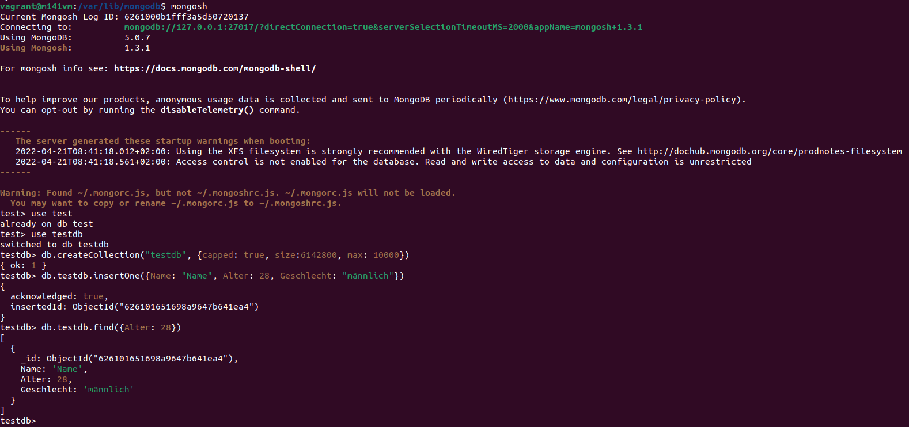

# MongoDB Installation/Konfiguration

## Recherche zu MongoDB

* **Hersteller**  
  Diese Software wurde von MongoDB, Inc. entwickelt und 2009 veröffentlicht.

* **Lizenzen**  
  * Server Side Public License (SSPL)
  * GNU APGL v3.0 (opensource)

  Mehr Details auf der [offiziellen Webseite](https://www.mongodb.com/community/licensing).

* **Support**  
  MongoDB stellt zu ihrer Software Beratungen, Schulungen und viele weiter Ressourcen und Dokumentationen zur Verfügung. Genaueres wird auf ihrer [offiziellen Webseite](https://www.mongodb.com/support/get-started) beschrieben.

* **Software (Features)**  
  
  MongoDB ist ein NoSQL-Datenbankmanagementsystem (NoSQL = Not only SQL). Im Vergleich zu MySQL ist es ein nicht-relationales Datenbankmanagementsystem.  
  Besonders nützlich ist MongoDB bei komplexen Datenstrukturen oder wenn man unstrukturierte Daten speichern möchte. Im Vergleich zu einem RDMS speichert MongoDB die Daten nicht in Tabellen und Zeilen, sondern in Collections und Documents. Folgende Tabelle, zeigt den Vergleich zwischen den Begriffen.

  | RDBMS       | MongoDB                                                  |
  |:------------|:---------------------------------------------------------|
  | Database    | Database                                                 |
  | Table       | Collection                                               |
  | Tuple/Row   | Document                                                 |
  | column      | Field                                                    |
  | Table Join  | Embedded Documents                                       |
  | Primary Key | Primary Key (Default key _id provided by MongoDB itself) |

* **Vorteile:**
  * Skalierbarkeit
  * Hochverfügbarkeit
  * (Such-)Performance
  * Unstrukturierte Daten können gespeichert werden

* **Nachteile**
  * Nicht ACID kompatibel.
  * Keine Abstraktionen -> kaum Optimierung für NoSQL-Engines.

## Voraussetzungen der Installation (VM)

* **Aus welcher Quelle installieren Sie Ihre Software?**  
  Aus dem Paketmanager mittels ```sudo apt-get install -y mongodb-org```.

* **In welcher Version installieren Sie Ihre Software (und deren Abhängigkeiten)?**  
```bash
mongod --version
```
  
MongoDB version: v5.0.8 (Ubuntu)

## Prozess der Installation

1. Key für den Update-Link installieren. Danach sollte die Meldung "OK" erscheinen.

```bash
wget -qO - https://www.mongodb.org/static/pgp/server-5.0.asc | sudo apt-key add -
```

2. Source erfassen:

```bash
echo "deb [ arch=amd64,arm64 ] https://repo.mongodb.org/apt/ubuntu focal/mongodb-org/5.0 multiverse" | sudo tee /etc/apt/sources.list.d/mongodb-org-5.0.list
```

3. Updates durchführen:

```
sudo apt update
sudo apt upgrade
```

4. MongoDB installieren:

```
sudo apt-get install -y mongodb-org
```

5. Danach ist MongoDB installiert und einsatzbereit.

## Konfiguration

Wir haben für diese Übung keine besondere Konfiguration vorgenommen. Möchte man dies noch tun, kann dies in folgender Datei gemacht werden: ```/etc/mongod.conf```.

## Test der Installation

1. MongoDB Shell öffnen:
```bash
mongosh
```

2. Test-Datenbank erstellen:
```sql
use testdb
```

3. Collection erstellen:
```sql
db.createCollection("testdb", {capped: true, size:6142800, max: 10000})
```

4. Document erstellen:
```sql
db.testdb.insertOne({Name: "Name", Alter: 28, Geschlecht: "männlich"})
```

5. Document suchen:
```sql
db.testdb.find({Alter: 28})
```


