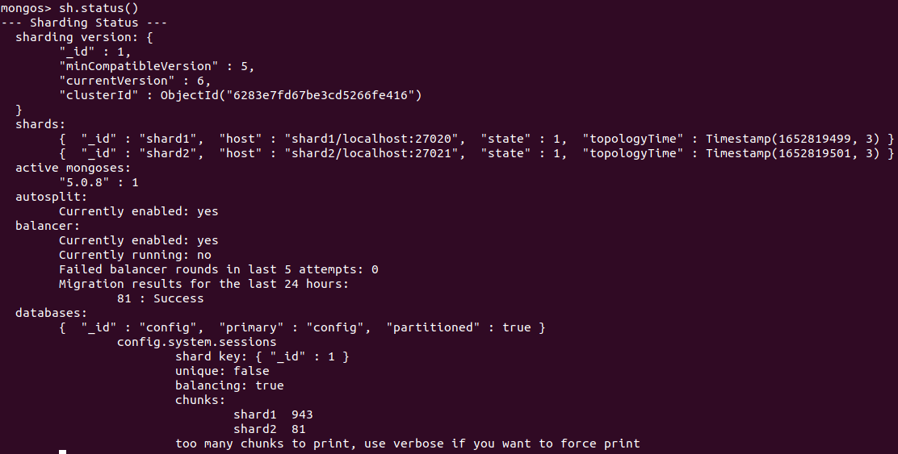

# Übung - Sharding und Replication

## Replication

Das Prinzip der Replication ist es, dass es eine Gruppe von Mongod-Instanzen gibt, die denselben Datensatz verwalten. Ein "Replica set" enthält mehrere Datentragende Knoten (Nodes) und optional auch einen Arbiter Knoten. Von den Datentragende Knoten kann immer nur einer der primäre Knoten (Primary Node) sein. Die anderen sind sekundäre Knoten (Secondary Nodes).


Wenn der primäre Knoten länger als die konfigurierte Zeit (standardmässig 10 Sekunden) kein Signal an die anderen Knoten abgibt, wird ein anderer Knoten zum primären Knoten aufgestuft. Somit wird bei einem Ausfall des primären Knotens automatisch ein anderer eingesetzt.


Schreib Befehle werden immer auf den primären Knoten ausgeführt, da dieser auf die anderen repliziert wird. Es ist allerdings möglich, dass Lese-Befehle auf andere Knoten umgeleitet werden. Dadurch sind die Daten eventuell nicht aktuell, da sie nicht direkt vom primären Knoten stammen. Dafür ist die Verfügbarkeit erhöht und kann ausserdem die Performance steigern, wenn die Abfragen auf verschiedene Nodes verteilt werden.
Um diese nutzen zu Können, müssen die [Read Preferences](https://www.mongodb.com/docs/manual/core/read-preference/) konfiguriert werden.


### Vorbereitung

Testverzeichnis für Replication erstellen:

```
sudo mkdir replication

cd replication/
```

Data-Directories für 3 MongoDB-Instanzen erstellen:

```
sudo mkdir ./mongo1 ./mongo2 ./mongo3
```

### Instanzen starten

3 Terminals öffnen und in jeder jeweils eine Instanz starten:

Instanz 1:

```
sudo mongod --replSet book --dbpath ./mongo1 --port 27011
```

Instanz 2:

```
sudo mongod --replSet book --dbpath ./mongo2 --port 27012
```

Instanz 3:

```
sudo mongod --replSet book --dbpath ./mongo3 --port 27013
```

### Starten!

In einem neuen Terminal mit einer der drei Instanzen verbinden:

```
mongo --port 27011
```

Initialisierung starten:

```js
rs.initiate({
    _id: 'book',
    members: [
      {_id: 1, host: 'localhost:27011'},
      {_id: 2, host: 'localhost:27012'},
      {_id: 3, host: 'localhost:27013'}
    ]
})
```

Status kontrollieren:

```js
rs.status().ok
```

Wenn der Status 1 ausgegeben wird, hat es funktioniert.


### Insert testen

> [!NOTE|style:callout]
> **Achtung:** Ab diesem Moment muss man sich jeweils bei der mongo-Connection auf den ganzen Cluster verbinden!

Verbindung zum Cluster erstellen:

```
mongo mongodb://localhost:27011,localhost:27012,localhost:27013/replicaSet=book
```

Test-Insert durchführen:

```js
db.echo.insert({ say : 'HELLO!' })
```

Resultat testen:

```js
db.echo.find()
```


### Replikation testen

Die einzelnen Nodes konnten nacheinander deaktiviert werden. Danach konnte die Mongo-Connection immer noch das korrekte Resultat liefern.

## Sharding

Das Sharding ermöglicht es, Daten auf verschiedene Shards aufzuteilen. So laufen die Anfragen nicht alle auf dem gleichen Knoten, sondern werden ja nach benötigten Daten von verschiedenen Knoten verarbeitet.

Beim Sharding besteht die Infrastruktur aus folgenden Komponenten:

* **Config-Server:**  
  Hier wird definiert, welche Daten von welchem Shard verwaltet werden sollen.

* **Router:**  
  Der Router nimmt die Anfragen und routet diese entsprechend der Konfiguration des Config-Servers an die einzelnen Shards.

* **Shards:**  
  Die Shards sind einzelne MongoDB-Instanzen, welche die ihren zugeteilten Daten verwalten und den Anfragen entsprechend bearbeiten.


Bei folgendem Auftrag wird das Sharding mit MongoDB eingerichtet. Dabei wird folgende Installation aufgebaut:


### Vorbereitung 1, Config Server

Testverzeichnis für Sharding erstellen:

```
sudo mkdir sharding

cd sharding/
```

Config-Server für unseren Cluster erstellen:

```
sudo mkdir ./mongoconfig

sudo mongod --configsvr --replSet "config" --dbpath ./mongoconfig --port 27016
```

Login auf dem Config-Server durchführen:

```
sudo mongo localhost:27016
```

Den Cluster initialisieren:

```js
rs.initiate()
```

Ausgabe:


### Vorbereitung 2, Shards einrichten

Die Data-Verzeichnisse der Instanzen einrichten:

```
sudo mkdir ./mongo4 ./mongo5
```

Dann 2 Terminals öffnen und in jeder jeweils eine Instanz starten:

Instanz 1:

```
sudo mongod --shardsvr --replSet "shard1" --dbpath ./mongo4 --port 27020
```

Instanz 2:

```
sudo mongod --shardsvr --replSet "shard2" --dbpath ./mongo5 --port 27021
```

### Shards intialisieren

Auf beide Shards verbinden und je die Initialisierung durchführen:

**Shard 1:**

Mit Shard 1 verbinden:

```
sudo mongo localhost:27020
```

Shard 1 initialisieren:

```js
rs.initiate()
```

Ausgabe:


**Shard 2:**

Mit Shard 2 verbinden:

```
sudo mongo localhost:27021
```

Shard 2 initialisieren:

```js
rs.initiate()
```

Ausgabe:


**Kontrolle:**  

Mit folgendem Befehl kann die Konfiguration auf den Shards überprüft werden:

```js
rs.status()
```

Die Ausgabe sieht dann etwa so aus: ```{ . . . "set" : "shard1", . . . "ok" : 1, . . . }```.  
Die genaue Ausgabe kann hier eingesehen werden:

<details>
<summary>Ausgabe Status Shard 1</summary>

```js
{
	"set" : "shard1",
	"date" : ISODate("2022-05-17T18:50:20.793Z"),
	"myState" : 1,
	"term" : NumberLong(1),
	"syncSourceHost" : "",
	"syncSourceId" : -1,
	"heartbeatIntervalMillis" : NumberLong(2000),
	"majorityVoteCount" : 1,
	"writeMajorityCount" : 1,
	"votingMembersCount" : 1,
	"writableVotingMembersCount" : 1,
	"optimes" : {
		"lastCommittedOpTime" : {
			"ts" : Timestamp(1652813413, 1),
			"t" : NumberLong(1)
		},
		"lastCommittedWallTime" : ISODate("2022-05-17T18:50:13.365Z"),
		"readConcernMajorityOpTime" : {
			"ts" : Timestamp(1652813413, 1),
			"t" : NumberLong(1)
		},
		"appliedOpTime" : {
			"ts" : Timestamp(1652813413, 1),
			"t" : NumberLong(1)
		},
		"durableOpTime" : {
			"ts" : Timestamp(1652813413, 1),
			"t" : NumberLong(1)
		},
		"lastAppliedWallTime" : ISODate("2022-05-17T18:50:13.365Z"),
		"lastDurableWallTime" : ISODate("2022-05-17T18:50:13.365Z")
	},
	"lastStableRecoveryTimestamp" : Timestamp(1652813383, 1),
	"electionCandidateMetrics" : {
		"lastElectionReason" : "electionTimeout",
		"lastElectionDate" : ISODate("2022-05-17T18:46:53.271Z"),
		"electionTerm" : NumberLong(1),
		"lastCommittedOpTimeAtElection" : {
			"ts" : Timestamp(1652813213, 1),
			"t" : NumberLong(-1)
		},
		"lastSeenOpTimeAtElection" : {
			"ts" : Timestamp(1652813213, 1),
			"t" : NumberLong(-1)
		},
		"numVotesNeeded" : 1,
		"priorityAtElection" : 1,
		"electionTimeoutMillis" : NumberLong(10000),
		"newTermStartDate" : ISODate("2022-05-17T18:46:53.313Z"),
		"wMajorityWriteAvailabilityDate" : ISODate("2022-05-17T18:46:53.334Z")
	},
	"members" : [
		{
			"_id" : 0,
			"name" : "localhost:27020",
			"health" : 1,
			"state" : 1,
			"stateStr" : "PRIMARY",
			"uptime" : 506,
			"optime" : {
				"ts" : Timestamp(1652813413, 1),
				"t" : NumberLong(1)
			},
			"optimeDate" : ISODate("2022-05-17T18:50:13Z"),
			"lastAppliedWallTime" : ISODate("2022-05-17T18:50:13.365Z"),
			"lastDurableWallTime" : ISODate("2022-05-17T18:50:13.365Z"),
			"syncSourceHost" : "",
			"syncSourceId" : -1,
			"infoMessage" : "",
			"electionTime" : Timestamp(1652813213, 2),
			"electionDate" : ISODate("2022-05-17T18:46:53Z"),
			"configVersion" : 1,
			"configTerm" : 1,
			"self" : true,
			"lastHeartbeatMessage" : ""
		}
	],
	"ok" : 1,
	"$clusterTime" : {
		"clusterTime" : Timestamp(1652813413, 1),
		"signature" : {
			"hash" : BinData(0,"AAAAAAAAAAAAAAAAAAAAAAAAAAA="),
			"keyId" : NumberLong(0)
		}
	},
	"operationTime" : Timestamp(1652813413, 1)
}
```

</details>

<details>
<summary>Ausgabe Status Shard 2</summary>

```js
{
	"set" : "shard2",
	"date" : ISODate("2022-05-17T18:50:43.291Z"),
	"myState" : 1,
	"term" : NumberLong(1),
	"syncSourceHost" : "",
	"syncSourceId" : -1,
	"heartbeatIntervalMillis" : NumberLong(2000),
	"majorityVoteCount" : 1,
	"writeMajorityCount" : 1,
	"votingMembersCount" : 1,
	"writableVotingMembersCount" : 1,
	"optimes" : {
		"lastCommittedOpTime" : {
			"ts" : Timestamp(1652813442, 1),
			"t" : NumberLong(1)
		},
		"lastCommittedWallTime" : ISODate("2022-05-17T18:50:42.741Z"),
		"readConcernMajorityOpTime" : {
			"ts" : Timestamp(1652813442, 1),
			"t" : NumberLong(1)
		},
		"appliedOpTime" : {
			"ts" : Timestamp(1652813442, 1),
			"t" : NumberLong(1)
		},
		"durableOpTime" : {
			"ts" : Timestamp(1652813442, 1),
			"t" : NumberLong(1)
		},
		"lastAppliedWallTime" : ISODate("2022-05-17T18:50:42.741Z"),
		"lastDurableWallTime" : ISODate("2022-05-17T18:50:42.741Z")
	},
	"lastStableRecoveryTimestamp" : Timestamp(1652813382, 1),
	"electionCandidateMetrics" : {
		"lastElectionReason" : "electionTimeout",
		"lastElectionDate" : ISODate("2022-05-17T18:48:52.641Z"),
		"electionTerm" : NumberLong(1),
		"lastCommittedOpTimeAtElection" : {
			"ts" : Timestamp(1652813332, 1),
			"t" : NumberLong(-1)
		},
		"lastSeenOpTimeAtElection" : {
			"ts" : Timestamp(1652813332, 1),
			"t" : NumberLong(-1)
		},
		"numVotesNeeded" : 1,
		"priorityAtElection" : 1,
		"electionTimeoutMillis" : NumberLong(10000),
		"newTermStartDate" : ISODate("2022-05-17T18:48:52.679Z"),
		"wMajorityWriteAvailabilityDate" : ISODate("2022-05-17T18:48:52.701Z")
	},
	"members" : [
		{
			"_id" : 0,
			"name" : "localhost:27021",
			"health" : 1,
			"state" : 1,
			"stateStr" : "PRIMARY",
			"uptime" : 519,
			"optime" : {
				"ts" : Timestamp(1652813442, 1),
				"t" : NumberLong(1)
			},
			"optimeDate" : ISODate("2022-05-17T18:50:42Z"),
			"lastAppliedWallTime" : ISODate("2022-05-17T18:50:42.741Z"),
			"lastDurableWallTime" : ISODate("2022-05-17T18:50:42.741Z"),
			"syncSourceHost" : "",
			"syncSourceId" : -1,
			"infoMessage" : "Could not find member to sync from",
			"electionTime" : Timestamp(1652813332, 2),
			"electionDate" : ISODate("2022-05-17T18:48:52Z"),
			"configVersion" : 1,
			"configTerm" : 1,
			"self" : true,
			"lastHeartbeatMessage" : ""
		}
	],
	"ok" : 1,
	"$clusterTime" : {
		"clusterTime" : Timestamp(1652813442, 1),
		"signature" : {
			"hash" : BinData(0,"AAAAAAAAAAAAAAAAAAAAAAAAAAA="),
			"keyId" : NumberLong(0)
		}
	},
	"operationTime" : Timestamp(1652813442, 1)
}
```

</details>

### Mongos (der Query Router)

Als nächstes die Mongos Instanz starten. Diese verbindet sich mit dem Config-Server.

```
sudo mongos --configdb config/localhost:27016 --port 27025
```

### Shards hinzufügen

Sich mit der Mongo-Instanz verbinden:

```
sudo mongo localhost:27025
```

Mit folgendem Befehl fügt man beide Shards hinzu:

```js
sh.addShard("shard1/localhost:27020")
sh.addShard("shard2/localhost:27021")
```

Ausgabe:


Die Shards können auch mit folgendem Befehl überprüft werden:

```js
sh.status()
```

Ausgabe:



### Sharding einführen und testen

Aktuell ist Sharding zwar aktiv, allerdings ist noch nicht genau definiert, wie es funktioniert und auf welche Daten es angewendet wird.

Mit folgendem Befehl wird Sharding für die die Datenbank ```populations``` aktiviert:

```js
sh.enableSharding("populations")
```

Ausgabe:


Mit folgendem Befehl wird innerhalb der Datenbank ```populations``` die Collection ```cities``` auf die beiden Shards verteilt. Dabei wird das Hashing für das Attribut ```country``` als Shardkey genutzt.

```js
sh.shardCollection("populations.cities", { "country": "hashed" })
```

Ausgabe:


### Daten hinzufügen

Datenbank auswählen und neue Datensätze hinzufügen:

```js
use populations

db.cities.insertMany([
  {"name": "Seoul", "country": "South Korea", "continent": "Asia", "population": 25.674 },
  {"name": "Mumbai", "country": "India", "continent": "Asia", "population": 19.980 },
  {"name": "Lagos", "country": "Nigeria", "continent": "Africa", "population": 13.463 },
  {"name": "Beijing", "country": "China", "continent": "Asia", "population": 19.618 },
  {"name": "Shanghai", "country": "China", "continent": "Asia", "population": 25.582 },
  {"name": "Osaka", "country": "Japan", "continent": "Asia", "population": 19.281 },
  {"name": "Cairo", "country": "Egypt", "continent": "Africa", "population": 20.076 },
  {"name": "Tokyo", "country": "Japan", "continent": "Asia", "population": 37.400 },
  {"name": "Karachi", "country": "Pakistan", "continent": "Asia", "population": 15.400 },
  {"name": "Dhaka", "country": "Bangladesh", "continent": "Asia", "population": 19.578 },
  {"name": "Rio de Janeiro", "country": "Brazil", "continent": "South America", "population": 13.293 },
  {"name": "São Paulo", "country": "Brazil", "continent": "South America", "population": 21.650 },
  {"name": "Mexico City", "country": "Mexico", "continent": "North America", "population": 21.581 },
  {"name": "Delhi", "country": "India", "continent": "Asia", "population": 28.514 },
  {"name": "Buenos Aires", "country": "Argentina", "continent": "South America", "population": 14.967 },
  {"name": "Kolkata", "country": "India", "continent": "Asia", "population": 14.681 },
  {"name": "New York", "country": "United States", "continent": "North America", "population": 18.819 },
  {"name": "Manila", "country": "Philippines", "continent": "Asia", "population": 13.482 },
  {"name": "Chongqing", "country": "China", "continent": "Asia", "population": 14.838 },
  {"name": "Istanbul", "country": "Turkey", "continent": "Europe", "population": 14.751 }
])
```

### Kontrolle

Die Statistiken für die Shards können wie folgt angezeigt werden:

```js
db.cities.getShardDistribution()
```

Ausgabe:


In Shard 1 befinden sich 11 Documents und in Shard 2 befinden sich 9 Documents. Diese Elemente wurden anhand des Attributs ```country``` auf die beiden Shards verteilt.

### Anwendung

Das Sharding ist somit konfiguriert. Nun kann man einen normalen ```find()```Befehl durchführen. Das Routing wird dabei automatisch vom Cluster übernommen.

Man könnte noch den ```find()``` Befehl mittels ```explain``` erweitern und kann dadurch mehr Details zur Abfrage (und im Bezug zu den Shards) ermitteln.

Ausgeführter Befehl:

```js
db.cities.find().explain()
```

Ausgabe:

```js
{
	"queryPlanner" : {
		"mongosPlannerVersion" : 1,
		"winningPlan" : {
			"stage" : "SHARD_MERGE",
			"shards" : [
				{
					"shardName" : "shard2",
					"connectionString" : "shard2/localhost:27021",
					"serverInfo" : {
						"host" : "m141vm",
						"port" : 27021,
						"version" : "5.0.8",
						"gitVersion" : "c87e1c23421bf79614baf500fda6622bd90f674e"
					},
					"namespace" : "populations.cities",
					"indexFilterSet" : false,
					"parsedQuery" : {
						
					},
					"queryHash" : "8B3D4AB8",
					"planCacheKey" : "D542626C",
					"maxIndexedOrSolutionsReached" : false,
					"maxIndexedAndSolutionsReached" : false,
					"maxScansToExplodeReached" : false,
					"winningPlan" : {
						"stage" : "SHARDING_FILTER",
						"inputStage" : {
							"stage" : "COLLSCAN",
							"direction" : "forward"
						}
					},
					"rejectedPlans" : [ ]
				},
				{
					"shardName" : "shard1",
					"connectionString" : "shard1/localhost:27020",
					"serverInfo" : {
						"host" : "m141vm",
						"port" : 27020,
						"version" : "5.0.8",
						"gitVersion" : "c87e1c23421bf79614baf500fda6622bd90f674e"
					},
					"namespace" : "populations.cities",
					"indexFilterSet" : false,
					"parsedQuery" : {
						
					},
					"queryHash" : "8B3D4AB8",
					"planCacheKey" : "D542626C",
					"maxIndexedOrSolutionsReached" : false,
					"maxIndexedAndSolutionsReached" : false,
					"maxScansToExplodeReached" : false,
					"winningPlan" : {
						"stage" : "SHARDING_FILTER",
						"inputStage" : {
							"stage" : "COLLSCAN",
							"direction" : "forward"
						}
					},
					"rejectedPlans" : [ ]
				}
			]
		}
	},
	"serverInfo" : {
		"host" : "m141vm",
		"port" : 27025,
		"version" : "5.0.8",
		"gitVersion" : "c87e1c23421bf79614baf500fda6622bd90f674e"
	},
	"serverParameters" : {
		"internalQueryFacetBufferSizeBytes" : 104857600,
		"internalQueryFacetMaxOutputDocSizeBytes" : 104857600,
		"internalLookupStageIntermediateDocumentMaxSizeBytes" : 104857600,
		"internalDocumentSourceGroupMaxMemoryBytes" : 104857600,
		"internalQueryMaxBlockingSortMemoryUsageBytes" : 104857600,
		"internalQueryProhibitBlockingMergeOnMongoS" : 0,
		"internalQueryMaxAddToSetBytes" : 104857600,
		"internalDocumentSourceSetWindowFieldsMaxMemoryBytes" : 104857600
	},
	"command" : {
		"find" : "cities",
		"filter" : {
			
		},
		"lsid" : {
			"id" : UUID("d03a6c23-a849-42b5-849f-178596c4fb10")
		},
		"$clusterTime" : {
			"clusterTime" : Timestamp(1652821322, 1),
			"signature" : {
				"hash" : BinData(0,"AAAAAAAAAAAAAAAAAAAAAAAAAAA="),
				"keyId" : NumberLong(0)
			}
		},
		"$db" : "populations"
	},
	"ok" : 1,
	"$clusterTime" : {
		"clusterTime" : Timestamp(1652821335, 1),
		"signature" : {
			"hash" : BinData(0,"AAAAAAAAAAAAAAAAAAAAAAAAAAA="),
			"keyId" : NumberLong(0)
		}
	},
	"operationTime" : Timestamp(1652821335, 1)
}
```
