# MySQL Installation

## Recherche zu MySQL

* **Hersteller:**  
  MySQL wurde seit 1994 vom schwedischen Unternehmen MySQL AB entwickelt. Im Februar 2008 wurde MySQL AB vom Unternehmen Sun Microsystems übernommen, das seinerseits im Januar 2010 von Oracle gekauft wurde.

* **Lizenzen:**
  * GNU General Public License: [FOSS License](https://www.mysql.com/about/legal/licensing/foss-exception/) für Free und Open-Source Software
  * Proprietäre Lizenz: [Commercial License](https://www.mysql.com/about/legal/licensing/oem/)

* **Support:**  
  Oracle bietet auch kostenpflichtige Support-Lizenzen in drei Leistungsstufen an: MySQL Enterprise Silver, Gold und Platinum. Der Unterschied liegt im Leistungsumfang und Preis.

## Voraussetzungen der Installation (VM)

* **Welches Betriebssystem setzen Sie ein? Hardware?**  
  * Betriebssystem: Ubuntu 21.04
  * Arbeitsspeicher: 4 GB
  * Prozessoren: 4
  * Massenspeicher: 64 GB

* **In welcher Version ist Ihr Betriebssystem vorhanden? Kernel?**  
  * Betriebssystem: Ubuntu 21.04
  * Kernel: 5.11.0-49-generic

* **Aus welcher Quelle installieren Sie Ihre Software?**  
  Aus dem Paketmanager mittels ```sudo apt install mysql-server```.

* **In welcher Version installieren Sie Ihre Software (und deren Abhängigkeiten)?**  
  Server version: 8.0.27-0ubuntu0.21.04.1 (Ubuntu)

* **Welche Dienste laufen sonst noch auf dem Server?**  

```bash
systemctl --type=service --state=active
```
  
```
UNIT                                                                                      LOAD   ACTIVE SUB     DESCRIPTION
------------------------------------------------------------------------------------------------------------------------------------------------------------------
accounts-daemon.service                                                                   loaded active running Accounts Service
acpid.service                                                                             loaded active running ACPI event daemon
apparmor.service                                                                          loaded active exited  Load AppArmor profiles
apport.service                                                                            loaded active exited  LSB: automatic crash report generation
avahi-daemon.service                                                                      loaded active running Avahi mDNS/DNS-SD Stack
binfmt-support.service                                                                    loaded active exited  Enable support for additional executable binary formats
blk-availability.service                                                                  loaded active exited  Availability of block devices
cloud-config.service                                                                      loaded active exited  Apply the settings specified in cloud-config
cloud-final.service                                                                       loaded active exited  Execute cloud user/final scripts
cloud-init-local.service                                                                  loaded active exited  Initial cloud-init job (pre-networking)
cloud-init.service                                                                        loaded active exited  Initial cloud-init job (metadata service crawler)
colord.service                                                                            loaded active running Manage, Install and Generate Color Profiles
console-setup.service                                                                     loaded active exited  Set console font and keymap
containerd.service                                                                        loaded active running containerd container runtime
cron.service                                                                              loaded active running Regular background program processing daemon
cups-browsed.service                                                                      loaded active running Make remote CUPS printers available locally
cups.service                                                                              loaded active running CUPS Scheduler
dbus.service                                                                              loaded active running D-Bus System Message Bus
docker.service                                                                            loaded active running Docker Application Container Engine
finalrd.service                                                                           loaded active exited  Create final runtime dir for shutdown pivot root
gdm.service                                                                               loaded active running GNOME Display Manager
grub-common.service                                                                       loaded active exited  Record successful boot for GRUB
hddtemp.service                                                                           loaded active exited  LSB: disk temperature monitoring daemon
irqbalance.service                                                                        loaded active running irqbalance daemon
kerneloops.service                                                                        loaded active running Tool to automatically collect and submit kernel crash signatures
keyboard-setup.service                                                                    loaded active exited  Set the console keyboard layout
kmod-static-nodes.service                                                                 loaded active exited  Create list of static device nodes for the current kernel
lm-sensors.service                                                                        loaded active exited  Initialize hardware monitoring sensors
lvm2-monitor.service                                                                      loaded active exited  Monitoring of LVM2 mirrors, snapshots etc. using dmeventd or progress polling
lvm2-pvscan@8:3.service                                                                   loaded active exited  LVM event activation on device 8:3
ModemManager.service                                                                      loaded active running Modem Manager
mongod.service                                                                            loaded active running MongoDB Database Server
multipathd.service                                                                        loaded active running Device-Mapper Multipath Device Controller
mysql.service                                                                             loaded active running MySQL Community Server
networkd-dispatcher.service                                                               loaded active running Dispatcher daemon for systemd-networkd
NetworkManager-wait-online.service                                                        loaded active exited  Network Manager Wait Online
NetworkManager.service                                                                    loaded active running Network Manager
node_exporter.service                                                                     loaded active running Prometheus Node Exporter
openvpn.service                                                                           loaded active exited  OpenVPN service
packagekit.service                                                                        loaded active running PackageKit Daemon
plymouth-quit-wait.service                                                                loaded active exited  Hold until boot process finishes up
plymouth-read-write.service                                                               loaded active exited  Tell Plymouth To Write Out Runtime Data
polkit.service                                                                            loaded active running Authorization Manager
power-profiles-daemon.service                                                             loaded active running Power Profiles daemon
rsyslog.service                                                                           loaded active running System Logging Service
rtkit-daemon.service                                                                      loaded active running RealtimeKit Scheduling Policy Service
setvtrgb.service                                                                          loaded active exited  Set console scheme
snapd.apparmor.service                                                                    loaded active exited  Load AppArmor profiles managed internally by snapd
snapd.seeded.service                                                                      loaded active exited  Wait until snapd is fully seeded
snapd.service                                                                             loaded active running Snap Daemon
ssh.service                                                                               loaded active running OpenBSD Secure Shell server
switcheroo-control.service                                                                loaded active running Switcheroo Control Proxy service
systemd-fsck@dev-disk-by\x2duuid-8beb0264\x2d37b3\x2d45d0\x2d939b\x2d5acf0dece046.service loaded active exited  File System Check on /dev/disk/by-uuid/8beb0264-37b3-45d0-939b-5acf0dece046
systemd-journal-flush.service                                                             loaded active exited  Flush Journal to Persistent Storage
systemd-journald.service                                                                  loaded active running Journal Service
systemd-logind.service                                                                    loaded active running User Login Management
systemd-modules-load.service                                                              loaded active exited  Load Kernel Modules
systemd-networkd-wait-online.service                                                      loaded active exited  Wait for Network to be Configured
systemd-networkd.service                                                                  loaded active running Network Service
systemd-random-seed.service                                                               loaded active exited  Load/Save Random Seed
systemd-remount-fs.service                                                                loaded active exited  Remount Root and Kernel File Systems
systemd-resolved.service                                                                  loaded active running Network Name Resolution
systemd-sysctl.service                                                                    loaded active exited  Apply Kernel Variables
systemd-sysusers.service                                                                  loaded active exited  Create System Users
systemd-tmpfiles-setup-dev.service                                                        loaded active exited  Create Static Device Nodes in /dev
systemd-tmpfiles-setup.service                                                            loaded active exited  Create Volatile Files and Directories
systemd-udev-settle.service                                                               loaded active exited  Wait for udev To Complete Device Initialization
systemd-udev-trigger.service                                                              loaded active exited  Coldplug All udev Devices
systemd-udevd.service                                                                     loaded active running Rule-based Manager for Device Events and Files
systemd-update-utmp.service                                                               loaded active exited  Update UTMP about System Boot/Shutdown
systemd-user-sessions.service                                                             loaded active exited  Permit User Sessions
udisks2.service                                                                           loaded active running Disk Manager
ufw.service                                                                               loaded active exited  Uncomplicated firewall
upower.service                                                                            loaded active running Daemon for power management
user-runtime-dir@1000.service                                                             loaded active exited  User Runtime Directory /run/user/1000
user@1000.service                                                                         loaded active running User Manager for UID 1000
vboxadd-service.service                                                                   loaded active running vboxadd-service.service
vboxadd.service                                                                           loaded active exited  vboxadd.service
whoopsie.service                                                                          loaded active running crash report submission daemon
wpa_supplicant.service                                                                    loaded active running WPA supplicant
```

## Prozess der Installation

### 1. Paketindex aktualisieren:
```
sudo apt update
```  
```
sudo apt upgrade
```  

### 2. MySQL installieren:
```
sudo apt install mysql-server
```  

### 3. MySQL Sicherheitsskript starten:
```
sudo mysql_secure_installation
```  
Im ersten Schritt wird gefragt, ob das Plugin *Validate Password* eingerichtet werden soll. Dieses Plugin kann die Stärke von Passwörtern testen. Mit der Eingabe von **Y** habe ich dies bestätigt.  
Der nächste Schritt frägt nach der Passwort-Validierungsstufe. Stufen der Passwörter: 0 = schwach, 1 = mittel und 2 = stark. Mit der Eingabe von **2** habe ich mich für die stärkste Stufe entschieden.  
Danach muss man noch ein Root-Passwort für MySQL festlegen. Dabei wird die stärke des Passworts angezeigt (in diesem Fall 25) und danach kann dies mit der Eingabe von **Y** bestätigt werden.  
  
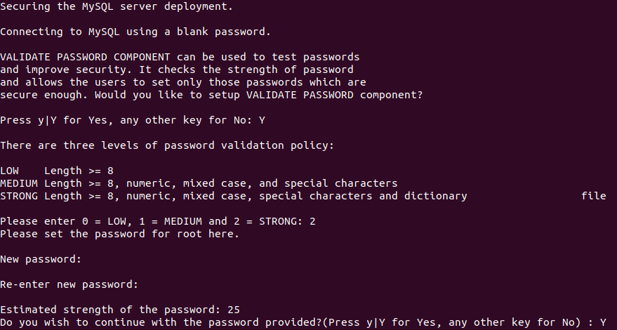
  
Alle nachfolgenden Fragen habe ich mit der Eingabe von **Y** akzeptiert. Dadurch werden der anonyme Benutzer und die Testdatenbank entfernt und auch Remote-Root-Logins werden deaktiviert. Schliesslich werden diese Änderungen angewendet.  
  
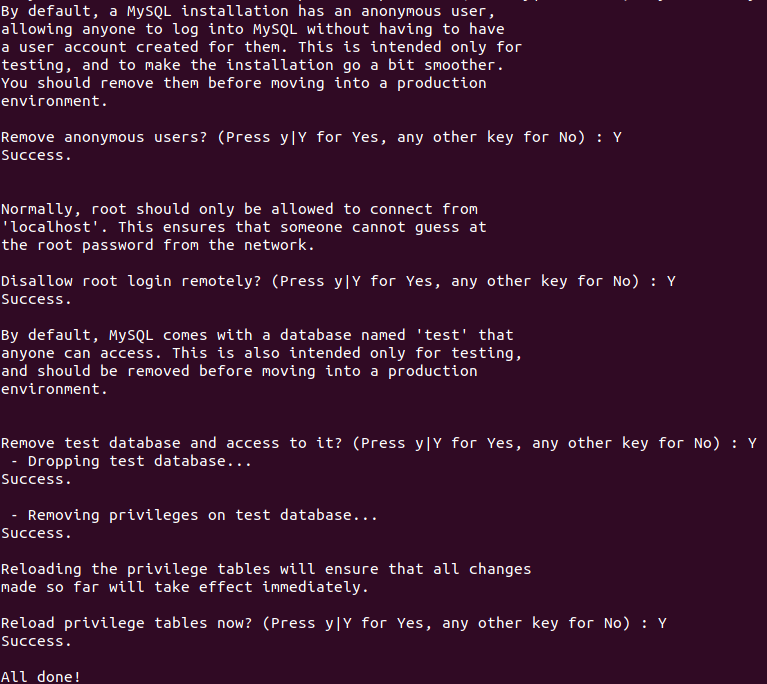

### 4. Benutzerauthentifizierung anpassen:

Der MySQL Root ist standardmässig so konfiguriert, dass er nicht per Passwort sondern über das Plugin *auth_socket* authentifiziert wird. Folgende Schritte erklären, wie das Plugin zu *caching_sha2_password* geändert werden kann.  
  
MySQL -Eingabeaufforderung öffnen:  
```
sudo mysql
```  
Mit folgendem Befehl kann überprüft werden, welche Authentifizierungsverfahren die MySQL Benutzer verwenden:  
```sql
SELECT user,authentication_string,plugin,host FROM mysql.user;
```  
Ausgabe:  
Es ist zu sehen, dass der Root-Benutzer aktuell über das Plugin *auth_socket* authentifiziert wird.  
  
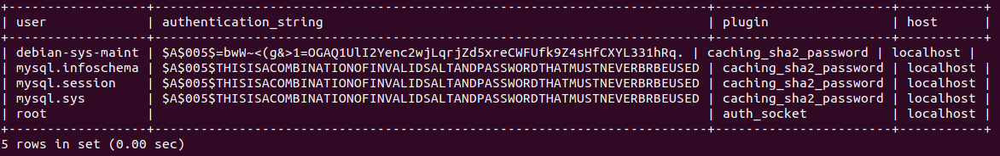  
  
Mit folgendem Befehl kann das Plugin für den Benutzer Root auf *caching_sha2_password* geändert werden. Dabei muss "password" durch ein starkes Passwort ersetzt werden. Das Passwort war in meinem Fall: **vagrantM141!**  
```sql
ALTER USER 'root'@'localhost' IDENTIFIED WITH caching_sha2_password BY 'password';
```  
Damit dir Änderungen übernommen werden, muss folgender Befehl ausgeführt werden:  
```sql
FLUSH PRIVILEGES;
```  
Zur Kontrolle kann nochmals die Benutzertabelle abgefragt werden:  
```sql
SELECT user,authentication_string,plugin,host FROM mysql.user;
```  
Dann sollte wie hier das *caching_sha2_password* Plugin für den Root-Benutzer angezeigt werden.  
  
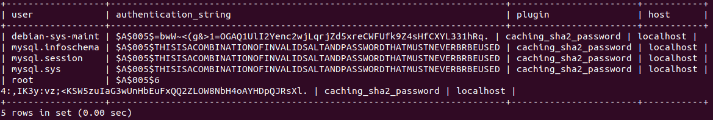  
  
Beenden der MySQL-Shell:  
```
exit
```

### Dedizierter Benutzer erstellen:

Mit folgenden Schritten kann man auch einen dedizierten MySQL-Benutzer erstellen.  
  
MySQL -Eingabeaufforderung öffnen:  
```
sudo mysql
```  
oder
```
mysql -u root -p
```  
Einen neuen Benutzer mit einem Passwort erstellen:  
```sql
CREATE USER 'username'@'localhost' IDENTIFIED BY 'password';
```  
Danach kann man noch die Berechtigungen für an den Benutzer vergeben. Bei diesem Beispiel wird der Benutzer auf alle Tabellen in der Datenbank, sowie für das Hinzufügen, Änderung und Löschen von Benutzerberechtigungen berechtigt:  
```sql
GRANT ALL PRIVILEGES ON *.* TO 'username'@'localhost' WITH GRANT OPTION;
```  
Beenden der MySQL-Shell:  
```
exit
```

## Test der Installation

### Dienst starten:  

```
systemctl start mysql.service
```

### Dienst-Status anzeigen:  

```
systemctl status mysql.service
```

Ausgabe:  

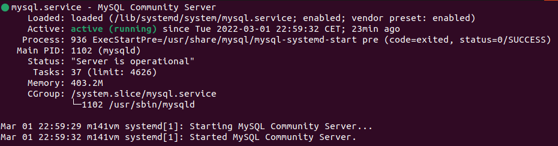

### Verbindungstest:

Mit diesem Befehl wird eine Verbindung mit MySQL als Root (*-u root*) hergestellt. Es wird nach einem Passwort abgefragt (*-p*) und zeigt dann noch die Version an.  

```
sudo mysqladmin -p -u root version
```

Ausgabe:  

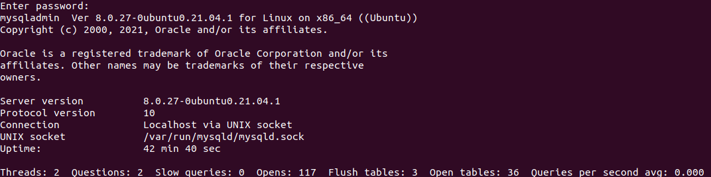

### Installierte Datenbanken anzeigen:

Datenbanken auflisten:  

```sql
SHOW DATABASES;
```

Ausgabe:  

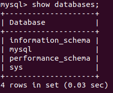

### Installierte Benutzer anzeigen:

Benutzer anzeigen:  
```sql
SELECT user FROM mysql.user;
```

Ausgabe:  

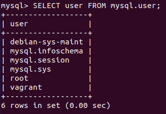

Benutzerberechtigungen für einen Benutzer anzeigen:  

```sql
SHOW GRANTS FOR 'user_name'@'host';
```

Beispiel für den Benutzer **vagrant**:

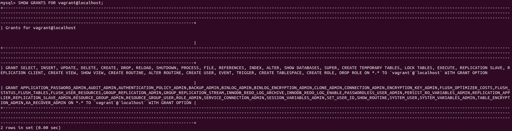

### DBMS-Version:

```sql
SELECT version();
```

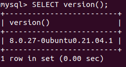


### DB erstellen/löschen:

Eine Datenbank erstellen:  

```sql
CREATE DATABASE 'database_name';
```

Beispiel:  

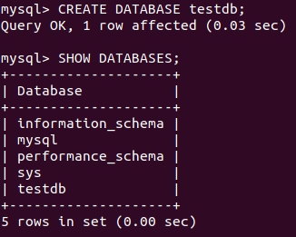

Eine Datenbank löschen:  

```sql
DROP DATABASE 'database_name';
```

Beispiel:  

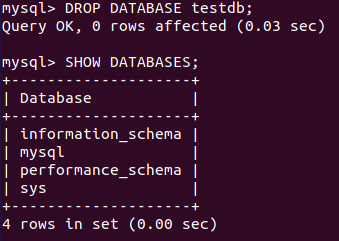
