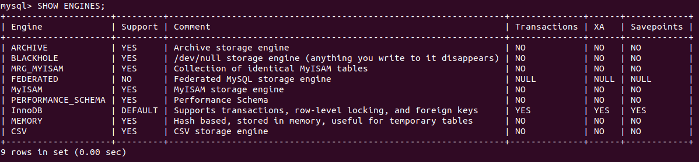

# MySQL Konfiguration

## Storage Engines bei MySQL

### Wichtigste Storage-Engines unter MySQL

**InnoDB**

* RDBMS: Durch referenzielle Integrität werden Fremdschlüssel unterstützt.
* Unterstützt Transaktionen.
* Verwendet Transaktionsprotokolle (zuverlässiger).
* Möglichkeit der Sperrung der Schreibzugriffe auf Datensätze.
* INSERT und UPDATE werden schneller ausgeführt, dafür ist SELECT langsamer.

**MyISAM**

* Wird häufiger genutzt, da eine höhere Stabilität besteht.
* DBMS: Keine Unterstützung für referenzielle Integrität.
* Unterstützt keine Transaktionen.
* Verwendet keine Transaktionsprotokolle.
* Die Schreibzugriffe erfolgen nur auf ganze Tabellen.
* SELECT wird schneller ausgeführt, dafür sind INSERT und UPDATE langsamer.

### Installierte Storage-Engines

Die installierten Storage-Engines anzeigen lassen:  

```sql
SHOW ENGINES;
```

Ausgabe:  



* [ARCHIVE](https://dev.mysql.com/doc/refman/8.0/en/archive-storage-engine.html): Erzeugt Spezialtabellen, die grosse Mengen von nicht indezierten Daten auf sehr kleinem Raum speichert.
* [BLACKHOLE](https://dev.mysql.com/doc/refman/8.0/en/blackhole-storage-engine.html): Fungiert als "Schwarzes Loch", welches Daten akzeptiert, dann aber wegwirft und nicht speichert.
* MRG_MYISAM:
* [FEDERATED](https://dev.mysql.com/doc/refman/8.0/en/federated-storage-engine.html): Mit dieser Engine kann man auf Daten aus einer Remote-MySQL-Datenbank zugreifen, ohne Replikations- oder Cluster-Technologien zu verwenden.
* [MyISAM](https://dev.mysql.com/doc/refman/8.0/en/myisam-storage-engine.html): Basiert auf der älteren (und nicht mehr erhältlichen) ISAM-Speicher-Engine, hat dafür aber viele nützliche Erweiterungen.
* PERFORMANCE_SCHEMA:
* [InnoDB](https://dev.mysql.com/doc/refman/8.0/en/innodb-introduction.html): Allzweck-Speicher-Engine, die über hohe Zuverlässigkeit und hohe Leistung verfügt. In MySQL 8.0 ist InnoDB die standardmäßige MySQL-Speicher-Engine.
* [MEMORY](https://dev.mysql.com/doc/refman/8.0/en/memory-storage-engine.html): Speichert Daten im Arbeitsspeicher. Da diese Daten anfällig für Abstürze, Hardwareprobleme oder Stromausfälle sind, werden diese Tabellen nur als temporäre Arbeitsbereiche verwendet.
* [CSV](https://dev.mysql.com/doc/refman/8.0/en/csv-storage-engine.html): Speichert Daten in Textdateien im CSV-Format.

### Storage-Engine auf Tabelle anwenden

Standard Storage-Engine setzen:  

```sql
SET default_storage_engine=MyISAM;
```

Storage-Engine beim Erstellen einer neuen Tabelle definieren:  

```sql
CREATE TABLE 'table_name' (i INT) ENGINE = ARCHIVE;
```

Storage-Engine einer vorhandenen Tabelle anpassen:  

```sql
ALTER TABLE 'table_name' ENGINE = InnoDB;
```

Storage-Engine einer bestimmten Tabelle anzeigen:  

```sql
SHOW TABLE STATUS WHERE Name = 'table_name'
```

## Benutzer und Berechtigungen

### Erstellen Sie eine Demo-Datenbank mit zwei Tabellen

```sql
CREATE DATABSE demodb;

USE demodb;

CREATE TABLE table1 (i INT);
CREATE TABLE table2 (i INT);
```

### Root-Benutzer konfiguriert (Login/Passwort)

Der Root-Benutzer wurde bereits in diesem [Abschnitt](/auftraege/MySQL_installation?id=_4-benutzerauthentifizierung-anpassen) konfiguriert.

### Benutzer konfiguriert (Login/Passwort/Berechtigung auf Datenbank eingeschränkt <- ein Anwendungsbenutzer)

Einen neuen Anwendungsbenutzer erstellen:  

```sql
USE mysql;
CREATE USER 'vagrant'@'localhost' IDENTIFIED BY 'vagrantM141!';
GRANT SELECT,INSERT,UPDATE,DELETE,CREATE,DROP ON demodb.* TO 'vagrant'@'localhost';
UPDATE user SET plugin='auth_socket' WHERE User='vagrant';
FLUSH PRIVILEGES;
exit;
```

Danach noch den MySQL Service neustarten.

### Admin-Benutzer konfiguriert (Login/Passwort/Berechtigung auf Datenbank eingeschränkt)

Einen neuen Adminbenutzer erstellen:  

```sql
USE mysql;
CREATE USER 'admin'@'localhost' IDENTIFIED BY 'adminM141!!';
GRANT ALL PRIVILEGES ON demodb.* TO 'admin'@'localhost';
UPDATE user SET plugin='auth_socket' WHERE User='admin';
FLUSH PRIVILEGES;
exit;
```

Danach noch den MySQL Service neustarten.  

### Verfizieren Sie Ihre Konfiguration

**Root-Benutzer:**  

```sql
SHOW GRANTS FOR 'root'@'localhost';
```

Ausgabe:  


**Anwendungsbenutzer (vagrant):**  

```sql
SHOW GRANTS FOR 'vagrant'@'localhost';
```

Ausgabe:  


**Admin-Benutzer:**  

```sql
SHOW GRANTS FOR 'admin'@'localhost';
```

Ausgabe:  


## Server-Konfiguration

### Transaktions-Isolation

Transaktions-Isolation anzeigen lassen:  

```sql
SHOW VARIABLES LIKE 'transaction_isolation';
```

Ausgabe:  


Transaktions-Isolation ändern:

```sql
SET TRANSACTION ISOLATION LEVEL SERIALIZABLE;
```

**Isolations-Level:**

| Isolationsebene | Dirty Read | Lost Updates | Non-Repeatable Read | Phantom |
|---|---|---|---|---|
| *Read Uncommitted* | möglich | möglich auch bei Db2 CS | möglich | möglich |
| *Read Committed* | unmöglich | möglich auch bei Db2 CS | möglich | möglich |
| *Repeatable Read* | unmöglich | unmöglich | unmöglich | möglich |
| *Serializable* | unmöglich | unmöglich | unmöglich | unmöglich |

1. Dirty Read:  
   Daten einer noch nicht abgeschlossenen Transaktion werden von einer anderen Transaktion gelesen.

2. Lost Updates:  
   Zwei Transaktionen modifizieren parallel denselben Datensatz und nach Ablauf dieser beiden Transaktionen wird nur die Änderung von einer von ihnen übernommen.

3. Non-Repeatable Read:  
   Wiederholte Lesevorgänge liefern unterschiedliche Ergebnisse.

4. Phantom Read:  
   Suchkriterien treffen während einer Transaktion auf unterschiedliche Datensätze zu, weil eine (während des Ablaufs dieser Transaktion laufende) andere Transaktion Datensätze hinzugefügt, entfernt oder verändert hat.

Demnach wäre bim *Repeatable Read* sichergestellt, dass wiederholte Leseversuche mit den gleichen Parametern auch die gleichen Ergebnisse liefern. Sowohl bei Lese- als auch bei Schreiboperationen werden für die gesamte Dauer der Transaktion Sperren gesetzt. Bis auf Phantom Reads gibt es daher keine Anomalien.

### Exportieren Sie die aktuelle Liste an System-Variablen

```sql
SHOW VARIABLES \G;
```

Ausgabe:  

```
*************************** 1. row ***************************
Variable_name: activate_all_roles_on_login
        Value: OFF
*************************** 2. row ***************************
Variable_name: admin_address
        Value: 
*************************** 3. row ***************************
Variable_name: admin_port
        Value: 33062
*************************** 4. row ***************************
Variable_name: admin_ssl_ca
        Value: 
*************************** 5. row ***************************
Variable_name: admin_ssl_capath
        Value: 
*************************** 6. row ***************************
Variable_name: admin_ssl_cert
        Value: 
*************************** 7. row ***************************
Variable_name: admin_ssl_cipher
        Value: 
*************************** 8. row ***************************
Variable_name: admin_ssl_crl
        Value: 
*************************** 9. row ***************************
Variable_name: admin_ssl_crlpath
        Value: 
*************************** 10. row ***************************
Variable_name: admin_ssl_key
        Value: 
*************************** 11. row ***************************
Variable_name: admin_tls_ciphersuites
        Value: 
*************************** 12. row ***************************
Variable_name: admin_tls_version
        Value: TLSv1,TLSv1.1,TLSv1.2,TLSv1.3
*************************** 13. row ***************************
Variable_name: authentication_policy
        Value: *,,
*************************** 14. row ***************************
Variable_name: auto_generate_certs
        Value: ON
*************************** 15. row ***************************
Variable_name: auto_increment_increment
        Value: 1
*************************** 16. row ***************************
Variable_name: auto_increment_offset
        Value: 1
*************************** 17. row ***************************
Variable_name: autocommit
        Value: ON
*************************** 18. row ***************************
Variable_name: automatic_sp_privileges
        Value: ON
*************************** 19. row ***************************
Variable_name: avoid_temporal_upgrade
        Value: OFF
*************************** 20. row ***************************
Variable_name: back_log
        Value: 151
*************************** 21. row ***************************
Variable_name: basedir
        Value: /usr/
*************************** 22. row ***************************
Variable_name: big_tables
        Value: OFF
*************************** 23. row ***************************
Variable_name: bind_address
        Value: 127.0.0.1
*************************** 24. row ***************************
Variable_name: binlog_cache_size
        Value: 32768
*************************** 25. row ***************************
Variable_name: binlog_checksum
        Value: CRC32
*************************** 26. row ***************************
Variable_name: binlog_direct_non_transactional_updates
        Value: OFF
*************************** 27. row ***************************
Variable_name: binlog_encryption
        Value: OFF
*************************** 28. row ***************************
Variable_name: binlog_error_action
        Value: ABORT_SERVER
*************************** 29. row ***************************
Variable_name: binlog_expire_logs_seconds
        Value: 2592000
*************************** 30. row ***************************
Variable_name: binlog_format
        Value: ROW
*************************** 31. row ***************************
Variable_name: binlog_group_commit_sync_delay
        Value: 0
*************************** 32. row ***************************
Variable_name: binlog_group_commit_sync_no_delay_count
        Value: 0
*************************** 33. row ***************************
Variable_name: binlog_gtid_simple_recovery
        Value: ON
*************************** 34. row ***************************
Variable_name: binlog_max_flush_queue_time
        Value: 0
*************************** 35. row ***************************
Variable_name: binlog_order_commits
        Value: ON
*************************** 36. row ***************************
Variable_name: binlog_rotate_encryption_master_key_at_startup
        Value: OFF
*************************** 37. row ***************************
Variable_name: binlog_row_event_max_size
        Value: 8192
*************************** 38. row ***************************
Variable_name: binlog_row_image
        Value: FULL
*************************** 39. row ***************************
Variable_name: binlog_row_metadata
        Value: MINIMAL
*************************** 40. row ***************************
Variable_name: binlog_row_value_options
        Value: 
*************************** 41. row ***************************
Variable_name: binlog_rows_query_log_events
        Value: OFF
*************************** 42. row ***************************
Variable_name: binlog_stmt_cache_size
        Value: 32768
*************************** 43. row ***************************
Variable_name: binlog_transaction_compression
        Value: OFF
*************************** 44. row ***************************
Variable_name: binlog_transaction_compression_level_zstd
        Value: 3
*************************** 45. row ***************************
Variable_name: binlog_transaction_dependency_history_size
        Value: 25000
*************************** 46. row ***************************
Variable_name: binlog_transaction_dependency_tracking
        Value: COMMIT_ORDER
*************************** 47. row ***************************
Variable_name: block_encryption_mode
        Value: aes-128-ecb
*************************** 48. row ***************************
Variable_name: bulk_insert_buffer_size
        Value: 8388608
*************************** 49. row ***************************
Variable_name: caching_sha2_password_auto_generate_rsa_keys
        Value: ON
*************************** 50. row ***************************
Variable_name: caching_sha2_password_digest_rounds
        Value: 5000
*************************** 51. row ***************************
Variable_name: caching_sha2_password_private_key_path
        Value: private_key.pem
*************************** 52. row ***************************
Variable_name: caching_sha2_password_public_key_path
        Value: public_key.pem
*************************** 53. row ***************************
Variable_name: character_set_client
        Value: utf8mb4
*************************** 54. row ***************************
Variable_name: character_set_connection
        Value: utf8mb4
*************************** 55. row ***************************
Variable_name: character_set_database
        Value: utf8mb4
*************************** 56. row ***************************
Variable_name: character_set_filesystem
        Value: binary
*************************** 57. row ***************************
Variable_name: character_set_results
        Value: utf8mb4
*************************** 58. row ***************************
Variable_name: character_set_server
        Value: utf8mb4
*************************** 59. row ***************************
Variable_name: character_set_system
        Value: utf8mb3
*************************** 60. row ***************************
Variable_name: character_sets_dir
        Value: /usr/share/mysql/charsets/
*************************** 61. row ***************************
Variable_name: check_proxy_users
        Value: OFF
*************************** 62. row ***************************
Variable_name: collation_connection
        Value: utf8mb4_0900_ai_ci
*************************** 63. row ***************************
Variable_name: collation_database
        Value: utf8mb4_0900_ai_ci
*************************** 64. row ***************************
Variable_name: collation_server
        Value: utf8mb4_0900_ai_ci
*************************** 65. row ***************************
Variable_name: completion_type
        Value: NO_CHAIN
*************************** 66. row ***************************
Variable_name: concurrent_insert
        Value: AUTO
*************************** 67. row ***************************
Variable_name: connect_timeout
        Value: 10
*************************** 68. row ***************************
Variable_name: core_file
        Value: OFF
*************************** 69. row ***************************
Variable_name: create_admin_listener_thread
        Value: OFF
*************************** 70. row ***************************
Variable_name: cte_max_recursion_depth
        Value: 1000
*************************** 71. row ***************************
Variable_name: datadir
        Value: /var/lib/mysql/
*************************** 72. row ***************************
Variable_name: default_authentication_plugin
        Value: caching_sha2_password
*************************** 73. row ***************************
Variable_name: default_collation_for_utf8mb4
        Value: utf8mb4_0900_ai_ci
*************************** 74. row ***************************
Variable_name: default_password_lifetime
        Value: 0
*************************** 75. row ***************************
Variable_name: default_storage_engine
        Value: InnoDB
*************************** 76. row ***************************
Variable_name: default_table_encryption
        Value: OFF
*************************** 77. row ***************************
Variable_name: default_tmp_storage_engine
        Value: InnoDB
*************************** 78. row ***************************
Variable_name: default_week_format
        Value: 0
*************************** 79. row ***************************
Variable_name: delay_key_write
        Value: ON
*************************** 80. row ***************************
Variable_name: delayed_insert_limit
        Value: 100
*************************** 81. row ***************************
Variable_name: delayed_insert_timeout
        Value: 300
*************************** 82. row ***************************
Variable_name: delayed_queue_size
        Value: 1000
*************************** 83. row ***************************
Variable_name: disabled_storage_engines
        Value: 
*************************** 84. row ***************************
Variable_name: disconnect_on_expired_password
        Value: ON
*************************** 85. row ***************************
Variable_name: div_precision_increment
        Value: 4
*************************** 86. row ***************************
Variable_name: end_markers_in_json
        Value: OFF
*************************** 87. row ***************************
Variable_name: enforce_gtid_consistency
        Value: OFF
*************************** 88. row ***************************
Variable_name: eq_range_index_dive_limit
        Value: 200
*************************** 89. row ***************************
Variable_name: error_count
        Value: 0
*************************** 90. row ***************************
Variable_name: event_scheduler
        Value: ON
*************************** 91. row ***************************
Variable_name: expire_logs_days
        Value: 0
*************************** 92. row ***************************
Variable_name: explicit_defaults_for_timestamp
        Value: ON
*************************** 93. row ***************************
Variable_name: external_user
        Value: 
*************************** 94. row ***************************
Variable_name: flush
        Value: OFF
*************************** 95. row ***************************
Variable_name: flush_time
        Value: 0
*************************** 96. row ***************************
Variable_name: foreign_key_checks
        Value: ON
*************************** 97. row ***************************
Variable_name: ft_boolean_syntax
        Value: + -><()~*:""&|
*************************** 98. row ***************************
Variable_name: ft_max_word_len
        Value: 84
*************************** 99. row ***************************
Variable_name: ft_min_word_len
        Value: 4
*************************** 100. row ***************************
Variable_name: ft_query_expansion_limit
        Value: 20
*************************** 101. row ***************************
Variable_name: ft_stopword_file
        Value: (built-in)
*************************** 102. row ***************************
Variable_name: general_log
        Value: OFF
*************************** 103. row ***************************
Variable_name: general_log_file
        Value: /var/lib/mysql/m141vm.log
*************************** 104. row ***************************
Variable_name: generated_random_password_length
        Value: 20
*************************** 105. row ***************************
Variable_name: group_concat_max_len
        Value: 1024
*************************** 106. row ***************************
Variable_name: group_replication_consistency
        Value: EVENTUAL
*************************** 107. row ***************************
Variable_name: gtid_executed
        Value: 
*************************** 108. row ***************************
Variable_name: gtid_executed_compression_period
        Value: 0
*************************** 109. row ***************************
Variable_name: gtid_mode
        Value: OFF
*************************** 110. row ***************************
Variable_name: gtid_next
        Value: AUTOMATIC
*************************** 111. row ***************************
Variable_name: gtid_owned
        Value: 
*************************** 112. row ***************************
Variable_name: gtid_purged
        Value: 
*************************** 113. row ***************************
Variable_name: have_compress
        Value: YES
*************************** 114. row ***************************
Variable_name: have_dynamic_loading
        Value: YES
*************************** 115. row ***************************
Variable_name: have_geometry
        Value: YES
*************************** 116. row ***************************
Variable_name: have_openssl
        Value: YES
*************************** 117. row ***************************
Variable_name: have_profiling
        Value: YES
*************************** 118. row ***************************
Variable_name: have_query_cache
        Value: NO
*************************** 119. row ***************************
Variable_name: have_rtree_keys
        Value: YES
*************************** 120. row ***************************
Variable_name: have_ssl
        Value: YES
*************************** 121. row ***************************
Variable_name: have_statement_timeout
        Value: YES
*************************** 122. row ***************************
Variable_name: have_symlink
        Value: DISABLED
*************************** 123. row ***************************
Variable_name: histogram_generation_max_mem_size
        Value: 20000000
*************************** 124. row ***************************
Variable_name: host_cache_size
        Value: 279
*************************** 125. row ***************************
Variable_name: hostname
        Value: m141vm
*************************** 126. row ***************************
Variable_name: identity
        Value: 0
*************************** 127. row ***************************
Variable_name: immediate_server_version
        Value: 999999
*************************** 128. row ***************************
Variable_name: information_schema_stats_expiry
        Value: 86400
*************************** 129. row ***************************
Variable_name: init_connect
        Value: 
*************************** 130. row ***************************
Variable_name: init_file
        Value: 
*************************** 131. row ***************************
Variable_name: init_replica
        Value: 
*************************** 132. row ***************************
Variable_name: init_slave
        Value: 
*************************** 133. row ***************************
Variable_name: innodb_adaptive_flushing
        Value: ON
*************************** 134. row ***************************
Variable_name: innodb_adaptive_flushing_lwm
        Value: 10
*************************** 135. row ***************************
Variable_name: innodb_adaptive_hash_index
        Value: ON
*************************** 136. row ***************************
Variable_name: innodb_adaptive_hash_index_parts
        Value: 8
*************************** 137. row ***************************
Variable_name: innodb_adaptive_max_sleep_delay
        Value: 150000
*************************** 138. row ***************************
Variable_name: innodb_api_bk_commit_interval
        Value: 5
*************************** 139. row ***************************
Variable_name: innodb_api_disable_rowlock
        Value: OFF
*************************** 140. row ***************************
Variable_name: innodb_api_enable_binlog
        Value: OFF
*************************** 141. row ***************************
Variable_name: innodb_api_enable_mdl
        Value: OFF
*************************** 142. row ***************************
Variable_name: innodb_api_trx_level
        Value: 0
*************************** 143. row ***************************
Variable_name: innodb_autoextend_increment
        Value: 64
*************************** 144. row ***************************
Variable_name: innodb_autoinc_lock_mode
        Value: 2
*************************** 145. row ***************************
Variable_name: innodb_buffer_pool_chunk_size
        Value: 134217728
*************************** 146. row ***************************
Variable_name: innodb_buffer_pool_dump_at_shutdown
        Value: ON
*************************** 147. row ***************************
Variable_name: innodb_buffer_pool_dump_now
        Value: OFF
*************************** 148. row ***************************
Variable_name: innodb_buffer_pool_dump_pct
        Value: 25
*************************** 149. row ***************************
Variable_name: innodb_buffer_pool_filename
        Value: ib_buffer_pool
*************************** 150. row ***************************
Variable_name: innodb_buffer_pool_in_core_file
        Value: ON
*************************** 151. row ***************************
Variable_name: innodb_buffer_pool_instances
        Value: 1
*************************** 152. row ***************************
Variable_name: innodb_buffer_pool_load_abort
        Value: OFF
*************************** 153. row ***************************
Variable_name: innodb_buffer_pool_load_at_startup
        Value: ON
*************************** 154. row ***************************
Variable_name: innodb_buffer_pool_load_now
        Value: OFF
*************************** 155. row ***************************
Variable_name: innodb_buffer_pool_size
        Value: 134217728
*************************** 156. row ***************************
Variable_name: innodb_change_buffer_max_size
        Value: 25
*************************** 157. row ***************************
Variable_name: innodb_change_buffering
        Value: all
*************************** 158. row ***************************
Variable_name: innodb_checksum_algorithm
        Value: crc32
*************************** 159. row ***************************
Variable_name: innodb_cmp_per_index_enabled
        Value: OFF
*************************** 160. row ***************************
Variable_name: innodb_commit_concurrency
        Value: 0
*************************** 161. row ***************************
Variable_name: innodb_compression_failure_threshold_pct
        Value: 5
*************************** 162. row ***************************
Variable_name: innodb_compression_level
        Value: 6
*************************** 163. row ***************************
Variable_name: innodb_compression_pad_pct_max
        Value: 50
*************************** 164. row ***************************
Variable_name: innodb_concurrency_tickets
        Value: 5000
*************************** 165. row ***************************
Variable_name: innodb_data_file_path
        Value: ibdata1:12M:autoextend
*************************** 166. row ***************************
Variable_name: innodb_data_home_dir
        Value: 
*************************** 167. row ***************************
Variable_name: innodb_ddl_buffer_size
        Value: 1048576
*************************** 168. row ***************************
Variable_name: innodb_ddl_threads
        Value: 4
*************************** 169. row ***************************
Variable_name: innodb_deadlock_detect
        Value: ON
*************************** 170. row ***************************
Variable_name: innodb_dedicated_server
        Value: OFF
*************************** 171. row ***************************
Variable_name: innodb_default_row_format
        Value: dynamic
*************************** 172. row ***************************
Variable_name: innodb_directories
        Value: 
*************************** 173. row ***************************
Variable_name: innodb_disable_sort_file_cache
        Value: OFF
*************************** 174. row ***************************
Variable_name: innodb_doublewrite
        Value: ON
*************************** 175. row ***************************
Variable_name: innodb_doublewrite_batch_size
        Value: 0
*************************** 176. row ***************************
Variable_name: innodb_doublewrite_dir
        Value: 
*************************** 177. row ***************************
Variable_name: innodb_doublewrite_files
        Value: 2
*************************** 178. row ***************************
Variable_name: innodb_doublewrite_pages
        Value: 4
*************************** 179. row ***************************
Variable_name: innodb_extend_and_initialize
        Value: ON
*************************** 180. row ***************************
Variable_name: innodb_fast_shutdown
        Value: 1
*************************** 181. row ***************************
Variable_name: innodb_file_per_table
        Value: ON
*************************** 182. row ***************************
Variable_name: innodb_fill_factor
        Value: 100
*************************** 183. row ***************************
Variable_name: innodb_flush_log_at_timeout
        Value: 1
*************************** 184. row ***************************
Variable_name: innodb_flush_log_at_trx_commit
        Value: 1
*************************** 185. row ***************************
Variable_name: innodb_flush_method
        Value: fsync
*************************** 186. row ***************************
Variable_name: innodb_flush_neighbors
        Value: 0
*************************** 187. row ***************************
Variable_name: innodb_flush_sync
        Value: ON
*************************** 188. row ***************************
Variable_name: innodb_flushing_avg_loops
        Value: 30
*************************** 189. row ***************************
Variable_name: innodb_force_load_corrupted
        Value: OFF
*************************** 190. row ***************************
Variable_name: innodb_force_recovery
        Value: 0
*************************** 191. row ***************************
Variable_name: innodb_fsync_threshold
        Value: 0
*************************** 192. row ***************************
Variable_name: innodb_ft_aux_table
        Value: 
*************************** 193. row ***************************
Variable_name: innodb_ft_cache_size
        Value: 8000000
*************************** 194. row ***************************
Variable_name: innodb_ft_enable_diag_print
        Value: OFF
*************************** 195. row ***************************
Variable_name: innodb_ft_enable_stopword
        Value: ON
*************************** 196. row ***************************
Variable_name: innodb_ft_max_token_size
        Value: 84
*************************** 197. row ***************************
Variable_name: innodb_ft_min_token_size
        Value: 3
*************************** 198. row ***************************
Variable_name: innodb_ft_num_word_optimize
        Value: 2000
*************************** 199. row ***************************
Variable_name: innodb_ft_result_cache_limit
        Value: 2000000000
*************************** 200. row ***************************
Variable_name: innodb_ft_server_stopword_table
        Value: 
*************************** 201. row ***************************
Variable_name: innodb_ft_sort_pll_degree
        Value: 2
*************************** 202. row ***************************
Variable_name: innodb_ft_total_cache_size
        Value: 640000000
*************************** 203. row ***************************
Variable_name: innodb_ft_user_stopword_table
        Value: 
*************************** 204. row ***************************
Variable_name: innodb_idle_flush_pct
        Value: 100
*************************** 205. row ***************************
Variable_name: innodb_io_capacity
        Value: 200
*************************** 206. row ***************************
Variable_name: innodb_io_capacity_max
        Value: 2000
*************************** 207. row ***************************
Variable_name: innodb_lock_wait_timeout
        Value: 50
*************************** 208. row ***************************
Variable_name: innodb_log_buffer_size
        Value: 16777216
*************************** 209. row ***************************
Variable_name: innodb_log_checksums
        Value: ON
*************************** 210. row ***************************
Variable_name: innodb_log_compressed_pages
        Value: ON
*************************** 211. row ***************************
Variable_name: innodb_log_file_size
        Value: 50331648
*************************** 212. row ***************************
Variable_name: innodb_log_files_in_group
        Value: 2
*************************** 213. row ***************************
Variable_name: innodb_log_group_home_dir
        Value: ./
*************************** 214. row ***************************
Variable_name: innodb_log_spin_cpu_abs_lwm
        Value: 80
*************************** 215. row ***************************
Variable_name: innodb_log_spin_cpu_pct_hwm
        Value: 50
*************************** 216. row ***************************
Variable_name: innodb_log_wait_for_flush_spin_hwm
        Value: 400
*************************** 217. row ***************************
Variable_name: innodb_log_write_ahead_size
        Value: 8192
*************************** 218. row ***************************
Variable_name: innodb_log_writer_threads
        Value: ON
*************************** 219. row ***************************
Variable_name: innodb_lru_scan_depth
        Value: 1024
*************************** 220. row ***************************
Variable_name: innodb_max_dirty_pages_pct
        Value: 90.000000
*************************** 221. row ***************************
Variable_name: innodb_max_dirty_pages_pct_lwm
        Value: 10.000000
*************************** 222. row ***************************
Variable_name: innodb_max_purge_lag
        Value: 0
*************************** 223. row ***************************
Variable_name: innodb_max_purge_lag_delay
        Value: 0
*************************** 224. row ***************************
Variable_name: innodb_max_undo_log_size
        Value: 1073741824
*************************** 225. row ***************************
Variable_name: innodb_monitor_disable
        Value: 
*************************** 226. row ***************************
Variable_name: innodb_monitor_enable
        Value: 
*************************** 227. row ***************************
Variable_name: innodb_monitor_reset
        Value: 
*************************** 228. row ***************************
Variable_name: innodb_monitor_reset_all
        Value: 
*************************** 229. row ***************************
Variable_name: innodb_numa_interleave
        Value: OFF
*************************** 230. row ***************************
Variable_name: innodb_old_blocks_pct
        Value: 37
*************************** 231. row ***************************
Variable_name: innodb_old_blocks_time
        Value: 1000
*************************** 232. row ***************************
Variable_name: innodb_online_alter_log_max_size
        Value: 134217728
*************************** 233. row ***************************
Variable_name: innodb_open_files
        Value: 4000
*************************** 234. row ***************************
Variable_name: innodb_optimize_fulltext_only
        Value: OFF
*************************** 235. row ***************************
Variable_name: innodb_page_cleaners
        Value: 1
*************************** 236. row ***************************
Variable_name: innodb_page_size
        Value: 16384
*************************** 237. row ***************************
Variable_name: innodb_parallel_read_threads
        Value: 4
*************************** 238. row ***************************
Variable_name: innodb_print_all_deadlocks
        Value: OFF
*************************** 239. row ***************************
Variable_name: innodb_print_ddl_logs
        Value: OFF
*************************** 240. row ***************************
Variable_name: innodb_purge_batch_size
        Value: 300
*************************** 241. row ***************************
Variable_name: innodb_purge_rseg_truncate_frequency
        Value: 128
*************************** 242. row ***************************
Variable_name: innodb_purge_threads
        Value: 4
*************************** 243. row ***************************
Variable_name: innodb_random_read_ahead
        Value: OFF
*************************** 244. row ***************************
Variable_name: innodb_read_ahead_threshold
        Value: 56
*************************** 245. row ***************************
Variable_name: innodb_read_io_threads
        Value: 4
*************************** 246. row ***************************
Variable_name: innodb_read_only
        Value: OFF
*************************** 247. row ***************************
Variable_name: innodb_redo_log_archive_dirs
        Value: 
*************************** 248. row ***************************
Variable_name: innodb_redo_log_encrypt
        Value: OFF
*************************** 249. row ***************************
Variable_name: innodb_replication_delay
        Value: 0
*************************** 250. row ***************************
Variable_name: innodb_rollback_on_timeout
        Value: OFF
*************************** 251. row ***************************
Variable_name: innodb_rollback_segments
        Value: 128
*************************** 252. row ***************************
Variable_name: innodb_segment_reserve_factor
        Value: 12.500000
*************************** 253. row ***************************
Variable_name: innodb_sort_buffer_size
        Value: 1048576
*************************** 254. row ***************************
Variable_name: innodb_spin_wait_delay
        Value: 6
*************************** 255. row ***************************
Variable_name: innodb_spin_wait_pause_multiplier
        Value: 50
*************************** 256. row ***************************
Variable_name: innodb_stats_auto_recalc
        Value: ON
*************************** 257. row ***************************
Variable_name: innodb_stats_include_delete_marked
        Value: OFF
*************************** 258. row ***************************
Variable_name: innodb_stats_method
        Value: nulls_equal
*************************** 259. row ***************************
Variable_name: innodb_stats_on_metadata
        Value: OFF
*************************** 260. row ***************************
Variable_name: innodb_stats_persistent
        Value: ON
*************************** 261. row ***************************
Variable_name: innodb_stats_persistent_sample_pages
        Value: 20
*************************** 262. row ***************************
Variable_name: innodb_stats_transient_sample_pages
        Value: 8
*************************** 263. row ***************************
Variable_name: innodb_status_output
        Value: OFF
*************************** 264. row ***************************
Variable_name: innodb_status_output_locks
        Value: OFF
*************************** 265. row ***************************
Variable_name: innodb_strict_mode
        Value: ON
*************************** 266. row ***************************
Variable_name: innodb_sync_array_size
        Value: 1
*************************** 267. row ***************************
Variable_name: innodb_sync_spin_loops
        Value: 30
*************************** 268. row ***************************
Variable_name: innodb_table_locks
        Value: ON
*************************** 269. row ***************************
Variable_name: innodb_temp_data_file_path
        Value: ibtmp1:12M:autoextend
*************************** 270. row ***************************
Variable_name: innodb_temp_tablespaces_dir
        Value: ./#innodb_temp/
*************************** 271. row ***************************
Variable_name: innodb_thread_concurrency
        Value: 0
*************************** 272. row ***************************
Variable_name: innodb_thread_sleep_delay
        Value: 10000
*************************** 273. row ***************************
Variable_name: innodb_tmpdir
        Value: 
*************************** 274. row ***************************
Variable_name: innodb_undo_directory
        Value: ./
*************************** 275. row ***************************
Variable_name: innodb_undo_log_encrypt
        Value: OFF
*************************** 276. row ***************************
Variable_name: innodb_undo_log_truncate
        Value: ON
*************************** 277. row ***************************
Variable_name: innodb_undo_tablespaces
        Value: 2
*************************** 278. row ***************************
Variable_name: innodb_use_fdatasync
        Value: OFF
*************************** 279. row ***************************
Variable_name: innodb_use_native_aio
        Value: ON
*************************** 280. row ***************************
Variable_name: innodb_validate_tablespace_paths
        Value: ON
*************************** 281. row ***************************
Variable_name: innodb_version
        Value: 8.0.27
*************************** 282. row ***************************
Variable_name: innodb_write_io_threads
        Value: 4
*************************** 283. row ***************************
Variable_name: insert_id
        Value: 0
*************************** 284. row ***************************
Variable_name: interactive_timeout
        Value: 28800
*************************** 285. row ***************************
Variable_name: internal_tmp_mem_storage_engine
        Value: TempTable
*************************** 286. row ***************************
Variable_name: join_buffer_size
        Value: 262144
*************************** 287. row ***************************
Variable_name: keep_files_on_create
        Value: OFF
*************************** 288. row ***************************
Variable_name: key_buffer_size
        Value: 16777216
*************************** 289. row ***************************
Variable_name: key_cache_age_threshold
        Value: 300
*************************** 290. row ***************************
Variable_name: key_cache_block_size
        Value: 1024
*************************** 291. row ***************************
Variable_name: key_cache_division_limit
        Value: 100
*************************** 292. row ***************************
Variable_name: keyring_operations
        Value: ON
*************************** 293. row ***************************
Variable_name: large_files_support
        Value: ON
*************************** 294. row ***************************
Variable_name: large_page_size
        Value: 0
*************************** 295. row ***************************
Variable_name: large_pages
        Value: OFF
*************************** 296. row ***************************
Variable_name: last_insert_id
        Value: 0
*************************** 297. row ***************************
Variable_name: lc_messages
        Value: en_US
*************************** 298. row ***************************
Variable_name: lc_messages_dir
        Value: /usr/share/mysql/
*************************** 299. row ***************************
Variable_name: lc_time_names
        Value: en_US
*************************** 300. row ***************************
Variable_name: license
        Value: GPL
*************************** 301. row ***************************
Variable_name: local_infile
        Value: OFF
*************************** 302. row ***************************
Variable_name: lock_wait_timeout
        Value: 31536000
*************************** 303. row ***************************
Variable_name: locked_in_memory
        Value: OFF
*************************** 304. row ***************************
Variable_name: log_bin
        Value: ON
*************************** 305. row ***************************
Variable_name: log_bin_basename
        Value: /var/lib/mysql/binlog
*************************** 306. row ***************************
Variable_name: log_bin_index
        Value: /var/lib/mysql/binlog.index
*************************** 307. row ***************************
Variable_name: log_bin_trust_function_creators
        Value: OFF
*************************** 308. row ***************************
Variable_name: log_bin_use_v1_row_events
        Value: OFF
*************************** 309. row ***************************
Variable_name: log_error
        Value: /var/log/mysql/error.log
*************************** 310. row ***************************
Variable_name: log_error_services
        Value: log_filter_internal; log_sink_internal
*************************** 311. row ***************************
Variable_name: log_error_suppression_list
        Value: 
*************************** 312. row ***************************
Variable_name: log_error_verbosity
        Value: 2
*************************** 313. row ***************************
Variable_name: log_output
        Value: FILE
*************************** 314. row ***************************
Variable_name: log_queries_not_using_indexes
        Value: OFF
*************************** 315. row ***************************
Variable_name: log_raw
        Value: OFF
*************************** 316. row ***************************
Variable_name: log_replica_updates
        Value: ON
*************************** 317. row ***************************
Variable_name: log_slave_updates
        Value: ON
*************************** 318. row ***************************
Variable_name: log_slow_admin_statements
        Value: OFF
*************************** 319. row ***************************
Variable_name: log_slow_extra
        Value: OFF
*************************** 320. row ***************************
Variable_name: log_slow_replica_statements
        Value: OFF
*************************** 321. row ***************************
Variable_name: log_slow_slave_statements
        Value: OFF
*************************** 322. row ***************************
Variable_name: log_statements_unsafe_for_binlog
        Value: ON
*************************** 323. row ***************************
Variable_name: log_throttle_queries_not_using_indexes
        Value: 0
*************************** 324. row ***************************
Variable_name: log_timestamps
        Value: UTC
*************************** 325. row ***************************
Variable_name: long_query_time
        Value: 10.000000
*************************** 326. row ***************************
Variable_name: low_priority_updates
        Value: OFF
*************************** 327. row ***************************
Variable_name: lower_case_file_system
        Value: OFF
*************************** 328. row ***************************
Variable_name: lower_case_table_names
        Value: 0
*************************** 329. row ***************************
Variable_name: mandatory_roles
        Value: 
*************************** 330. row ***************************
Variable_name: master_info_repository
        Value: TABLE
*************************** 331. row ***************************
Variable_name: master_verify_checksum
        Value: OFF
*************************** 332. row ***************************
Variable_name: max_allowed_packet
        Value: 67108864
*************************** 333. row ***************************
Variable_name: max_binlog_cache_size
        Value: 18446744073709547520
*************************** 334. row ***************************
Variable_name: max_binlog_size
        Value: 104857600
*************************** 335. row ***************************
Variable_name: max_binlog_stmt_cache_size
        Value: 18446744073709547520
*************************** 336. row ***************************
Variable_name: max_connect_errors
        Value: 100
*************************** 337. row ***************************
Variable_name: max_connections
        Value: 151
*************************** 338. row ***************************
Variable_name: max_delayed_threads
        Value: 20
*************************** 339. row ***************************
Variable_name: max_digest_length
        Value: 1024
*************************** 340. row ***************************
Variable_name: max_error_count
        Value: 1024
*************************** 341. row ***************************
Variable_name: max_execution_time
        Value: 0
*************************** 342. row ***************************
Variable_name: max_heap_table_size
        Value: 16777216
*************************** 343. row ***************************
Variable_name: max_insert_delayed_threads
        Value: 20
*************************** 344. row ***************************
Variable_name: max_join_size
        Value: 18446744073709551615
*************************** 345. row ***************************
Variable_name: max_length_for_sort_data
        Value: 4096
*************************** 346. row ***************************
Variable_name: max_points_in_geometry
        Value: 65536
*************************** 347. row ***************************
Variable_name: max_prepared_stmt_count
        Value: 16382
*************************** 348. row ***************************
Variable_name: max_relay_log_size
        Value: 0
*************************** 349. row ***************************
Variable_name: max_seeks_for_key
        Value: 18446744073709551615
*************************** 350. row ***************************
Variable_name: max_sort_length
        Value: 1024
*************************** 351. row ***************************
Variable_name: max_sp_recursion_depth
        Value: 0
*************************** 352. row ***************************
Variable_name: max_user_connections
        Value: 0
*************************** 353. row ***************************
Variable_name: max_write_lock_count
        Value: 18446744073709551615
*************************** 354. row ***************************
Variable_name: min_examined_row_limit
        Value: 0
*************************** 355. row ***************************
Variable_name: myisam_data_pointer_size
        Value: 6
*************************** 356. row ***************************
Variable_name: myisam_max_sort_file_size
        Value: 9223372036853727232
*************************** 357. row ***************************
Variable_name: myisam_mmap_size
        Value: 18446744073709551615
*************************** 358. row ***************************
Variable_name: myisam_recover_options
        Value: BACKUP
*************************** 359. row ***************************
Variable_name: myisam_repair_threads
        Value: 1
*************************** 360. row ***************************
Variable_name: myisam_sort_buffer_size
        Value: 8388608
*************************** 361. row ***************************
Variable_name: myisam_stats_method
        Value: nulls_unequal
*************************** 362. row ***************************
Variable_name: myisam_use_mmap
        Value: OFF
*************************** 363. row ***************************
Variable_name: mysql_native_password_proxy_users
        Value: OFF
*************************** 364. row ***************************
Variable_name: mysqlx_bind_address
        Value: 127.0.0.1
*************************** 365. row ***************************
Variable_name: mysqlx_compression_algorithms
        Value: DEFLATE_STREAM,LZ4_MESSAGE,ZSTD_STREAM
*************************** 366. row ***************************
Variable_name: mysqlx_connect_timeout
        Value: 30
*************************** 367. row ***************************
Variable_name: mysqlx_deflate_default_compression_level
        Value: 3
*************************** 368. row ***************************
Variable_name: mysqlx_deflate_max_client_compression_level
        Value: 5
*************************** 369. row ***************************
Variable_name: mysqlx_document_id_unique_prefix
        Value: 0
*************************** 370. row ***************************
Variable_name: mysqlx_enable_hello_notice
        Value: ON
*************************** 371. row ***************************
Variable_name: mysqlx_idle_worker_thread_timeout
        Value: 60
*************************** 372. row ***************************
Variable_name: mysqlx_interactive_timeout
        Value: 28800
*************************** 373. row ***************************
Variable_name: mysqlx_lz4_default_compression_level
        Value: 2
*************************** 374. row ***************************
Variable_name: mysqlx_lz4_max_client_compression_level
        Value: 8
*************************** 375. row ***************************
Variable_name: mysqlx_max_allowed_packet
        Value: 67108864
*************************** 376. row ***************************
Variable_name: mysqlx_max_connections
        Value: 100
*************************** 377. row ***************************
Variable_name: mysqlx_min_worker_threads
        Value: 2
*************************** 378. row ***************************
Variable_name: mysqlx_port
        Value: 33060
*************************** 379. row ***************************
Variable_name: mysqlx_port_open_timeout
        Value: 0
*************************** 380. row ***************************
Variable_name: mysqlx_read_timeout
        Value: 30
*************************** 381. row ***************************
Variable_name: mysqlx_socket
        Value: /var/run/mysqld/mysqlx.sock
*************************** 382. row ***************************
Variable_name: mysqlx_ssl_ca
        Value: 
*************************** 383. row ***************************
Variable_name: mysqlx_ssl_capath
        Value: 
*************************** 384. row ***************************
Variable_name: mysqlx_ssl_cert
        Value: 
*************************** 385. row ***************************
Variable_name: mysqlx_ssl_cipher
        Value: 
*************************** 386. row ***************************
Variable_name: mysqlx_ssl_crl
        Value: 
*************************** 387. row ***************************
Variable_name: mysqlx_ssl_crlpath
        Value: 
*************************** 388. row ***************************
Variable_name: mysqlx_ssl_key
        Value: 
*************************** 389. row ***************************
Variable_name: mysqlx_wait_timeout
        Value: 28800
*************************** 390. row ***************************
Variable_name: mysqlx_write_timeout
        Value: 60
*************************** 391. row ***************************
Variable_name: mysqlx_zstd_default_compression_level
        Value: 3
*************************** 392. row ***************************
Variable_name: mysqlx_zstd_max_client_compression_level
        Value: 11
*************************** 393. row ***************************
Variable_name: net_buffer_length
        Value: 16384
*************************** 394. row ***************************
Variable_name: net_read_timeout
        Value: 30
*************************** 395. row ***************************
Variable_name: net_retry_count
        Value: 10
*************************** 396. row ***************************
Variable_name: net_write_timeout
        Value: 60
*************************** 397. row ***************************
Variable_name: new
        Value: OFF
*************************** 398. row ***************************
Variable_name: ngram_token_size
        Value: 2
*************************** 399. row ***************************
Variable_name: offline_mode
        Value: OFF
*************************** 400. row ***************************
Variable_name: old
        Value: OFF
*************************** 401. row ***************************
Variable_name: old_alter_table
        Value: OFF
*************************** 402. row ***************************
Variable_name: open_files_limit
        Value: 10000
*************************** 403. row ***************************
Variable_name: optimizer_prune_level
        Value: 1
*************************** 404. row ***************************
Variable_name: optimizer_search_depth
        Value: 62
*************************** 405. row ***************************
Variable_name: optimizer_switch
        Value: index_merge=on,index_merge_union=on,index_merge_sort_union=on,index_merge_intersection=on,engine_condition_pushdown=on,index_condition_pushdown=on,mrr=on,mrr_cost_based=on,block_nested_loop=on,batched_key_access=off,materialization=on,semijoin=on,loosescan=on,firstmatch=on,duplicateweedout=on,subquery_materialization_cost_based=on,use_index_extensions=on,condition_fanout_filter=on,derived_merge=on,use_invisible_indexes=off,skip_scan=on,hash_join=on,subquery_to_derived=off,prefer_ordering_index=on,hypergraph_optimizer=off,derived_condition_pushdown=on
*************************** 406. row ***************************
Variable_name: optimizer_trace
        Value: enabled=off,one_line=off
*************************** 407. row ***************************
Variable_name: optimizer_trace_features
        Value: greedy_search=on,range_optimizer=on,dynamic_range=on,repeated_subselect=on
*************************** 408. row ***************************
Variable_name: optimizer_trace_limit
        Value: 1
*************************** 409. row ***************************
Variable_name: optimizer_trace_max_mem_size
        Value: 1048576
*************************** 410. row ***************************
Variable_name: optimizer_trace_offset
        Value: -1
*************************** 411. row ***************************
Variable_name: original_commit_timestamp
        Value: 36028797018963968
*************************** 412. row ***************************
Variable_name: original_server_version
        Value: 999999
*************************** 413. row ***************************
Variable_name: parser_max_mem_size
        Value: 18446744073709551615
*************************** 414. row ***************************
Variable_name: partial_revokes
        Value: OFF
*************************** 415. row ***************************
Variable_name: password_history
        Value: 0
*************************** 416. row ***************************
Variable_name: password_require_current
        Value: OFF
*************************** 417. row ***************************
Variable_name: password_reuse_interval
        Value: 0
*************************** 418. row ***************************
Variable_name: performance_schema
        Value: ON
*************************** 419. row ***************************
Variable_name: performance_schema_accounts_size
        Value: -1
*************************** 420. row ***************************
Variable_name: performance_schema_digests_size
        Value: 10000
*************************** 421. row ***************************
Variable_name: performance_schema_error_size
        Value: 5018
*************************** 422. row ***************************
Variable_name: performance_schema_events_stages_history_long_size
        Value: 10000
*************************** 423. row ***************************
Variable_name: performance_schema_events_stages_history_size
        Value: 10
*************************** 424. row ***************************
Variable_name: performance_schema_events_statements_history_long_size
        Value: 10000
*************************** 425. row ***************************
Variable_name: performance_schema_events_statements_history_size
        Value: 10
*************************** 426. row ***************************
Variable_name: performance_schema_events_transactions_history_long_size
        Value: 10000
*************************** 427. row ***************************
Variable_name: performance_schema_events_transactions_history_size
        Value: 10
*************************** 428. row ***************************
Variable_name: performance_schema_events_waits_history_long_size
        Value: 10000
*************************** 429. row ***************************
Variable_name: performance_schema_events_waits_history_size
        Value: 10
*************************** 430. row ***************************
Variable_name: performance_schema_hosts_size
        Value: -1
*************************** 431. row ***************************
Variable_name: performance_schema_max_cond_classes
        Value: 150
*************************** 432. row ***************************
Variable_name: performance_schema_max_cond_instances
        Value: -1
*************************** 433. row ***************************
Variable_name: performance_schema_max_digest_length
        Value: 1024
*************************** 434. row ***************************
Variable_name: performance_schema_max_digest_sample_age
        Value: 60
*************************** 435. row ***************************
Variable_name: performance_schema_max_file_classes
        Value: 80
*************************** 436. row ***************************
Variable_name: performance_schema_max_file_handles
        Value: 32768
*************************** 437. row ***************************
Variable_name: performance_schema_max_file_instances
        Value: -1
*************************** 438. row ***************************
Variable_name: performance_schema_max_index_stat
        Value: -1
*************************** 439. row ***************************
Variable_name: performance_schema_max_memory_classes
        Value: 450
*************************** 440. row ***************************
Variable_name: performance_schema_max_metadata_locks
        Value: -1
*************************** 441. row ***************************
Variable_name: performance_schema_max_mutex_classes
        Value: 350
*************************** 442. row ***************************
Variable_name: performance_schema_max_mutex_instances
        Value: -1
*************************** 443. row ***************************
Variable_name: performance_schema_max_prepared_statements_instances
        Value: -1
*************************** 444. row ***************************
Variable_name: performance_schema_max_program_instances
        Value: -1
*************************** 445. row ***************************
Variable_name: performance_schema_max_rwlock_classes
        Value: 60
*************************** 446. row ***************************
Variable_name: performance_schema_max_rwlock_instances
        Value: -1
*************************** 447. row ***************************
Variable_name: performance_schema_max_socket_classes
        Value: 10
*************************** 448. row ***************************
Variable_name: performance_schema_max_socket_instances
        Value: -1
*************************** 449. row ***************************
Variable_name: performance_schema_max_sql_text_length
        Value: 1024
*************************** 450. row ***************************
Variable_name: performance_schema_max_stage_classes
        Value: 175
*************************** 451. row ***************************
Variable_name: performance_schema_max_statement_classes
        Value: 219
*************************** 452. row ***************************
Variable_name: performance_schema_max_statement_stack
        Value: 10
*************************** 453. row ***************************
Variable_name: performance_schema_max_table_handles
        Value: -1
*************************** 454. row ***************************
Variable_name: performance_schema_max_table_instances
        Value: -1
*************************** 455. row ***************************
Variable_name: performance_schema_max_table_lock_stat
        Value: -1
*************************** 456. row ***************************
Variable_name: performance_schema_max_thread_classes
        Value: 100
*************************** 457. row ***************************
Variable_name: performance_schema_max_thread_instances
        Value: -1
*************************** 458. row ***************************
Variable_name: performance_schema_session_connect_attrs_size
        Value: 512
*************************** 459. row ***************************
Variable_name: performance_schema_setup_actors_size
        Value: -1
*************************** 460. row ***************************
Variable_name: performance_schema_setup_objects_size
        Value: -1
*************************** 461. row ***************************
Variable_name: performance_schema_show_processlist
        Value: OFF
*************************** 462. row ***************************
Variable_name: performance_schema_users_size
        Value: -1
*************************** 463. row ***************************
Variable_name: persist_only_admin_x509_subject
        Value: 
*************************** 464. row ***************************
Variable_name: persisted_globals_load
        Value: ON
*************************** 465. row ***************************
Variable_name: pid_file
        Value: /var/lib/mysql/m141vm.pid
*************************** 466. row ***************************
Variable_name: plugin_dir
        Value: /usr/lib/mysql/plugin/
*************************** 467. row ***************************
Variable_name: port
        Value: 3306
*************************** 468. row ***************************
Variable_name: preload_buffer_size
        Value: 32768
*************************** 469. row ***************************
Variable_name: print_identified_with_as_hex
        Value: OFF
*************************** 470. row ***************************
Variable_name: profiling
        Value: OFF
*************************** 471. row ***************************
Variable_name: profiling_history_size
        Value: 15
*************************** 472. row ***************************
Variable_name: protocol_compression_algorithms
        Value: zlib,zstd,uncompressed
*************************** 473. row ***************************
Variable_name: protocol_version
        Value: 10
*************************** 474. row ***************************
Variable_name: proxy_user
        Value: 
*************************** 475. row ***************************
Variable_name: pseudo_replica_mode
        Value: OFF
*************************** 476. row ***************************
Variable_name: pseudo_slave_mode
        Value: OFF
*************************** 477. row ***************************
Variable_name: pseudo_thread_id
        Value: 10
*************************** 478. row ***************************
Variable_name: query_alloc_block_size
        Value: 8192
*************************** 479. row ***************************
Variable_name: query_prealloc_size
        Value: 8192
*************************** 480. row ***************************
Variable_name: rand_seed1
        Value: 0
*************************** 481. row ***************************
Variable_name: rand_seed2
        Value: 0
*************************** 482. row ***************************
Variable_name: range_alloc_block_size
        Value: 4096
*************************** 483. row ***************************
Variable_name: range_optimizer_max_mem_size
        Value: 8388608
*************************** 484. row ***************************
Variable_name: rbr_exec_mode
        Value: STRICT
*************************** 485. row ***************************
Variable_name: read_buffer_size
        Value: 131072
*************************** 486. row ***************************
Variable_name: read_only
        Value: OFF
*************************** 487. row ***************************
Variable_name: read_rnd_buffer_size
        Value: 262144
*************************** 488. row ***************************
Variable_name: regexp_stack_limit
        Value: 8000000
*************************** 489. row ***************************
Variable_name: regexp_time_limit
        Value: 32
*************************** 490. row ***************************
Variable_name: relay_log
        Value: m141vm-relay-bin
*************************** 491. row ***************************
Variable_name: relay_log_basename
        Value: /var/lib/mysql/m141vm-relay-bin
*************************** 492. row ***************************
Variable_name: relay_log_index
        Value: /var/lib/mysql/m141vm-relay-bin.index
*************************** 493. row ***************************
Variable_name: relay_log_info_file
        Value: relay-log.info
*************************** 494. row ***************************
Variable_name: relay_log_info_repository
        Value: TABLE
*************************** 495. row ***************************
Variable_name: relay_log_purge
        Value: ON
*************************** 496. row ***************************
Variable_name: relay_log_recovery
        Value: OFF
*************************** 497. row ***************************
Variable_name: relay_log_space_limit
        Value: 0
*************************** 498. row ***************************
Variable_name: replica_allow_batching
        Value: OFF
*************************** 499. row ***************************
Variable_name: replica_checkpoint_group
        Value: 512
*************************** 500. row ***************************
Variable_name: replica_checkpoint_period
        Value: 300
*************************** 501. row ***************************
Variable_name: replica_compressed_protocol
        Value: OFF
*************************** 502. row ***************************
Variable_name: replica_exec_mode
        Value: STRICT
*************************** 503. row ***************************
Variable_name: replica_load_tmpdir
        Value: /tmp
*************************** 504. row ***************************
Variable_name: replica_max_allowed_packet
        Value: 1073741824
*************************** 505. row ***************************
Variable_name: replica_net_timeout
        Value: 60
*************************** 506. row ***************************
Variable_name: replica_parallel_type
        Value: LOGICAL_CLOCK
*************************** 507. row ***************************
Variable_name: replica_parallel_workers
        Value: 4
*************************** 508. row ***************************
Variable_name: replica_pending_jobs_size_max
        Value: 134217728
*************************** 509. row ***************************
Variable_name: replica_preserve_commit_order
        Value: ON
*************************** 510. row ***************************
Variable_name: replica_skip_errors
        Value: OFF
*************************** 511. row ***************************
Variable_name: replica_sql_verify_checksum
        Value: ON
*************************** 512. row ***************************
Variable_name: replica_transaction_retries
        Value: 10
*************************** 513. row ***************************
Variable_name: replica_type_conversions
        Value: 
*************************** 514. row ***************************
Variable_name: replication_optimize_for_static_plugin_config
        Value: OFF
*************************** 515. row ***************************
Variable_name: replication_sender_observe_commit_only
        Value: OFF
*************************** 516. row ***************************
Variable_name: report_host
        Value: 
*************************** 517. row ***************************
Variable_name: report_password
        Value: 
*************************** 518. row ***************************
Variable_name: report_port
        Value: 3306
*************************** 519. row ***************************
Variable_name: report_user
        Value: 
*************************** 520. row ***************************
Variable_name: require_row_format
        Value: OFF
*************************** 521. row ***************************
Variable_name: require_secure_transport
        Value: OFF
*************************** 522. row ***************************
Variable_name: resultset_metadata
        Value: FULL
*************************** 523. row ***************************
Variable_name: rpl_read_size
        Value: 8192
*************************** 524. row ***************************
Variable_name: rpl_stop_replica_timeout
        Value: 31536000
*************************** 525. row ***************************
Variable_name: rpl_stop_slave_timeout
        Value: 31536000
*************************** 526. row ***************************
Variable_name: schema_definition_cache
        Value: 256
*************************** 527. row ***************************
Variable_name: secondary_engine_cost_threshold
        Value: 100000.000000
*************************** 528. row ***************************
Variable_name: secure_file_priv
        Value: /var/lib/mysql-files/
*************************** 529. row ***************************
Variable_name: select_into_buffer_size
        Value: 131072
*************************** 530. row ***************************
Variable_name: select_into_disk_sync
        Value: OFF
*************************** 531. row ***************************
Variable_name: select_into_disk_sync_delay
        Value: 0
*************************** 532. row ***************************
Variable_name: server_id
        Value: 1
*************************** 533. row ***************************
Variable_name: server_id_bits
        Value: 32
*************************** 534. row ***************************
Variable_name: server_uuid
        Value: d03d1448-925e-11ec-9be9-08002749d81f
*************************** 535. row ***************************
Variable_name: session_track_gtids
        Value: OFF
*************************** 536. row ***************************
Variable_name: session_track_schema
        Value: ON
*************************** 537. row ***************************
Variable_name: session_track_state_change
        Value: OFF
*************************** 538. row ***************************
Variable_name: session_track_system_variables
        Value: time_zone,autocommit,character_set_client,character_set_results,character_set_connection
*************************** 539. row ***************************
Variable_name: session_track_transaction_info
        Value: OFF
*************************** 540. row ***************************
Variable_name: sha256_password_auto_generate_rsa_keys
        Value: ON
*************************** 541. row ***************************
Variable_name: sha256_password_private_key_path
        Value: private_key.pem
*************************** 542. row ***************************
Variable_name: sha256_password_proxy_users
        Value: OFF
*************************** 543. row ***************************
Variable_name: sha256_password_public_key_path
        Value: public_key.pem
*************************** 544. row ***************************
Variable_name: show_create_table_skip_secondary_engine
        Value: OFF
*************************** 545. row ***************************
Variable_name: show_create_table_verbosity
        Value: OFF
*************************** 546. row ***************************
Variable_name: show_old_temporals
        Value: OFF
*************************** 547. row ***************************
Variable_name: skip_external_locking
        Value: ON
*************************** 548. row ***************************
Variable_name: skip_name_resolve
        Value: OFF
*************************** 549. row ***************************
Variable_name: skip_networking
        Value: OFF
*************************** 550. row ***************************
Variable_name: skip_replica_start
        Value: OFF
*************************** 551. row ***************************
Variable_name: skip_show_database
        Value: OFF
*************************** 552. row ***************************
Variable_name: skip_slave_start
        Value: OFF
*************************** 553. row ***************************
Variable_name: slave_allow_batching
        Value: OFF
*************************** 554. row ***************************
Variable_name: slave_checkpoint_group
        Value: 512
*************************** 555. row ***************************
Variable_name: slave_checkpoint_period
        Value: 300
*************************** 556. row ***************************
Variable_name: slave_compressed_protocol
        Value: OFF
*************************** 557. row ***************************
Variable_name: slave_exec_mode
        Value: STRICT
*************************** 558. row ***************************
Variable_name: slave_load_tmpdir
        Value: /tmp
*************************** 559. row ***************************
Variable_name: slave_max_allowed_packet
        Value: 1073741824
*************************** 560. row ***************************
Variable_name: slave_net_timeout
        Value: 60
*************************** 561. row ***************************
Variable_name: slave_parallel_type
        Value: LOGICAL_CLOCK
*************************** 562. row ***************************
Variable_name: slave_parallel_workers
        Value: 4
*************************** 563. row ***************************
Variable_name: slave_pending_jobs_size_max
        Value: 134217728
*************************** 564. row ***************************
Variable_name: slave_preserve_commit_order
        Value: ON
*************************** 565. row ***************************
Variable_name: slave_rows_search_algorithms
        Value: INDEX_SCAN,HASH_SCAN
*************************** 566. row ***************************
Variable_name: slave_skip_errors
        Value: OFF
*************************** 567. row ***************************
Variable_name: slave_sql_verify_checksum
        Value: ON
*************************** 568. row ***************************
Variable_name: slave_transaction_retries
        Value: 10
*************************** 569. row ***************************
Variable_name: slave_type_conversions
        Value: 
*************************** 570. row ***************************
Variable_name: slow_launch_time
        Value: 2
*************************** 571. row ***************************
Variable_name: slow_query_log
        Value: OFF
*************************** 572. row ***************************
Variable_name: slow_query_log_file
        Value: /var/lib/mysql/m141vm-slow.log
*************************** 573. row ***************************
Variable_name: socket
        Value: /var/run/mysqld/mysqld.sock
*************************** 574. row ***************************
Variable_name: sort_buffer_size
        Value: 262144
*************************** 575. row ***************************
Variable_name: source_verify_checksum
        Value: OFF
*************************** 576. row ***************************
Variable_name: sql_auto_is_null
        Value: OFF
*************************** 577. row ***************************
Variable_name: sql_big_selects
        Value: ON
*************************** 578. row ***************************
Variable_name: sql_buffer_result
        Value: OFF
*************************** 579. row ***************************
Variable_name: sql_log_bin
        Value: ON
*************************** 580. row ***************************
Variable_name: sql_log_off
        Value: OFF
*************************** 581. row ***************************
Variable_name: sql_mode
        Value: ONLY_FULL_GROUP_BY,STRICT_TRANS_TABLES,NO_ZERO_IN_DATE,NO_ZERO_DATE,ERROR_FOR_DIVISION_BY_ZERO,NO_ENGINE_SUBSTITUTION
*************************** 582. row ***************************
Variable_name: sql_notes
        Value: ON
*************************** 583. row ***************************
Variable_name: sql_quote_show_create
        Value: ON
*************************** 584. row ***************************
Variable_name: sql_replica_skip_counter
        Value: 0
*************************** 585. row ***************************
Variable_name: sql_require_primary_key
        Value: OFF
*************************** 586. row ***************************
Variable_name: sql_safe_updates
        Value: OFF
*************************** 587. row ***************************
Variable_name: sql_select_limit
        Value: 18446744073709551615
*************************** 588. row ***************************
Variable_name: sql_slave_skip_counter
        Value: 0
*************************** 589. row ***************************
Variable_name: sql_warnings
        Value: OFF
*************************** 590. row ***************************
Variable_name: ssl_ca
        Value: ca.pem
*************************** 591. row ***************************
Variable_name: ssl_capath
        Value: 
*************************** 592. row ***************************
Variable_name: ssl_cert
        Value: server-cert.pem
*************************** 593. row ***************************
Variable_name: ssl_cipher
        Value: 
*************************** 594. row ***************************
Variable_name: ssl_crl
        Value: 
*************************** 595. row ***************************
Variable_name: ssl_crlpath
        Value: 
*************************** 596. row ***************************
Variable_name: ssl_fips_mode
        Value: OFF
*************************** 597. row ***************************
Variable_name: ssl_key
        Value: server-key.pem
*************************** 598. row ***************************
Variable_name: stored_program_cache
        Value: 256
*************************** 599. row ***************************
Variable_name: stored_program_definition_cache
        Value: 256
*************************** 600. row ***************************
Variable_name: super_read_only
        Value: OFF
*************************** 601. row ***************************
Variable_name: sync_binlog
        Value: 1
*************************** 602. row ***************************
Variable_name: sync_master_info
        Value: 10000
*************************** 603. row ***************************
Variable_name: sync_relay_log
        Value: 10000
*************************** 604. row ***************************
Variable_name: sync_relay_log_info
        Value: 10000
*************************** 605. row ***************************
Variable_name: sync_source_info
        Value: 10000
*************************** 606. row ***************************
Variable_name: system_time_zone
        Value: CET
*************************** 607. row ***************************
Variable_name: table_definition_cache
        Value: 2000
*************************** 608. row ***************************
Variable_name: table_encryption_privilege_check
        Value: OFF
*************************** 609. row ***************************
Variable_name: table_open_cache
        Value: 4000
*************************** 610. row ***************************
Variable_name: table_open_cache_instances
        Value: 16
*************************** 611. row ***************************
Variable_name: tablespace_definition_cache
        Value: 256
*************************** 612. row ***************************
Variable_name: temptable_max_mmap
        Value: 1073741824
*************************** 613. row ***************************
Variable_name: temptable_max_ram
        Value: 1073741824
*************************** 614. row ***************************
Variable_name: temptable_use_mmap
        Value: ON
*************************** 615. row ***************************
Variable_name: terminology_use_previous
        Value: NONE
*************************** 616. row ***************************
Variable_name: thread_cache_size
        Value: 9
*************************** 617. row ***************************
Variable_name: thread_handling
        Value: one-thread-per-connection
*************************** 618. row ***************************
Variable_name: thread_stack
        Value: 1048576
*************************** 619. row ***************************
Variable_name: time_zone
        Value: SYSTEM
*************************** 620. row ***************************
Variable_name: timestamp
        Value: 1646776211.360671
*************************** 621. row ***************************
Variable_name: tls_ciphersuites
        Value: 
*************************** 622. row ***************************
Variable_name: tls_version
        Value: TLSv1,TLSv1.1,TLSv1.2,TLSv1.3
*************************** 623. row ***************************
Variable_name: tmp_table_size
        Value: 16777216
*************************** 624. row ***************************
Variable_name: tmpdir
        Value: /tmp
*************************** 625. row ***************************
Variable_name: transaction_alloc_block_size
        Value: 8192
*************************** 626. row ***************************
Variable_name: transaction_allow_batching
        Value: OFF
*************************** 627. row ***************************
Variable_name: transaction_isolation
        Value: REPEATABLE-READ
*************************** 628. row ***************************
Variable_name: transaction_prealloc_size
        Value: 4096
*************************** 629. row ***************************
Variable_name: transaction_read_only
        Value: OFF
*************************** 630. row ***************************
Variable_name: transaction_write_set_extraction
        Value: XXHASH64
*************************** 631. row ***************************
Variable_name: unique_checks
        Value: ON
*************************** 632. row ***************************
Variable_name: updatable_views_with_limit
        Value: YES
*************************** 633. row ***************************
Variable_name: use_secondary_engine
        Value: ON
*************************** 634. row ***************************
Variable_name: validate_password.check_user_name
        Value: ON
*************************** 635. row ***************************
Variable_name: validate_password.dictionary_file
        Value: 
*************************** 636. row ***************************
Variable_name: validate_password.length
        Value: 8
*************************** 637. row ***************************
Variable_name: validate_password.mixed_case_count
        Value: 1
*************************** 638. row ***************************
Variable_name: validate_password.number_count
        Value: 1
*************************** 639. row ***************************
Variable_name: validate_password.policy
        Value: MEDIUM
*************************** 640. row ***************************
Variable_name: validate_password.special_char_count
        Value: 1
*************************** 641. row ***************************
Variable_name: version
        Value: 8.0.27-0ubuntu0.21.04.1
*************************** 642. row ***************************
Variable_name: version_comment
        Value: (Ubuntu)
*************************** 643. row ***************************
Variable_name: version_compile_machine
        Value: x86_64
*************************** 644. row ***************************
Variable_name: version_compile_os
        Value: Linux
*************************** 645. row ***************************
Variable_name: version_compile_zlib
        Value: 1.2.11
*************************** 646. row ***************************
Variable_name: wait_timeout
        Value: 28800
*************************** 647. row ***************************
Variable_name: warning_count
        Value: 0
*************************** 648. row ***************************
Variable_name: windowing_use_high_precision
        Value: ON
648 rows in set (0.00 sec)
```

### Netzwerkkonfiguration DBMS-Server anpassen

In folgender Datei befindet sich die Konfiguration von MySQL:  
**/etc/mysql/mysql.conf.d/mysqld.cnf**

Hier drin können die wichtigsten Einstellungen getätigt werden. Einige Beispiele:  

* bind_address:  
  Standardmässig auf 127.0.0.1 gesetzt. Dadurch kann nur lokal (vom localhost) auf das DBMS zugegriffen werden. Setzt man es auf 0.0.0.0 kann man von allen Geräten aus dem Netzwerk auf das DBMS zugreifen.

* port:  
  Der Port, über welchen MySQL erreichbar ist.

* datadir:  
  Das Verzeichnis, in welchem die Daten gespeichert werden

* log_error:  
  Pfad der Log-Datei bei Fehlern

* slow_query_log und slow_query_log_file:  
  Wird slow_query_log auf 1 gesetzt, werden Datenbankabfragen, welche lange benötigen in einer Logdatei festgehalten. Die Datei wird im Pfad, welcher durch slow_query_log_file angegeben wurde erstellt. Dies ist in der Entwicklungsumgebung hilfreich.

```
#
# The MySQL database server configuration file.
#
# One can use all long options that the program supports.
# Run program with --help to get a list of available options and with
# --print-defaults to see which it would actually understand and use.
#
# For explanations see
# http://dev.mysql.com/doc/mysql/en/server-system-variables.html

# Here is entries for some specific programs
# The following values assume you have at least 32M ram

[mysqld]
#
# * Basic Settings
#
user		= mysql
# pid-file	= /var/run/mysqld/mysqld.pid
# socket	= /var/run/mysqld/mysqld.sock
# port		= 3306
# datadir	= /var/lib/mysql


# If MySQL is running as a replication slave, this should be
# changed. Ref https://dev.mysql.com/doc/refman/8.0/en/server-system-variables.html#sysvar_tmpdir
# tmpdir		= /tmp
#
# Instead of skip-networking the default is now to listen only on
# localhost which is more compatible and is not less secure.
bind-address		= 127.0.0.1
mysqlx-bind-address	= 127.0.0.1
#
# * Fine Tuning
#
key_buffer_size		= 16M
# max_allowed_packet	= 64M
# thread_stack		= 256K

# thread_cache_size       = -1

# This replaces the startup script and checks MyISAM tables if needed
# the first time they are touched
myisam-recover-options  = BACKUP

# max_connections        = 151

# table_open_cache       = 4000

#
# * Logging and Replication
#
# Both location gets rotated by the cronjob.
#
# Log all queries
# Be aware that this log type is a performance killer.
# general_log_file        = /var/log/mysql/query.log
# general_log             = 1
#
# Error log - should be very few entries.
#
log_error = /var/log/mysql/error.log
#
# Here you can see queries with especially long duration
# slow_query_log		= 1
# slow_query_log_file	= /var/log/mysql/mysql-slow.log
# long_query_time = 2
# log-queries-not-using-indexes
#
# The following can be used as easy to replay backup logs or for replication.
# note: if you are setting up a replication slave, see README.Debian about
#       other settings you may need to change.
# server-id		= 1
# log_bin			= /var/log/mysql/mysql-bin.log
# binlog_expire_logs_seconds	= 2592000
max_binlog_size   = 100M
# binlog_do_db		= include_database_name
# binlog_ignore_db	= include_database_name
```

## Server-Betrieb

### Protokollierung langsamer Abfragen aktivieren

Logging für langsame Abfragen aktivieren:

```sql
SET GLOBAL slow_query_log = 'ON';
```

Logdatei setzen:

```sql
SET GLOBAL slow_query_log_file = '/var/lib/mysql/slow.log';
```

### Inhalt des Data-Directories auflisten

Pfad des Data-Directory anzeigen:

```sql
SHOW VARIABLES LIKE 'datadir';
```

Ausgabe:


Inhalt des Verzeichnisses auflisten:

```
sudo ls -l /var/lib/mysql
```

Ausgabe:

```
total 188956
-rw-r----- 1 mysql mysql       56 Feb 20 16:07  auto.cnf
-rw-r----- 1 mysql mysql      179 Feb 20 16:07  binlog.000001
-rw-r----- 1 mysql mysql      403 Feb 20 16:07  binlog.000002
-rw-r----- 1 mysql mysql     1247 Feb 20 22:17  binlog.000003
-rw-r----- 1 mysql mysql      179 Feb 21 12:44  binlog.000004
-rw-r----- 1 mysql mysql      156 Feb 23 21:30  binlog.000005
-rw-r----- 1 mysql mysql      200 Feb 24 00:00  binlog.000006
-rw-r----- 1 mysql mysql      179 Feb 24 00:21  binlog.000007
-rw-r----- 1 mysql mysql     2359 Mar  1 13:09  binlog.000008
-rw-r----- 1 mysql mysql      200 Mar  2 00:00  binlog.000009
-rw-r----- 1 mysql mysql      557 Mar  2 00:32  binlog.000010
-rw-r----- 1 mysql mysql      200 Mar  3 00:00  binlog.000011
-rw-r----- 1 mysql mysql     1717 Mar  3 00:17  binlog.000012
-rw-r----- 1 mysql mysql     5766 Mar  3 09:00  binlog.000013
-rw-r----- 1 mysql mysql     2320 Mar  8 22:09  binlog.000014
-rw-r----- 1 mysql mysql     4712 Mar  8 22:30  binlog.000015
-rw-r----- 1 mysql mysql      156 Mar  8 22:30  binlog.000016
-rw-r----- 1 mysql mysql      256 Mar  8 22:30  binlog.index
-rw------- 1 mysql mysql     1680 Feb 20 16:07  ca-key.pem
-rw-r--r-- 1 mysql mysql     1112 Feb 20 16:07  ca.pem
-rw-r--r-- 1 mysql mysql     1112 Feb 20 16:07  client-cert.pem
-rw------- 1 mysql mysql     1676 Feb 20 16:07  client-key.pem
-rw-r--r-- 1 root  root         0 Feb 20 16:07  debian-5.7.flag
drwxr-x--- 2 mysql mysql     4096 Mar  8 21:53  demodb
-rw-r----- 1 mysql mysql   196608 Mar  8 22:32 '#ib_16384_0.dblwr'
-rw-r----- 1 mysql mysql  8585216 Feb 20 16:07 '#ib_16384_1.dblwr'
-rw-r----- 1 mysql mysql     3746 Mar  8 22:30  ib_buffer_pool
-rw-r----- 1 mysql mysql 12582912 Mar  8 22:30  ibdata1
-rw-r----- 1 mysql mysql 50331648 Mar  8 22:32  ib_logfile0
-rw-r----- 1 mysql mysql 50331648 Feb 20 16:07  ib_logfile1
-rw-r----- 1 mysql mysql 12582912 Mar  8 22:30  ibtmp1
drwxr-x--- 2 mysql mysql     4096 Mar  8 22:30 '#innodb_temp'
-rw-r----- 1 mysql mysql        5 Mar  8 22:30  m141vm.pid
-rw-r----- 1 mysql mysql      178 Mar  8 23:41  m141vm-slow.log
drwxr-x--- 2 mysql mysql     4096 Feb 20 16:07  mysql
-rw-r----- 1 mysql mysql 25165824 Mar  8 22:30  mysql.ibd
drwxr-x--- 2 mysql mysql     4096 Feb 20 16:07  performance_schema
-rw------- 1 mysql mysql     1680 Feb 20 16:07  private_key.pem
-rw-r--r-- 1 mysql mysql      452 Feb 20 16:07  public_key.pem
drwxr-x--- 2 mysql mysql     4096 Mar  3 08:09  schooltest
-rw-r--r-- 1 mysql mysql     1112 Feb 20 16:07  server-cert.pem
-rw------- 1 mysql mysql     1680 Feb 20 16:07  server-key.pem
-rw-r----- 1 mysql mysql      178 Mar  8 23:48  slow.log
drwxr-x--- 2 mysql mysql     4096 Feb 20 16:07  sys
-rw-r----- 1 mysql mysql 16777216 Mar  8 22:32  undo_001
-rw-r----- 1 mysql mysql 16777216 Mar  8 22:32  undo_002
```

### Default-Datenbanken mysql, sys, performance_schema

* **mysql**  
  Systemdatenbank mit Tabellen, die Informationen enthält, die vom MySQL-Server benötigt werden.

* **sys**  
  Eine Reihe von Objekten, die DBAs (Datenbank-Admins) und Entwicklern helfen, die vom Leistungsschema gesammelten Daten zu interpretieren.

* **performance_schema**  
  Eine Funktion zur Überwachung der Ausführung von MySQL Server.

* **information_schema**  
  Zugriff auf Datenbank-Metadaten.
