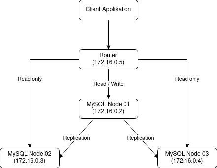

# Übung - Replication bei MySQL

## MySQL-Router

Bei diesem Beispiel wird mit diesem [GitHub-Repository](https://github.com/garutilorenzo/mysql-innodb-cluster) gearbeitet.

### Analyse docker-compose.yml

Der Aufbaue der Applikation wird in folgendem Diagramm aufgezeigt:



Die Konfigurationsdateien der Nodes sind im Verzeichnis ```config```abgelegt. Die Unterschiede der einzelnen Datei wird hier erklärt:

<!-- tabs:start -->

#### ** config/master.cnf **

Konfigurationsdatei für den Master-Node (Node 01).

```
[mysqld]

server-id = 1
port = 3306

binlog_format = ROW

gtid_mode=ON
enforce-gtid-consistency=true

log-slave-updates
log_bin = mysql-bin

default_storage_engine = InnoDB

# replication

report-host = mysql_node01
slave_net_timeout = 60

skip-slave-start

transaction_isolation = 'READ-COMMITTED'

binlog_checksum = NONE
relay_log_info_repository = TABLE
transaction_write_set_extraction = XXHASH64

auto_increment_increment = 1
auto_increment_offset = 2

binlog_transaction_dependency_tracking = WRITESET 
slave_parallel_type = LOGICAL_CLOCK
slave_preserve_commit_order = ON
```

#### ** config/replica.cnf **

Konfigurationsdatei für den Slave-Node (Node 02). Die Konfiguration ist ähnlich zu der des Master-Nodes, ausser dass hier noch ```read_only``` definiert wurde.

```
[mysqld]

server-id = 2
port = 3306

binlog_format = ROW

gtid_mode=ON
enforce-gtid-consistency=true

log-slave-updates
log_bin = mysql-bin

default_storage_engine = InnoDB

# replication

report-host = mysql_node02
slave_net_timeout = 60

skip-slave-start
read_only

transaction_isolation = 'READ-COMMITTED'

binlog_checksum = NONE
relay_log_info_repository = TABLE
transaction_write_set_extraction = XXHASH64

auto_increment_increment = 1
auto_increment_offset = 2

binlog_transaction_dependency_tracking = WRITESET
slave_parallel_type = LOGICAL_CLOCK
slave_preserve_commit_order = ON
```

#### ** config/replica-bis.cnf **

Konfigurationsdatei für den Slave-Node (Node 03). Die Konfiguration ist ähnlich zu der des Master-Nodes, ausser dass hier noch ```read_only``` definiert wurde.

```
[mysqld]

server-id = 3
port = 3306

binlog_format = ROW

gtid_mode=ON
enforce-gtid-consistency=true

log-slave-updates
log_bin = mysql-bin

default_storage_engine = InnoDB

# replication

report-host = mysql_node03
slave_net_timeout = 60

skip-slave-start
read_only

transaction_isolation = 'READ-COMMITTED'

binlog_checksum = NONE
relay_log_info_repository = TABLE
transaction_write_set_extraction = XXHASH64

auto_increment_increment = 1
auto_increment_offset = 2

binlog_transaction_dependency_tracking = WRITESET
slave_parallel_type = LOGICAL_CLOCK
slave_preserve_commit_order = ON
```

<!-- tabs:end -->

### Installation

Repository klonen und in das Verzeichnis wechseln:

```
sudo git clone https://github.com/garutilorenzo/mysql-innodb-cluster.git

cd mysql-innodb-cluster/
```

Umgebung starten:

```
docker-compose up -d
```

Mit folgendem kann noch überprüft werden, ob alles funktioniert:

```
docker-compose ps
docker-compose logs -f
```

**Ausgabe:**  


### Kontrolle

Login auf den Master-Node machen:

```
docker-compose exec mysql_node01 bash
```

Dann auf dem Master-Node eine Verbindung auf sich selbst machen:

```
mysqlsh --js root@mysql_node01 # Login mit root
```

Dann wird das Root-Password abgefragt (Standard: ```root```).

Führt man nun folgende Befehle aus, werden Informationen zum Cluster ausgegeben.

```
var cluster = dba.getCluster()
cluster.status()
```

**Ausgabe:**  


## ProxySQL und Spring Boot -> the Full Monty

Bei dieser Aufgabe wird mit diesem [GitHub-Repository](https://github.com/ivangfr/springboot-proxysql-mysql) gearbeitet.

### Analyse docker-compose.yml

Der Aufbaue der Applikation wird in folgendem Diagramm aufgezeigt:


### Installation

1. Applikation von GitHub herunterladen:

```
git clone https://github.com/ivangfr/springboot-proxysql-mysql.git
```

2. Applikation starten:

```
cd springboot-proxysql-mysql/

./init-environment.sh
```

War die Installation erfolgreich, wird folgendes angezeigt:


### MySQL Replikation

Befindet man sich im Verzeichnis ```springboot-proxysql-mysql```, lässt sich mit folgendem Skript den Status der MySQL Replikationen überprüfen:

```
./check-replication-status.sh
```

**Ausgabe:**

```
mysql-master
------------
File	Position	Binlog_Do_DB	Binlog_Ignore_DB	Executed_Gtid_Set
mysql-bin-1.000003	1397			ef63f0b7-f4c0-11ec-a54d-0242ac160002:1-14

mysql-slave-1
-------------
*************************** 1. row ***************************
               Slave_IO_State: Waiting for master to send event
                  Master_Host: mysql-master
                  Master_User: replication
                  Master_Port: 3306
                Connect_Retry: 60
              Master_Log_File: mysql-bin-1.000003
          Read_Master_Log_Pos: 1397
               Relay_Log_File: f503e01a6895-relay-bin.000003
                Relay_Log_Pos: 1614
        Relay_Master_Log_File: mysql-bin-1.000003
             Slave_IO_Running: Yes
            Slave_SQL_Running: Yes
              Replicate_Do_DB: 
          Replicate_Ignore_DB: 
           Replicate_Do_Table: 
       Replicate_Ignore_Table: 
      Replicate_Wild_Do_Table: 
  Replicate_Wild_Ignore_Table: 
                   Last_Errno: 0
                   Last_Error: 
                 Skip_Counter: 0
          Exec_Master_Log_Pos: 1397
              Relay_Log_Space: 3086770
              Until_Condition: None
               Until_Log_File: 
                Until_Log_Pos: 0
           Master_SSL_Allowed: No
           Master_SSL_CA_File: 
           Master_SSL_CA_Path: 
              Master_SSL_Cert: 
            Master_SSL_Cipher: 
               Master_SSL_Key: 
        Seconds_Behind_Master: 0
Master_SSL_Verify_Server_Cert: No
                Last_IO_Errno: 0
                Last_IO_Error: 
               Last_SQL_Errno: 0
               Last_SQL_Error: 
  Replicate_Ignore_Server_Ids: 
             Master_Server_Id: 1
                  Master_UUID: ef63f0b7-f4c0-11ec-a54d-0242ac160002
             Master_Info_File: /var/lib/mysql/master.info
                    SQL_Delay: 0
          SQL_Remaining_Delay: NULL
      Slave_SQL_Running_State: Slave has read all relay log; waiting for more updates
           Master_Retry_Count: 86400
                  Master_Bind: 
      Last_IO_Error_Timestamp: 
     Last_SQL_Error_Timestamp: 
               Master_SSL_Crl: 
           Master_SSL_Crlpath: 
           Retrieved_Gtid_Set: ef63f0b7-f4c0-11ec-a54d-0242ac160002:1-14
            Executed_Gtid_Set: ef63f0b7-f4c0-11ec-a54d-0242ac160002:1-14
                Auto_Position: 1
         Replicate_Rewrite_DB: 
                 Channel_Name: 
           Master_TLS_Version: 

mysql-slave-2
-------------
*************************** 1. row ***************************
               Slave_IO_State: Waiting for master to send event
                  Master_Host: mysql-master
                  Master_User: replication
                  Master_Port: 3306
                Connect_Retry: 60
              Master_Log_File: mysql-bin-1.000003
          Read_Master_Log_Pos: 1397
               Relay_Log_File: 93313bbcb9b2-relay-bin.000003
                Relay_Log_Pos: 1614
        Relay_Master_Log_File: mysql-bin-1.000003
             Slave_IO_Running: Yes
            Slave_SQL_Running: Yes
              Replicate_Do_DB: 
          Replicate_Ignore_DB: 
           Replicate_Do_Table: 
       Replicate_Ignore_Table: 
      Replicate_Wild_Do_Table: 
  Replicate_Wild_Ignore_Table: 
                   Last_Errno: 0
                   Last_Error: 
                 Skip_Counter: 0
          Exec_Master_Log_Pos: 1397
              Relay_Log_Space: 3086770
              Until_Condition: None
               Until_Log_File: 
                Until_Log_Pos: 0
           Master_SSL_Allowed: No
           Master_SSL_CA_File: 
           Master_SSL_CA_Path: 
              Master_SSL_Cert: 
            Master_SSL_Cipher: 
               Master_SSL_Key: 
        Seconds_Behind_Master: 0
Master_SSL_Verify_Server_Cert: No
                Last_IO_Errno: 0
                Last_IO_Error: 
               Last_SQL_Errno: 0
               Last_SQL_Error: 
  Replicate_Ignore_Server_Ids: 
             Master_Server_Id: 1
                  Master_UUID: ef63f0b7-f4c0-11ec-a54d-0242ac160002
             Master_Info_File: /var/lib/mysql/master.info
                    SQL_Delay: 0
          SQL_Remaining_Delay: NULL
      Slave_SQL_Running_State: Slave has read all relay log; waiting for more updates
           Master_Retry_Count: 86400
                  Master_Bind: 
      Last_IO_Error_Timestamp: 
     Last_SQL_Error_Timestamp: 
               Master_SSL_Crl: 
           Master_SSL_Crlpath: 
           Retrieved_Gtid_Set: ef63f0b7-f4c0-11ec-a54d-0242ac160002:1-14
            Executed_Gtid_Set: ef63f0b7-f4c0-11ec-a54d-0242ac160002:1-14
                Auto_Position: 1
         Replicate_Rewrite_DB: 
                 Channel_Name: 
           Master_TLS_Version: 
```

### ProxySQL Konfiguration

1. Befindet man sich im Verzeichnis ```springboot-proxysql-mysql```, kann man sich mit folgendem Skript mit dem ProxySQL Terminal verbinden:

```
./proxysql-admin.sh
```


2. Mit folgendem Befehl können die MySQL-Server angezeigt werden:

```
SELECT * FROM mysql_servers;
```

**Ausgabe:**

```
+--------------+---------------+------+-----------+--------+--------+-------------+-----------------+---------------------+---------+----------------+---------+
| hostgroup_id | hostname      | port | gtid_port | status | weight | compression | max_connections | max_replication_lag | use_ssl | max_latency_ms | comment |
+--------------+---------------+------+-----------+--------+--------+-------------+-----------------+---------------------+---------+----------------+---------+
| 10           | mysql-master  | 3306 | 0         | ONLINE | 1      | 0           | 100             | 5                   | 0       | 0              |         |
| 20           | mysql-slave-1 | 3306 | 0         | ONLINE | 1      | 0           | 100             | 5                   | 0       | 0              |         |
| 20           | mysql-slave-2 | 3306 | 0         | ONLINE | 1      | 0           | 100             | 5                   | 0       | 0              |         |
+--------------+---------------+------+-----------+--------+--------+-------------+-----------------+---------------------+---------+----------------+---------+
```

3. Mit diesem Befehl können die globalen Variablen angezeigt werden:

```
SELECT * FROM global_variables;
```

**Ausgabe:**

```
+----------------------------------------------------------------------+---------------------------------+
| variable_name                                                        | variable_value                  |
+----------------------------------------------------------------------+---------------------------------+
| mysql-default_charset                                                | utf8                            |
| mysql-default_collation_connection                                   | utf8_general_ci                 |
| mysql-shun_on_failures                                               | 5                               |
| mysql-shun_recovery_time_sec                                         | 10                              |
| mysql-query_retries_on_failure                                       | 1                               |
| mysql-client_multi_statements                                        | true                            |
| mysql-client_host_cache_size                                         | 0                               |
| mysql-client_host_error_counts                                       | 0                               |
| mysql-connect_retries_on_failure                                     | 10                              |
| mysql-connect_retries_delay                                          | 1                               |
| mysql-connection_delay_multiplex_ms                                  | 0                               |
| mysql-connection_max_age_ms                                          | 0                               |
| mysql-connect_timeout_client                                         | 10000                           |
| mysql-connect_timeout_server_max                                     | 10000                           |
| mysql-enable_client_deprecate_eof                                    | true                            |
| mysql-enable_server_deprecate_eof                                    | true                            |
| mysql-enable_load_data_local_infile                                  | false                           |
| mysql-eventslog_filename                                             |                                 |
| mysql-eventslog_filesize                                             | 104857600                       |
| mysql-eventslog_default_log                                          | 0                               |
| mysql-eventslog_format                                               | 1                               |
| mysql-auditlog_filename                                              |                                 |
| mysql-auditlog_filesize                                              | 104857600                       |
| mysql-handle_unknown_charset                                         | 1                               |
| mysql-free_connections_pct                                           | 10                              |
| mysql-connection_warming                                             | false                           |
| mysql-session_idle_ms                                                | 1                               |
| mysql-have_ssl                                                       | false                           |
| mysql-client_found_rows                                              | true                            |
| mysql-log_mysql_warnings_enabled                                     | false                           |
| mysql-monitor_enabled                                                | true                            |
| mysql-monitor_connect_timeout                                        | 600                             |
| mysql-monitor_ping_max_failures                                      | 3                               |
| mysql-monitor_ping_timeout                                           | 1000                            |
| mysql-monitor_read_only_interval                                     | 1000                            |
| mysql-monitor_read_only_timeout                                      | 800                             |
| mysql-monitor_read_only_max_timeout_count                            | 3                               |
| mysql-monitor_replication_lag_interval                               | 10000                           |
| mysql-monitor_replication_lag_timeout                                | 1000                            |
| mysql-monitor_replication_lag_count                                  | 1                               |
| mysql-monitor_groupreplication_healthcheck_interval                  | 5000                            |
| mysql-monitor_groupreplication_healthcheck_timeout                   | 800                             |
| mysql-monitor_groupreplication_healthcheck_max_timeout_count         | 3                               |
| mysql-monitor_groupreplication_max_transactions_behind_count         | 3                               |
| mysql-monitor_groupreplication_max_transactions_behind_for_read_only | 1                               |
| mysql-monitor_galera_healthcheck_interval                            | 5000                            |
| mysql-monitor_galera_healthcheck_timeout                             | 800                             |
| mysql-monitor_galera_healthcheck_max_timeout_count                   | 3                               |
| mysql-monitor_replication_lag_use_percona_heartbeat                  |                                 |
| mysql-monitor_query_interval                                         | 60000                           |
| mysql-monitor_query_timeout                                          | 100                             |
| mysql-monitor_slave_lag_when_null                                    | 60                              |
| mysql-monitor_threads_min                                            | 8                               |
| mysql-monitor_threads_max                                            | 128                             |
| mysql-monitor_threads_queue_maxsize                                  | 128                             |
| mysql-monitor_wait_timeout                                           | true                            |
| mysql-monitor_writer_is_also_reader                                  | true                            |
| mysql-max_allowed_packet                                             | 67108864                        |
| mysql-tcp_keepalive_time                                             | 0                               |
| mysql-use_tcp_keepalive                                              | false                           |
| mysql-automatic_detect_sqli                                          | false                           |
| mysql-firewall_whitelist_enabled                                     | false                           |
| mysql-firewall_whitelist_errormsg                                    | Firewall blocked this query     |
| mysql-throttle_connections_per_sec_to_hostgroup                      | 1000000                         |
| mysql-max_transaction_idle_time                                      | 14400000                        |
| mysql-max_transaction_time                                           | 14400000                        |
| mysql-multiplexing                                                   | true                            |
| mysql-log_unhealthy_connections                                      | true                            |
| mysql-enforce_autocommit_on_reads                                    | false                           |
| mysql-autocommit_false_not_reusable                                  | false                           |
| mysql-autocommit_false_is_transaction                                | false                           |
| mysql-verbose_query_error                                            | false                           |
| mysql-hostgroup_manager_verbose                                      | 1                               |
| mysql-binlog_reader_connect_retry_msec                               | 3000                            |
| mysql-threshold_query_length                                         | 524288                          |
| mysql-threshold_resultset_size                                       | 4194304                         |
| mysql-query_digests_max_digest_length                                | 2048                            |
| mysql-query_digests_max_query_length                                 | 65000                           |
| mysql-query_digests_grouping_limit                                   | 3                               |
| mysql-wait_timeout                                                   | 28800000                        |
| mysql-throttle_max_bytes_per_second_to_client                        | 0                               |
| mysql-throttle_ratio_server_to_client                                | 0                               |
| mysql-max_stmts_per_connection                                       | 20                              |
| mysql-max_stmts_cache                                                | 10000                           |
| mysql-mirror_max_concurrency                                         | 16                              |
| mysql-mirror_max_queue_length                                        | 32000                           |
| mysql-default_max_latency_ms                                         | 1000                            |
| mysql-query_processor_iterations                                     | 0                               |
| mysql-query_processor_regex                                          | 1                               |
| mysql-set_query_lock_on_hostgroup                                    | 1                               |
| mysql-reset_connection_algorithm                                     | 2                               |
| mysql-auto_increment_delay_multiplex                                 | 5                               |
| mysql-long_query_time                                                | 1000                            |
| mysql-query_cache_size_MB                                            | 256                             |
| mysql-poll_timeout_on_failure                                        | 100                             |
| mysql-server_capabilities                                            | 569867                          |
| mysql-keep_multiplexing_variables                                    | tx_isolation,version            |
| mysql-kill_backend_connection_when_disconnect                        | true                            |
| mysql-client_session_track_gtid                                      | true                            |
| mysql-session_idle_show_processlist                                  | true                            |
| mysql-show_processlist_extended                                      | 0                               |
| mysql-query_digests                                                  | true                            |
| mysql-query_digests_lowercase                                        | false                           |
| mysql-query_digests_replace_null                                     | false                           |
| mysql-query_digests_no_digits                                        | false                           |
| mysql-query_digests_normalize_digest_text                            | false                           |
| mysql-query_digests_track_hostname                                   | false                           |
| mysql-servers_stats                                                  | true                            |
| mysql-default_reconnect                                              | true                            |
| mysql-ssl_p2s_ca                                                     |                                 |
| mysql-ssl_p2s_capath                                                 |                                 |
| mysql-ssl_p2s_cert                                                   |                                 |
| mysql-ssl_p2s_key                                                    |                                 |
| mysql-ssl_p2s_cipher                                                 |                                 |
| mysql-ssl_p2s_crl                                                    |                                 |
| mysql-ssl_p2s_crlpath                                                |                                 |
| mysql-init_connect                                                   |                                 |
| mysql-ldap_user_variable                                             |                                 |
| mysql-add_ldap_user_comment                                          |                                 |
| mysql-default_tx_isolation                                           | READ-COMMITTED                  |
| mysql-default_session_track_gtids                                    | OFF                             |
| mysql-connpoll_reset_queue_length                                    | 50                              |
| mysql-min_num_servers_lantency_awareness                             | 1000                            |
| mysql-aurora_max_lag_ms_only_read_from_replicas                      | 2                               |
| mysql-stats_time_backend_query                                       | false                           |
| mysql-stats_time_query_processor                                     | false                           |
| mysql-query_cache_stores_empty_result                                | true                            |
| admin-stats_credentials                                              | stats:stats                     |
| admin-stats_mysql_connections                                        | 60                              |
| admin-stats_mysql_connection_pool                                    | 60                              |
| admin-stats_mysql_query_cache                                        | 60                              |
| admin-stats_mysql_query_digest_to_disk                               | 0                               |
| admin-stats_system_cpu                                               | 60                              |
| admin-stats_system_memory                                            | 60                              |
| admin-telnet_admin_ifaces                                            | (null)                          |
| admin-telnet_stats_ifaces                                            | (null)                          |
| admin-read_only                                                      | false                           |
| admin-hash_passwords                                                 | true                            |
| admin-vacuum_stats                                                   | true                            |
| admin-version                                                        | 2.3.2-10-g8cd66cf               |
| admin-cluster_username                                               |                                 |
| admin-cluster_password                                               |                                 |
| admin-cluster_check_interval_ms                                      | 1000                            |
| admin-cluster_check_status_frequency                                 | 10                              |
| admin-cluster_mysql_query_rules_diffs_before_sync                    | 3                               |
| admin-cluster_mysql_servers_diffs_before_sync                        | 3                               |
| admin-cluster_mysql_users_diffs_before_sync                          | 3                               |
| admin-cluster_proxysql_servers_diffs_before_sync                     | 3                               |
| admin-cluster_mysql_variables_diffs_before_sync                      | 3                               |
| admin-cluster_admin_variables_diffs_before_sync                      | 3                               |
| admin-cluster_ldap_variables_diffs_before_sync                       | 3                               |
| admin-cluster_mysql_query_rules_save_to_disk                         | true                            |
| admin-cluster_mysql_servers_save_to_disk                             | true                            |
| admin-cluster_mysql_users_save_to_disk                               | true                            |
| admin-cluster_proxysql_servers_save_to_disk                          | true                            |
| admin-cluster_mysql_variables_save_to_disk                           | true                            |
| admin-cluster_admin_variables_save_to_disk                           | true                            |
| admin-cluster_ldap_variables_save_to_disk                            | true                            |
| admin-checksum_mysql_query_rules                                     | true                            |
| admin-checksum_mysql_servers                                         | true                            |
| admin-checksum_mysql_users                                           | true                            |
| admin-checksum_mysql_variables                                       | true                            |
| admin-checksum_admin_variables                                       | true                            |
| admin-checksum_ldap_variables                                        | true                            |
| admin-restapi_enabled                                                | false                           |
| admin-restapi_port                                                   | 6070                            |
| admin-web_enabled                                                    | false                           |
| admin-web_port                                                       | 6080                            |
| admin-web_verbosity                                                  | 0                               |
| admin-prometheus_memory_metrics_interval                             | 61                              |
| admin-admin_credentials                                              | admin:admin;radmin:radmin       |
| admin-mysql_ifaces                                                   | 0.0.0.0:6032                    |
| admin-refresh_interval                                               | 2000                            |
| mysql-threads                                                        | 4                               |
| mysql-max_connections                                                | 2048                            |
| mysql-default_query_delay                                            | 0                               |
| mysql-default_query_timeout                                          | 36000000                        |
| mysql-have_compress                                                  | true                            |
| mysql-poll_timeout                                                   | 2000                            |
| mysql-interfaces                                                     | 0.0.0.0:6033;/tmp/proxysql.sock |
| mysql-default_schema                                                 | information_schema              |
| mysql-stacksize                                                      | 1048576                         |
| mysql-server_version                                                 | 5.1.30                          |
| mysql-connect_timeout_server                                         | 10000                           |
| mysql-monitor_history                                                | 60000                           |
| mysql-monitor_connect_interval                                       | 200000                          |
| mysql-monitor_ping_interval                                          | 200000                          |
| mysql-ping_interval_server_msec                                      | 10000                           |
| mysql-ping_timeout_server                                            | 200                             |
| mysql-commands_stats                                                 | true                            |
| mysql-sessions_sort                                                  | true                            |
| mysql-monitor_username                                               | monitor                         |
| mysql-monitor_password                                               | monitor                         |
+----------------------------------------------------------------------+---------------------------------+
```

### Customer-API starten

1. Befindet man sich im Verzeichnis ```springboot-proxysql-mysql```, kann mit folgendem Maven-Befehl die ```Customer API``` gestartet werden:

```
./mvnw clean spring-boot:run --projects customer-api
```

Sobal alles heruntergeladen ist und die Applikation gestartet wurde, sieht es etwa so aus:


2. Die Swagger Webseite kann unter [http://localhost:8080/swagger-ui.html](http://localhost:8080/swagger-ui.html) erreicht werden. Die Webseite sieht so aus:


### Simulation

#### Vorbereitung

1. Als erstes öffnet man drei Terminal-Fenster. In jedem dieser drei Terminals wird sich mit je eines der folgenden Befehle mit ```mysql-master```, ```mysql-slave-1``` oder ```mysql-slave-2``` verbunden.

**mysql-master:**

```
docker exec -it -e MYSQL_PWD=secret mysql-master mysql -uroot --database customerdb
```

**mysql-slave-1:**

```
docker exec -it -e MYSQL_PWD=secret mysql-slave-1 mysql -uroot --database customerdb
```

**mysql-slave-2:**

```
docker exec -it -e MYSQL_PWD=secret mysql-slave-2 mysql -uroot --database customerdb
```

2. In jedem dieser drei ```MySQL Monitors``` werden mit folgenden Befehlen die MySQL Logs aktiviert:

```
SET GLOBAL general_log = 'ON';
SET global log_output = 'table';
```

#### POST

1. Man öffnet ein neues Terminal-Fenster und gibt dort folgenden ```curl```Befehl ein, um einen neuen Kunden (Customer) zu erstellen:

```
curl -i -X POST http://localhost:8080/api/customers \
  -H 'Content-Type: application/json' \
  -d '{"firstName": "Ivan", "lastName": "Franchin"}'
```

**Ausgabe:**


2. Als nächstes führt man im Terminal von ```mysql-master``` folgenden SELECT-Befehl aus:

```
SELECT event_time, command_type, SUBSTRING(argument,1,250) argument FROM mysql.general_log
WHERE command_type = 'Query' AND (argument LIKE 'insert into customers %' OR argument LIKE 'select customer0_.id %' OR argument LIKE 'update customers %' OR argument LIKE 'delete from customers %');
```

**Ausgabe:**

```
+----------------------------+--------------+-------------------------------------------------------------------------------------------------------------------------------------------------+
| event_time                 | command_type | argument                                                                                                                                        |
+----------------------------+--------------+-------------------------------------------------------------------------------------------------------------------------------------------------+
| 2022-06-25 23:03:44.981041 | Query        | insert into customers (created_at, first_name, last_name, updated_at) values ('2022-06-25 23:03:44', 'Ivan', 'Franchin', '2022-06-25 23:03:44') |
+----------------------------+--------------+-------------------------------------------------------------------------------------------------------------------------------------------------+
```

Die Ausgabe beschreibt den Befehl, welcher für die Erstellung des Kundens (siehe Schritt 3) ausgeführt wurde.
Führt man den gleichen SELECT-Befehl bei einem der ```mysql-slave``` Terminals aus, so sieht man, dass diese nicht den INSERT-Befehl durchgeführt haben. Nur beim ```mysql-master``` werden INSERTS, UPDATES und DELETES durchgeführt. 

#### GET

1. Über eine ```GET``` kann der Kunden mit der ID: 1 abfragen werden. Dazu gibt man folgenden Befehl in einem neuen Terminal ein:

```
curl -i http://localhost:8080/api/customers/1
```

**Ausgabe:**


2. Nun kann man folgenden SELECT-Befehl in einem der ```mysql-slave``` Terminals aus:

```
SELECT event_time, command_type, SUBSTRING(argument,1,250) argument FROM mysql.general_log
WHERE command_type = 'Query' AND (argument LIKE 'insert into customers %' OR argument LIKE 'select customer0_.id %' OR argument LIKE 'update customers %' OR argument LIKE 'delete from customers %');
```

**Ausgabe:**

```
+----------------------------+--------------+-----------------------------------------------------------------------------------------------------------------------------------------------------------------------------------------------------------------------------------------------------+
| event_time                 | command_type | argument                                                                                                                                                                                                                                            |
+----------------------------+--------------+-----------------------------------------------------------------------------------------------------------------------------------------------------------------------------------------------------------------------------------------------------+
| 2022-06-25 23:22:16.588692 | Query        | select customer0_.id as id1_0_0_, customer0_.created_at as created_2_0_0_, customer0_.first_name as first_na3_0_0_, customer0_.last_name as last_nam4_0_0_, customer0_.updated_at as updated_5_0_0_ from customers customer0_ where customer0_.id=1 |
+----------------------------+--------------+-----------------------------------------------------------------------------------------------------------------------------------------------------------------------------------------------------------------------------------------------------+
```

> [!NOTE|style:callout]
> Die Abfrage sollte nur von einem der beiden ```mysql-slave``` durchgfeführt worden sein.

#### UPDATE

1. Ein UPDATE-Befehl wird auf den Customer mit der ID: 1 ausgeführt. Dazu gibt man folgenden Befehl in einem neuen Terminal ein:

```
curl -i -X PUT http://localhost:8080/api/customers/1 \
  -H 'Content-Type: application/json' \
  -d '{"firstName": "Ivan2", "lastName": "Franchin2"}'
```

**Ausgabe:**


2. Folgenden SELECT-Befehl wird dann im Terminal von ```mysql-master``` eingegeben:

```
SELECT event_time, command_type, SUBSTRING(argument,1,250) argument FROM mysql.general_log
WHERE command_type = 'Query' AND (argument LIKE 'insert into customers %' OR argument LIKE 'select customer0_.id %' OR argument LIKE 'update customers %' OR argument LIKE 'delete from customers %');
```

**Ausgabe:**

> [!NOTE|style:callout]
> Bei diesem Schritt ist nur der zweite Eintrag relevant.

```
+----------------------------+--------------+-------------------------------------------------------------------------------------------------------------------------------------------------+
| event_time                 | command_type | argument                                                                                                                                        |
+----------------------------+--------------+-------------------------------------------------------------------------------------------------------------------------------------------------+
| 2022-06-25 23:03:44.981041 | Query        | insert into customers (created_at, first_name, last_name, updated_at) values ('2022-06-25 23:03:44', 'Ivan', 'Franchin', '2022-06-25 23:03:44') |
| 2022-06-25 23:33:46.760676 | Query        | update customers set created_at='2022-06-25 23:03:44', first_name='Ivan2', last_name='Franchin2', updated_at='2022-06-25 23:33:46' where id=1   |
+----------------------------+--------------+-------------------------------------------------------------------------------------------------------------------------------------------------+
```

Der UPDATE-Befehl wird nur vom ```mysql-master``` verarbeitet. Allerdings wird während dem UPDATE noch ein SELECT ausgeführt. Dieser wird wieder von einem der beiden ```mysql-slave```bearbeitet. Auf einem der ```mysql-slave``` sieht es dann wie folgt aus:

```
+----------------------------+--------------+-----------------------------------------------------------------------------------------------------------------------------------------------------------------------------------------------------------------------------------------------------+
| event_time                 | command_type | argument                                                                                                                                                                                                                                            |
+----------------------------+--------------+-----------------------------------------------------------------------------------------------------------------------------------------------------------------------------------------------------------------------------------------------------+
| 2022-06-25 23:33:46.745779 | Query        | select customer0_.id as id1_0_0_, customer0_.created_at as created_2_0_0_, customer0_.first_name as first_na3_0_0_, customer0_.last_name as last_nam4_0_0_, customer0_.updated_at as updated_5_0_0_ from customers customer0_ where customer0_.id=1 |
+----------------------------+--------------+-----------------------------------------------------------------------------------------------------------------------------------------------------------------------------------------------------------------------------------------------------+
```

#### DELETE

1. Ein DELETE-Befehl soll auf den Customer mit der ID: 1 ausgeführt werden. Dazu gibt man folgenden Befehl in einem neuen Terminal ein:

```
curl -i -X DELETE http://localhost:8080/api/customers/1
```

**Ausgabe:**


2. Folgenden SELECT-Befehl wird dann im Terminal von ```mysql-master``` eingegeben:

```
SELECT event_time, command_type, SUBSTRING(argument,1,250) argument FROM mysql.general_log
WHERE command_type = 'Query' AND (argument LIKE 'insert into customers %' OR argument LIKE 'select customer0_.id %' OR argument LIKE 'update customers %' OR argument LIKE 'delete from customers %');
```

**Ausgabe:**

> [!NOTE|style:callout]
> Bei diesem Schritt ist nur der dritte Eintrag relevant.

```
+----------------------------+--------------+-------------------------------------------------------------------------------------------------------------------------------------------------+
| event_time                 | command_type | argument                                                                                                                                        |
+----------------------------+--------------+-------------------------------------------------------------------------------------------------------------------------------------------------+
| 2022-06-25 23:03:44.981041 | Query        | insert into customers (created_at, first_name, last_name, updated_at) values ('2022-06-25 23:03:44', 'Ivan', 'Franchin', '2022-06-25 23:03:44') |
| 2022-06-25 23:33:46.760676 | Query        | update customers set created_at='2022-06-25 23:03:44', first_name='Ivan2', last_name='Franchin2', updated_at='2022-06-25 23:33:46' where id=1   |
| 2022-06-25 23:49:13.961370 | Query        | delete from customers where id=1                                                                                                                |
+----------------------------+--------------+-------------------------------------------------------------------------------------------------------------------------------------------------+
```

Der DELETE-Befehl wird nur vom ```mysql-master``` verarbeitet. Während dem DELETE wird zusätzlich noch ein SELECT ausgeführt. Dieser wird wieder von einem der beiden ```mysql-slave```bearbeitet. Auf einem der ```mysql-slave``` sieht es dann wie folgt aus (siehe zweiter Eintrag):

```
+----------------------------+--------------+-----------------------------------------------------------------------------------------------------------------------------------------------------------------------------------------------------------------------------------------------------+
| event_time                 | command_type | argument                                                                                                                                                                                                                                            |
+----------------------------+--------------+-----------------------------------------------------------------------------------------------------------------------------------------------------------------------------------------------------------------------------------------------------+
| 2022-06-25 23:33:46.745779 | Query        | select customer0_.id as id1_0_0_, customer0_.created_at as created_2_0_0_, customer0_.first_name as first_na3_0_0_, customer0_.last_name as last_nam4_0_0_, customer0_.updated_at as updated_5_0_0_ from customers customer0_ where customer0_.id=1 |
| 2022-06-25 23:49:13.955022 | Query        | select customer0_.id as id1_0_0_, customer0_.created_at as created_2_0_0_, customer0_.first_name as first_na3_0_0_, customer0_.last_name as last_nam4_0_0_, customer0_.updated_at as updated_5_0_0_ from customers customer0_ where customer0_.id=1 |
+----------------------------+--------------+-----------------------------------------------------------------------------------------------------------------------------------------------------------------------------------------------------------------------------------------------------+
```

### Beenden

1. Um die Applikation zu stoppen, drückt man ```Ctrl+C``` innerhalb des Terminals, in dem es ausgeführt wurde.

2. Um die MySQL Monitors zu beenden, kann man in diesen jeweils ```exit``` eingeben.

3. Um die MySQL und ProxySQL Container zu stoppen und zu entfernen, wechselt man in das Verzeichnis ```springboot-proxysql-mysql``` und führt folgendes Skript aus:

```
./shutdown-environment.sh
```

**Ausgabe:**


