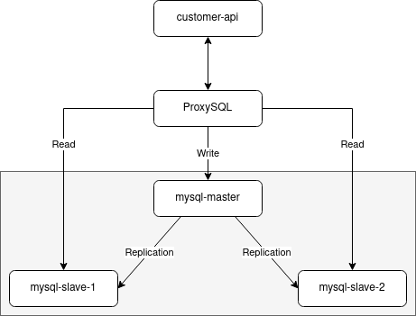

# Übung - Replication bei MySQL

## MySQL-Router

Bei diesem Beispiel wird mit diesem [GitHub-Repository](https://github.com/garutilorenzo/mysql-innodb-cluster) gearbeitet.

### Analyse docker-compose.yml

Der Aufbaue der Applikation wird in folgendem Diagramm aufgezeigt:


Die Konfigurationsdateien der Nodes sind im Verzeichnis ```config```abgelegt. Die Unterschiede der einzelnen Datei wird hier erklärt:

<!-- tabs:start -->

#### ** config/master.cnf **

Konfigurationsdatei für den Master-Node (Node 01).

```
[mysqld]

server-id = 1
port = 3306

binlog_format = ROW

gtid_mode=ON
enforce-gtid-consistency=true

log-slave-updates
log_bin = mysql-bin

default_storage_engine = InnoDB

# replication

report-host = mysql_node01
slave_net_timeout = 60

skip-slave-start

transaction_isolation = 'READ-COMMITTED'

binlog_checksum = NONE
relay_log_info_repository = TABLE
transaction_write_set_extraction = XXHASH64

auto_increment_increment = 1
auto_increment_offset = 2

binlog_transaction_dependency_tracking = WRITESET 
slave_parallel_type = LOGICAL_CLOCK
slave_preserve_commit_order = ON
```

#### ** config/replica.cnf **

Konfigurationsdatei für den Slave-Node (Node 02). Die Konfiguration ist ähnlich zu der des Master-Nodes, ausser dass hier noch ```read_only``` definiert wurde.

```
[mysqld]

server-id = 2
port = 3306

binlog_format = ROW

gtid_mode=ON
enforce-gtid-consistency=true

log-slave-updates
log_bin = mysql-bin

default_storage_engine = InnoDB

# replication

report-host = mysql_node02
slave_net_timeout = 60

skip-slave-start
read_only

transaction_isolation = 'READ-COMMITTED'

binlog_checksum = NONE
relay_log_info_repository = TABLE
transaction_write_set_extraction = XXHASH64

auto_increment_increment = 1
auto_increment_offset = 2

binlog_transaction_dependency_tracking = WRITESET
slave_parallel_type = LOGICAL_CLOCK
slave_preserve_commit_order = ON
```

#### ** config/replica-bis.cnf **

Konfigurationsdatei für den Slave-Node (Node 03). Die Konfiguration ist ähnlich zu der des Master-Nodes, ausser dass hier noch ```read_only``` definiert wurde.

```
[mysqld]

server-id = 3
port = 3306

binlog_format = ROW

gtid_mode=ON
enforce-gtid-consistency=true

log-slave-updates
log_bin = mysql-bin

default_storage_engine = InnoDB

# replication

report-host = mysql_node03
slave_net_timeout = 60

skip-slave-start
read_only

transaction_isolation = 'READ-COMMITTED'

binlog_checksum = NONE
relay_log_info_repository = TABLE
transaction_write_set_extraction = XXHASH64

auto_increment_increment = 1
auto_increment_offset = 2

binlog_transaction_dependency_tracking = WRITESET
slave_parallel_type = LOGICAL_CLOCK
slave_preserve_commit_order = ON
```

<!-- tabs:end -->

### Installation

Repository klonen und in das Verzeichnis wechseln:

```
sudo git clone https://github.com/garutilorenzo/mysql-innodb-cluster.git

cd mysql-innodb-cluster/
```

Umgebung starten:

```
docker-compose up -d
```

Mit folgendem kann noch überprüft werden, ob alles funktioniert:

```
docker-compose ps
docker-compose logs -f
```

**Ausgabe:**  


### Kontrolle

Login auf den Master-Node machen:

```
docker-compose exec mysql_node01 bash
```

Dann auf dem Master-Node eine Verbindung auf sich selbst machen:

```
mysqlsh --js root@mysql_node01 # Login mit root
```

Dann wird das Root-Password abgefragt (Standard: ```root```).

Führt man nun folgende Befehle aus, werden Informationen zum Cluster ausgegeben.

```
var cluster = dba.getCluster()
cluster.status()
```

**Ausgabe:**  


## ProxySQL und Spring Boot -> the Full Monty

Bei dieser Aufgabe wird mit diesem [GitHub-Repository](https://github.com/ivangfr/springboot-proxysql-mysql) gearbeitet.

Die Infrastruktur, welche aufgebaut wird, sieht dann wie folgt aus:



### Installation

1. Applikation von GitHub herunterladen:

```
git clone https://github.com/ivangfr/springboot-proxysql-mysql.git
```

2. Applikation starten:

```
cd springboot-proxysql-mysql/

./init-environment.sh
```
