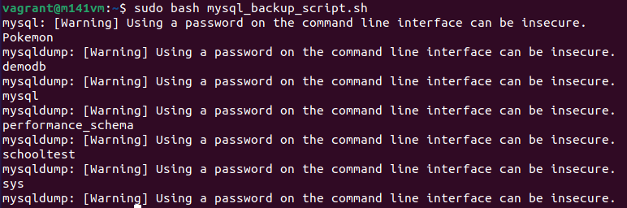
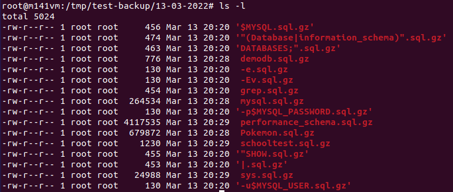
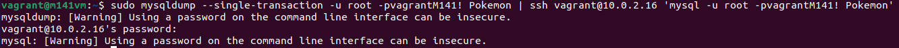

# Backup / Restore und Migration

## Backup-Begriffe

* **Cold:**  
  Während dem Import/Export stehen dem Endbenutzer keine Daten zur Verfügung.

* **Warm:**  
  Während dem Import/Export stehen dem Endbenutzer die Daten eingeschränkt (z.B. nur lesend) zur Verfügung.

* **Hot:**  
  Während dem Import/Export stehen dem Endbenutzer die Daten voll funktionsfähig zur Verfügung.

* **Logisch:**  
   Das Backup steht in "menschlesbarer Form" (z.B. SQL-Script) zur Verfügung.

* **Physisch:**  
  Das Backup steht in binärer Form (z.B. Filesystem-Snapshot) zur Verfügung.

* **Full vs. Incremental:**
  * Full: Gesamter Datenbestand wird gesichert.
  * Incremental: Differenzen von Datenbeständen werden gesichert.

## Percona XtraBackup

Percona XtraBackup ist eine Open-Source Backup-Software für MySQL. Diese Software eignet sich zur Erstellung von Hot-Backups. Dies ist besonders bei 24x7 hochbelasteten Servern sehr nützlich.  
Percona XtraBackup 8.0 kann Daten aus InnoDB-, XtraDB-, MyISAM- und MyRocks-Tabellen auf MySQL 8.0-Servern sowie auf Percona Server für MySQL mit XtraDB, Percona Server für MySQL 8.0 und Percona XtraDB Cluster 8.0 sichern.  
  
Links:  
* [Offizielle Webseite](https://www.percona.com/downloads/Percona-XtraBackup-LATEST/)
* [GitHub](https://github.com/percona/percona-xtrabackup)

## Aufgabe 1 - Lokales Backup

**Aufgabe:**  
Richten Sie auf Ihrem Server ein Backup-Script, gemäss der Vorlage, ein. Testen Sie das Script aus ob der Export funktioniert und Sie die Daten auch wieder importieren können ("Niemand will Backup - alle wollen restore")

1. Das Backup-Skript erstellen:

```bash
#!/bin/bash
# Add the backup dir location, MySQL root password, MySQL and mysqldump location
DATE=$(date +%d-%m-%Y)
BACKUP_DIR="/tmp/test-backup"
MYSQL_USER='root'
MYSQL_PASSWORD='vagrantM141!'
MYSQL=/usr/bin/mysql
MYSQLDUMP=/usr/bin/mysqldump

# To create a new directory in the backup directory location based on the date
mkdir -p $BACKUP_DIR/$DATE

# To get a list of databases
databases='$MYSQL -u$MYSQL_USER -p$MYSQL_PASSWORD -e "SHOW DATABASES;" | grep -Ev "(Database|information_schema)"' # ' sollen durch ` ersetzt werden

# To dump each database in a separate file
for db in $databases; do
echo $db
$MYSQLDUMP --single-transaction --force --opt --skip-lock-tables --user=$MYSQL_USER -p$MYSQL_PASSWORD --databases $db | gzip > "$BACKUP_DIR/$DATE/$db.sql.gz"
done

# Delete the files older than 10 days
find $BACKUP_DIR/* -mtime +10 -exec rm {} \;
```

2. Das Backup-Skript ausführen:  
  


3. Backup-Verzeichnis überprüfen:  
  


## Aufgabe 2 - mydumper und myloader

**Vorbereitung:**
1. Installieren Sie die Software mydumper und myloader gemäss der Anleitung von [hier](https://github.com/mydumper/mydumper#how-to-install-mydumpermyloader)

```
sudo apt install libatomic1
```

```
sudo wget https://github.com/mydumper/mydumper/releases/download/v0.12.1/mydumper_0.12.1-1-zstd.focal_amd64.deb
```

```
sudo dpkg -i mydumper_0.12.1-1-zstd.focal_amd64.deb
```

2. Beachten Sie die man-Page des Werkzeugs (oder die Anleitung [hier](https://github.com/mydumper/mydumper/blob/master/docs/mydumper_usage.rst))

**Aufgabe:**
1. Führen Sie mittels mydumper ein DB-Backup von Ihrem Pokémon-Datenbank durch. Achtung:
   a. Benutzen Sie für das Backup 6 parallele Threads
   b. Komprimieren Sie das Backup
2. Machen Sie vielleicht sicherheitshalber ein Snapshot Ihrer VM...
3. Löschen Sie die orginale DB
4. Restoren Sie die DB aus Ihrem Backup

Backup von Pokémon Datenbank erstellen:
```
sudo mydumper -u root -p vagrantM141! --database Pokemon --compress --threads 6
```

Pokémon Datenbank löschen:
```sql
DROP DATABASE Pokemon;
```

Backup wiederherstellen:
```
sudo myloader -u root -p vagrantM141! --directory export-20220313-212203 --overwrite-tables --verbose=3
```

**Ausgabe:**
```
** Message: 21:28:32.909: Server version reported as: 8.0.27-0ubuntu0.21.04.1
** Message: 21:28:32.913: Thread 1 restoring create database on `Pokemon` from Pokemon-schema-create.sql.zst
** Message: 21:28:32.916: Thread 3 restoring table `Pokemon`.`pokemon_abilities` from /home/vagrant/export-20220313-212203/Pokemon.pokemon_abilities-schema.sql.zst
** Message: 21:28:32.916: Dropping table or view (if exists) `Pokemon`.`pokemon_abilities`
** Message: 21:28:32.916: Thread 1 restoring table `Pokemon`.`abilities` from /home/vagrant/export-20220313-212203/Pokemon.abilities-schema.sql.zst
** Message: 21:28:32.916: Dropping table or view (if exists) `Pokemon`.`abilities`
** Message: 21:28:32.916: Thread 2 restoring table `Pokemon`.`att_def_hp` from /home/vagrant/export-20220313-212203/Pokemon.att_def_hp-schema.sql.zst
** Message: 21:28:32.916: Dropping table or view (if exists) `Pokemon`.`att_def_hp`
** Message: 21:28:32.917: Creating table `Pokemon`.`pokemon_abilities` from content in /home/vagrant/export-20220313-212203/Pokemon.pokemon_abilities-schema.sql.zst
** Message: 21:28:32.917: Creating table `Pokemon`.`abilities` from content in /home/vagrant/export-20220313-212203/Pokemon.abilities-schema.sql.zst
** Message: 21:28:32.917: Creating table `Pokemon`.`att_def_hp` from content in /home/vagrant/export-20220313-212203/Pokemon.att_def_hp-schema.sql.zst
** Message: 21:28:32.917: Thread 4 restoring table `Pokemon`.`pokemon_habitats` from /home/vagrant/export-20220313-212203/Pokemon.pokemon_habitats-schema.sql.zst
** Message: 21:28:32.917: Dropping table or view (if exists) `Pokemon`.`pokemon_habitats`
** Message: 21:28:32.918: Creating table `Pokemon`.`pokemon_habitats` from content in /home/vagrant/export-20220313-212203/Pokemon.pokemon_habitats-schema.sql.zst
** Message: 21:28:32.943: Thread 1 restoring table `Pokemon`.`pokemon_moves` from /home/vagrant/export-20220313-212203/Pokemon.pokemon_moves-schema.sql.zst
** Message: 21:28:32.943: Dropping table or view (if exists) `Pokemon`.`pokemon_moves`
** Message: 21:28:32.944: Creating table `Pokemon`.`pokemon_moves` from content in /home/vagrant/export-20220313-212203/Pokemon.pokemon_moves-schema.sql.zst
** Message: 21:28:32.947: Thread 4 restoring table `Pokemon`.`moves` from /home/vagrant/export-20220313-212203/Pokemon.moves-schema.sql.zst
** Message: 21:28:32.947: Dropping table or view (if exists) `Pokemon`.`moves`
** Message: 21:28:32.957: Thread 2 restoring table `Pokemon`.`pokemon_evolution_matchup` from /home/vagrant/export-20220313-212203/Pokemon.pokemon_evolution_matchup-schema.sql.zst
** Message: 21:28:32.957: Dropping table or view (if exists) `Pokemon`.`pokemon_evolution_matchup`
** Message: 21:28:32.958: Creating table `Pokemon`.`pokemon_evolution_matchup` from content in /home/vagrant/export-20220313-212203/Pokemon.pokemon_evolution_matchup-schema.sql.zst
** Message: 21:28:32.982: Thread 3 restoring table `Pokemon`.`base_stats` from /home/vagrant/export-20220313-212203/Pokemon.base_stats-schema.sql.zst
** Message: 21:28:32.982: Dropping table or view (if exists) `Pokemon`.`base_stats`
** Message: 21:28:32.982: Creating table `Pokemon`.`base_stats` from content in /home/vagrant/export-20220313-212203/Pokemon.base_stats-schema.sql.zst
** Message: 21:28:33.048: Thread 1 restoring table `Pokemon`.`version_groups` from /home/vagrant/export-20220313-212203/Pokemon.version_groups-schema.sql.zst
** Message: 21:28:33.048: Dropping table or view (if exists) `Pokemon`.`version_groups`
** Message: 21:28:33.049: Creating table `Pokemon`.`moves` from content in /home/vagrant/export-20220313-212203/Pokemon.moves-schema.sql.zst
** Message: 21:28:33.049: Creating table `Pokemon`.`version_groups` from content in /home/vagrant/export-20220313-212203/Pokemon.version_groups-schema.sql.zst
** Message: 21:28:33.109: Thread 1 restoring table `Pokemon`.`pokemon_total` from /home/vagrant/export-20220313-212203/Pokemon.pokemon_total-schema.sql.zst
** Message: 21:28:33.109: Dropping table or view (if exists) `Pokemon`.`pokemon_total`
** Message: 21:28:33.110: Creating table `Pokemon`.`pokemon_total` from content in /home/vagrant/export-20220313-212203/Pokemon.pokemon_total-schema.sql.zst
** Message: 21:28:33.121: Thread 2 restoring table `Pokemon`.`pok_abilities` from /home/vagrant/export-20220313-212203/Pokemon.pok_abilities-schema.sql.zst
** Message: 21:28:33.121: Dropping table or view (if exists) `Pokemon`.`pok_abilities`
** Message: 21:28:33.121: Creating table `Pokemon`.`pok_abilities` from content in /home/vagrant/export-20220313-212203/Pokemon.pok_abilities-schema.sql.zst
** Message: 21:28:33.151: Thread 1 restoring table `Pokemon`.`pokemon_types` from /home/vagrant/export-20220313-212203/Pokemon.pokemon_types-schema.sql.zst
** Message: 21:28:33.151: Dropping table or view (if exists) `Pokemon`.`pokemon_types`
** Message: 21:28:33.151: Creating table `Pokemon`.`pokemon_types` from content in /home/vagrant/export-20220313-212203/Pokemon.pokemon_types-schema.sql.zst
** Message: 21:28:33.156: Thread 3 restoring table `Pokemon`.`type_efficacy` from /home/vagrant/export-20220313-212203/Pokemon.type_efficacy-schema.sql.zst
** Message: 21:28:33.156: Dropping table or view (if exists) `Pokemon`.`type_efficacy`
** Message: 21:28:33.156: Creating table `Pokemon`.`type_efficacy` from content in /home/vagrant/export-20220313-212203/Pokemon.type_efficacy-schema.sql.zst
** Message: 21:28:33.163: Thread 4 restoring table `Pokemon`.`types` from /home/vagrant/export-20220313-212203/Pokemon.types-schema.sql.zst
** Message: 21:28:33.163: Dropping table or view (if exists) `Pokemon`.`types`
** Message: 21:28:33.166: Thread 2 restoring table `Pokemon`.`top_10_view` from /home/vagrant/export-20220313-212203/Pokemon.top_10_view-schema.sql.zst
** Message: 21:28:33.166: Dropping table or view (if exists) `Pokemon`.`top_10_view`
** Message: 21:28:33.167: Creating table `Pokemon`.`top_10_view` from content in /home/vagrant/export-20220313-212203/Pokemon.top_10_view-schema.sql.zst
** Message: 21:28:33.208: Thread 3 restoring table `Pokemon`.`pokemon_move_methods` from /home/vagrant/export-20220313-212203/Pokemon.pokemon_move_methods-schema.sql.zst
** Message: 21:28:33.208: Dropping table or view (if exists) `Pokemon`.`pokemon_move_methods`
** Message: 21:28:33.208: Creating table `Pokemon`.`pokemon_move_methods` from content in /home/vagrant/export-20220313-212203/Pokemon.pokemon_move_methods-schema.sql.zst
** Message: 21:28:33.212: Thread 2 restoring table `Pokemon`.`pokemon_evolution` from /home/vagrant/export-20220313-212203/Pokemon.pokemon_evolution-schema.sql.zst
** Message: 21:28:33.212: Dropping table or view (if exists) `Pokemon`.`pokemon_evolution`
** Message: 21:28:33.213: Creating table `Pokemon`.`pokemon_evolution` from content in /home/vagrant/export-20220313-212203/Pokemon.pokemon_evolution-schema.sql.zst
** Message: 21:28:33.218: Thread 1 restoring table `Pokemon`.`pokemon` from /home/vagrant/export-20220313-212203/Pokemon.pokemon-schema.sql.zst
** Message: 21:28:33.218: Dropping table or view (if exists) `Pokemon`.`pokemon`
** Message: 21:28:33.219: Creating table `Pokemon`.`types` from content in /home/vagrant/export-20220313-212203/Pokemon.types-schema.sql.zst
** Message: 21:28:33.219: Creating table `Pokemon`.`pokemon` from content in /home/vagrant/export-20220313-212203/Pokemon.pokemon-schema.sql.zst
** Message: 21:28:33.253: Thread 3 restoring table `Pokemon`.`habitat_view` from /home/vagrant/export-20220313-212203/Pokemon.habitat_view-schema.sql.zst
** Message: 21:28:33.253: Dropping table or view (if exists) `Pokemon`.`habitat_view`
** Message: 21:28:33.254: Creating table `Pokemon`.`habitat_view` from content in /home/vagrant/export-20220313-212203/Pokemon.habitat_view-schema.sql.zst
** Message: 21:28:33.303: Thread 2 restoring `Pokemon`.`pokemon_moves` part 0 0 of 1 from Pokemon.pokemon_moves.00000.sql.zst. Progress 1 of 14 .
** Message: 21:28:33.303: Thread 3 restoring `Pokemon`.`pokemon_abilities` part 0 0 of 1 from Pokemon.pokemon_abilities.00000.sql.zst. Progress 2 of 14 .
** Message: 21:28:33.303: Thread 4 restoring `Pokemon`.`pokemon_types` part 0 0 of 1 from Pokemon.pokemon_types.00000.sql.zst. Progress 3 of 14 .
** Message: 21:28:33.303: Thread 1 restoring `Pokemon`.`pokemon` part 0 0 of 1 from Pokemon.pokemon.00000.sql.zst. Progress 4 of 14 .
** Message: 21:28:33.336: Thread 1 restoring `Pokemon`.`base_stats` part 0 0 of 1 from Pokemon.base_stats.00000.sql.zst. Progress 5 of 14 .
** Message: 21:28:33.373: Thread 4 restoring `Pokemon`.`pokemon_evolution_matchup` part 0 0 of 1 from Pokemon.pokemon_evolution_matchup.00000.sql.zst. Progress 6 of 14 .
** Message: 21:28:33.381: Thread 1 restoring `Pokemon`.`moves` part 0 0 of 1 from Pokemon.moves.00000.sql.zst. Progress 7 of 14 .
** Message: 21:28:33.509: Thread 4 restoring `Pokemon`.`pokemon_evolution` part 0 0 of 1 from Pokemon.pokemon_evolution.00000.sql.zst. Progress 8 of 14 .
** Message: 21:28:33.513: Thread 1 restoring `Pokemon`.`type_efficacy` part 0 0 of 1 from Pokemon.type_efficacy.00000.sql.zst. Progress 9 of 14 .
** Message: 21:28:33.518: Thread 4 restoring `Pokemon`.`abilities` part 0 0 of 1 from Pokemon.abilities.00000.sql.zst. Progress 10 of 14 .
** Message: 21:28:33.520: Thread 1 restoring `Pokemon`.`types` part 0 0 of 1 from Pokemon.types.00000.sql.zst. Progress 11 of 14 .
** Message: 21:28:33.521: Thread 3 restoring `Pokemon`.`version_groups` part 0 0 of 1 from Pokemon.version_groups.00000.sql.zst. Progress 12 of 14 .
** Message: 21:28:33.523: Thread 4 restoring `Pokemon`.`pokemon_habitats` part 0 0 of 1 from Pokemon.pokemon_habitats.00000.sql.zst. Progress 13 of 14 .
** Message: 21:28:33.529: Thread 3 restoring `Pokemon`.`pokemon_move_methods` part 0 0 of 1 from Pokemon.pokemon_move_methods.00000.sql.zst. Progress 14 of 14 .
** Message: 21:28:38.785: Import timings:
** Message: 21:28:38.785: Data      	| Index    	| Total   	| Table
** Message: 21:28:38.785: 0 00:00:00	| 0 00:00:00	| 0 00:00:00	| `Pokemon`.`att_def_hp`
** Message: 21:28:38.785: 0 00:00:00	| 0 00:00:00	| 0 00:00:00	| `Pokemon`.`pok_abilities`
** Message: 21:28:38.785: 0 00:00:00	| 0 00:00:00	| 0 00:00:00	| `Pokemon`.`habitat_view`
** Message: 21:28:38.785: 0 00:00:00	| 0 00:00:00	| 0 00:00:00	| `Pokemon`.`pokemon_total`
** Message: 21:28:38.785: 0 00:00:00	| 0 00:00:00	| 0 00:00:00	| `Pokemon`.`top_10_view`
** Message: 21:28:38.785: 0 00:00:00	| 0 00:00:00	| 0 00:00:00	| `Pokemon`.`abilities`
** Message: 21:28:38.785: 0 00:00:00	| 0 00:00:00	| 0 00:00:00	| `Pokemon`.`type_efficacy`
** Message: 21:28:38.785: 0 00:00:00	| 0 00:00:00	| 0 00:00:00	| `Pokemon`.`version_groups`
** Message: 21:28:38.785: 0 00:00:00	| 0 00:00:00	| 0 00:00:00	| `Pokemon`.`types`
** Message: 21:28:38.785: 0 00:00:00	| 0 00:00:00	| 0 00:00:00	| `Pokemon`.`pokemon_evolution`
** Message: 21:28:38.785: 0 00:00:00	| 0 00:00:00	| 0 00:00:00	| `Pokemon`.`pokemon`
** Message: 21:28:38.785: 0 00:00:00	| 0 00:00:00	| 0 00:00:00	| `Pokemon`.`pokemon_move_methods`
** Message: 21:28:38.785: 0 00:00:00	| 0 00:00:00	| 0 00:00:00	| `Pokemon`.`base_stats`
** Message: 21:28:38.785: 0 00:00:00	| 0 00:00:00	| 0 00:00:00	| `Pokemon`.`pokemon_habitats`
** Message: 21:28:38.785: 0 00:00:00	| 0 00:00:00	| 0 00:00:00	| `Pokemon`.`pokemon_types`
** Message: 21:28:38.785: 0 00:00:00	| 0 00:00:00	| 0 00:00:00	| `Pokemon`.`moves`
** Message: 21:28:38.785: 0 00:00:00	| 0 00:00:00	| 0 00:00:00	| `Pokemon`.`pokemon_evolution_matchup`
** Message: 21:28:38.785: 0 00:00:00	| 0 00:00:00	| 0 00:00:00	| `Pokemon`.`pokemon_abilities`
** Message: 21:28:38.785: 0 00:00:05	| 0 00:00:00	| 0 00:00:05	| `Pokemon`.`pokemon_moves`
** Message: 21:28:38.785: Thread 2 restoring view on `Pokemon` from Pokemon.habitat_view-schema-view.sql.zst
** Message: 21:28:39.123: Thread 2 restoring view on `Pokemon` from Pokemon.top_10_view-schema-view.sql.zst
** Message: 21:28:39.249: Thread 2 restoring view on `Pokemon` from Pokemon.pok_abilities-schema-view.sql.zst
** Message: 21:28:39.417: Thread 2 restoring view on `Pokemon` from Pokemon.pokemon_total-schema-view.sql.zst
** Message: 21:28:39.599: Thread 2 restoring view on `Pokemon` from Pokemon.att_def_hp-schema-view.sql.zst
** Message: 21:28:39.751: Starting table checksum verification
```

## Aufgabe 3 - Migration auf entfernten Server

**Vorbereitung:**
1. Erstellen Sie einen Klon Ihrer MySQL-VM mit neuen MAC-Adressen
2. Verbinden Sie die orginale VM mit der geklonten VM in einem NAT-Network <- Testen Sie die Verbindung untereinander
3. Testen Sie die SSH-Verbindung zwischen den VMs

**Aufgabe:**  
Führen Sie einen entfernten Backup mittels SSH, gemäss den Anleitung von oben, durch. Nutzen Sie das Beispiel "Verbindung zwischen den Servern per SSH möglich".

Schrittweises Vorgehen:  
   1. SSH auf den Export-Server  
   2. Dump durchführen und Ausabe auf PIPE umleiten  
   3. Die PIPE umleiten auf die SSH-Verbindung zum Import-Server

Mit folgendem Befehl kann die Pokémon Datenbank vom Export-Server auf einen Remote-Server mittels SSH übertragen werden:

```
sudo mysqldump --single-transaction -u root -pvagrantM141! Pokemon | ssh vagrant@10.0.2.16 'mysql -u root -pvagrantM141! Pokemon'
```

Ausgabe:



Man könnte den ganzen Traffic noch zippen:

```
ssh user@SERVER1 'mysqldump --single-transaction -u root -pPASS DBNAME | gzip -9' | ssh user@SERVER2 'gunzip | mysql -u USER -pPASS NEWDB'
```

Bei den oberen Befehlen ist man auf eine stabile, gleichmässige Netzwerkverbindung angewiesen. Hat man dies nicht, kann man die Inhalte zuerst in eine FIFO-Datei schreiben, von welcher der Zielserver diese wieder ausliest. Somit hat man sozusagen einen Puffer.  
Alle drei Befehle müssen auf dem Export-Server ausgeführt werden. Der zweite und dritte Befehl müssen dabei parallel durchgeführt werden (2 Terminal-Fenster).

```
# FIFO erstellen
mkfifo namedPipe

# Export in Fifo umleiten
ssh user@SERVER1 'mysqldump --single-transaction -u root -pPASS DBNAME | gzip -9' > namedPipe;

# Import aus Fifo machen und umleiten auf die Import-SSH-Verbindung
ssh user@SERVER2 'gunzip | mysql -u USER -pPASS NEWDB' < namedPipe;
```
