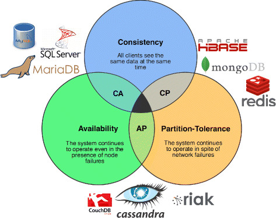

# Begriffe

## SQL, SQL DDL, SQL DML

SQL (Structured Query Language) ist eine Datenbanksprache. Mit dieser Sprache lassen sich Datenstrukturen in relationalen Datenbanken definieren, diese bearbeiten (Einfügen, Verändern und Löschen) und auch wieder abfragen.  
SQL kann dabei in folgende Kategorien unterteilt werden: DDL, DML, DCL und TCL.

### DDL (Data Definition Language)

DDL enthält Befehle zur Definition der Datenbankstruktur (Erzeugen, Ändern, Löschen von Datenbanktabellen, Definition von Primärschlüsseln und Fremdschlüsseln).

Beispiele:

| Befehl | Beschreibung |
| :-- | :-- |
| CREATE | Datenbank erstellen |
| ALTER | Struktur einer bereits existierenden Datenbank verändern |
| DROP | Löscht ein Datenbankobjekt |
| TRUNCATE | Löscht alle Einträge aus einer Tabelle |
| COMMENT | Kommentare hinzufügen |
| RENAME | Objekt umbenennen |

### DML (Data Manipulation Language)

DML enthält Befehle zur Manipulation (Ändern, Einfügen, Löschen von Datensätzen) und dem Lesen von Daten.

Beispiele:

| Befehl | Beschreibung |
| :-- | :-- |
| SELECT | Daten aus einer Datenbank abfragen |
| INSERT | Daten in eine Tabelle schreiben |
| UPDATE | Existierende Daten in einer Datenbank aktualisieren |
| DELETE | Löscht Einträge aus einer Tabelle |

### DCL (Data Control Language)

DCL enthält Befehle für die Verwaltung von Zugriffsrechten.

Beispiele:

| Befehl | Beschreibung |
| :-- | :-- |
| GRANT | Gibt einem Benutzer Zugriffsrechte auf eine Datenbank |
| REVOKE | Entfernt von einem Benutzer die Zugriffsrechte auf eine Datenbank |

### TCL (Transaction Control Language)

TCL enthält Befehle für die Transaktionskontrolle.

Beispiele:

| Befehl | Beschreibung |
| :-- | :-- |
| COMMIT | Schliesst eine Transaktion ab |
| ROLLBACK | Macht eine Transaktion rückgängig, falls ein Fehler passiert |
| SAVEPOINT | Dieser Befehl gibt an, bis wohin ein ROLLBACK zurückrollen soll |

## Transaktion

Eine Transaktion is eine Folge von Programmabschnitten, die eine logische Einheit bildet und einen Datenbestand nach fehlerfreier Ausführung in einem konsistenten Zustand hinterlässt. Der Sinn einer Transaktion ist es, dass sie entweder ganz und fehlerfrei oder gar nicht durchgeführt wird.

## ACID

* Atomicity (Atomarität (Abgeschlossenheit)):  
  Eine Transaktion wird komplett oder gar nicht ausgeführt. Die einzelnen Datenbankbefehle, aus welchen eine Transaktion besteht werden natürlich nacheinander ausgeführt. Allerdings werden sie erst dann als gültig erklärt, sobald alle volständig abgeschlossen wurden. Dadurch ist es bei einer fehlerhaften Transaktion, welche z.B. durch einen Problem eines einzelnen Datenbankbefehl ausgelöst wurde, möglich, diese durch einen "Rollback" rückgängig zu machen.

* Consistency (Konsistenzerhaltung):  
  Das bedeutet, dass eine Transaktion nach Beendigung einen konsistenten Datenbankzustand hinterlässt (z.B. Relationen sind korrekt, bei einem neuen Datensatz stimmen die Primär- und Fremdschlüssel).  

* Isolation (Isolation (Abgrenzung)):  
  Die Isolation verhindert, dass sich verschiedene gleichzeitig ausführende Transaktionen nicht gegenseitig beeinflussen. Ansonsten könnte es passieren, dass durch zwei Transaktionen der gleiche Wert zwei Mal hinzugefügt wird:  

  | Zeitpunkt | Transaktion 1 | Transaktion 2 | Ergebnis |
  | :-- | :-- | :-- | :-- |
  | 1 | Aktion 1 | | Keine Einträge gefunden |
  | 2 | | Aktion 1 | Keine Einträge gefunden |
  | 3 | Aktion 2 | | Eintrag wird hinzugefügt |
  | 4 | | Aktion 2 | Eintrag wird nochmal hinzugefügt |

  Dieses Problem kann durch ein Sperrverfahren verhindert werden, indem die von einem Datenzugriff benötigten Daten für andere Transaktionen gesperrt werden:

  | Zeitpunkt | Transaktion 1 | Transaktion 2 | Ergebnis |
  | :-- | :-- | :-- | :-- |
  | 1 | Aktion 1 | | Keine Einträge gefunden |
  | 2 | | [Aktion 1] | Tabelle gesperrt: Transaktion muss warten.  |
  | 3 | Aktion 2 | | Eintrag wird hinzugefügt. |
  | 4 | | [Aktion 1] | Transaktion wird fortgeführt. Neuer Datensatz wird gefunden. |

* Durability (Dauerhaftigkeit):  
  Die Dauerhaftigkeit beschreibt, dass Daten nach dem erfolgreichen Abschluss einer Transaktion garantiert dauerhaft in der Datenbank gespeichert  werden. Damit diese Daten auch bei einem Systemausfall sicher sind, soll ein Transaktionslog geschrieben werden. Ein Transaktionslog ermöglicht es, nach einem Systemausfall noch alle fehlenden Schreib-Operationen in der Datenbank auszuführen.  

## BASE

BASE steht für ein Designprinzip, welches im Gegensatz zu ACID steht. Dazu gibt es die Konsistenz auf und kann stattdessen die Verfügbarkeit erhöhen. Der Begriff setzt sich aus folgendem zusammen:  

* Basically Available: Die Daten sind grundsätzlich verfügbar.
* Soft state: Die Daten können verloren gehen.
* Eventual consistency: Eventuell sind die Daten konsistent gespeichert.

## CAP-Theorem

Das CAP-Theorem besagt, dass in einem verteilten System maximal zwei der folgenden drei Eigenschaften gewährleistet werden können:

* Consistency (Konsistenz):  
  Ein System ist konsistent, wenn alle Knoten des verteilten Systems zu jedem Zeitpunkt die gleichen Daten sehen.
  
* Availability (Verfügbarkeit):  
  Ein System gilt als verfügbar, wenn es auf alle einkommenden Anfragen antwortet.  

* Partition tolerance (Partitionstoleranz):  
  Partitionstolerant ist ein System nur, wenn es trotz einer Unterbrechung der Kommunikation mit einem Teil der Knoten noch funktionsfähig ist.

## Referenzielle Integrität

1. Datensätze, welche einen Fremdschlüssel enthalten, können nur dann erstellt werden, wenn der referenzierte Datensatz bereits besteht.
2. Datensätze, welche über ihren Primärschlüssel in einem anderen Datensatz referenziert werden, können nur dann gelöscht werden, wenn kein anderer Datensatz eine Referenz auf diesen gesetzt hat.

## DBMS beschreiben

Auftrag:  
Suchen Sie sich ein DBMS aus dem Internet raus (nicht MySQL, nicht MongoDB, nicht neo4j) und beschreiben Sie das DBMS. Versuchen Sie dabei so gut als möglich die Abkürzungen ACID und BASE einzusetzen.

MariaDB ist ein Open-Source relationales Datenbanksystem. Es entstand aus einer Abspaltung von MySQL und hat somit viele Kompatibilitäten, wodurch sich MySQL oft einfach durch MariaDB ersetzen lässt. Zudem basiert MariaDB auf SQL und unterstützt die Datenverarbeitung im ACID-Stil mit garantierter Atomarität, Konsistenz, Isolation und Beständigkeit für Transaktionen.
