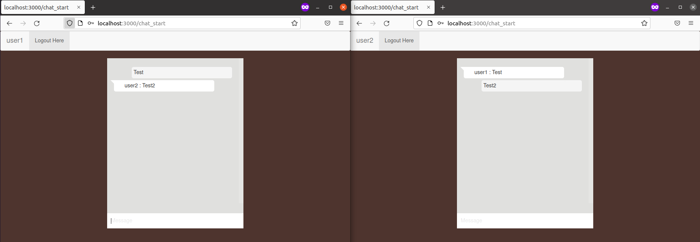

# Chat Applikation - Stored Procedures und Views

## Installation

1. Repository von [GitHub](https://github.com/psachan190/realtime-chat-application-using-nodejs-expressjs-and-web-socket) klonen:
   ```
   git clone https://github.com/psachan190/realtime-chat-application-using-nodejs-expressjs-and-web-socket.git
   ```

2. In das neue Verzeichnis wechseln und installieren:
   ```
   cd realtime-chat-application-using-nodejs-expressjs-and-web-socket
   npm install
   ```

3. Chat-Datenbank, Benutzer und Benutzerberechtigungen in MySQL erstellen:
   ```sql
   CREATE DATABASE chat;
   CREATE USER 'chatapp'@'localhost' identified by 'vagrantM141!';
   ALTER USER 'chatapp'@'localhost' IDENTIFIED WITH mysql_native_password BY 'vagrantM141!';
   GRANT CREATE,ALTER,SELECT,INSERT,UPDATE,DELETE on `chat`.* to 'chatapp'@'localhost';
   ```

4. Benutzerinformationen der Datenbank in ```database/db.js``` eintragen:
   ```
   sudo nano database/db.js
   ```

   Konfiguration:
   ```js
   var con = mysql.createConnection({
      host: "localhost",
      user: "chatapp",
      password: "vagrantM141!",
      database: "chat"
   });
   ```

5. Zwei Logins in der Datenbank erstellen:
   ```sql
   -- Wir installieren zwei Logins
   INSERT INTO login VALUES ('1','user1','user1');
   INSERT INTO login VALUES ('2','user2','user2');
   ```

## Testing

Die Chat-Applikation ist unter [http://localhost:3000](http://localhost:3000) erreichbar.

Für den Test kann man zwei Browserfenster öffnen und sich bei einem mit *user1* und beim anderen mit *User2* anmelden. Bei beiden öffnet sich dann ein Chat-Fenster, worüber sie sich gegenseitig Nachrichten senden können.



## Anwenden

**Aufgaben:**
1. Führen Sie für die Applikation eine Stored-Procedures und eine View ein.
2. Passen Sie die Applikation entsprechend an und testen Sie sie aus

### Stored-Procedure

**Stored-Procedure in Datenbank erstellen:**

```sql
DELIMITER //

CREATE PROCEDURE send_message (IN p_message VARCHAR(2550), IN p_user VARCHAR(250))
READS SQL DATA
BEGIN
      INSERT INTO message (message, user)
      VALUES (p_message, p_user);
END //

DELIMITER ;
```

**Berechtigung auf Stored-Procedure vergeben:**

```sql
GRANT EXECUTE ON PROCEDURE chat.send_message TO 'chatapp'@'localhost';
FLUSH PRIVILEGES;
```

**Stored-Procedure in server.js anpassen:**

Vorher:
```js
//   ============== Send and Save Messages=====================================
        socket.on('send-message', function (data, user) {
			//console.log(user);
            var sql = "INSERT INTO message (message , user) VALUES ('" + data+ "' , '"+user+"')";
            con.query(sql, function (err, result) {
                if (err) throw err;
                //console.log("1 record inserted");
            });
            io.sockets.emit('new-message', {msg: data , username : user});
        })
```

Nachher:
```js
//   ============== Send and Save Messages=====================================
        socket.on('send-message', function (data, user) {
			//console.log(user);
            var sql = "CALL send_message('" + data+ "' , '"+user+"')";
            con.query(sql, function (err, result) {
                if (err) throw err;
                //console.log("1 record inserted");
            });
            io.sockets.emit('new-message', {msg: data , username : user});
        })
```

### View

**View in Datenbank erstellen:**

```sql
CREATE OR REPLACE VIEW all_messages AS SELECT * FROM message;
```

**View in server.js anpassen:**

Vorher:
```js
// ==================initilize data and show================================
        socket.on('initial-messages', function (data) {
            var sql = "SELECT * FROM message ";
            con.query(sql, function (err, result, fields) {
                var jsonMessages = JSON.stringify(result);
                // console.log(jsonMessages);
                io.sockets.emit('initial-message', {msg: jsonMessages});
            });
        });
        socket.on('username', function (data) {
			socket.emit('username', {username: username});
            //io.sockets.emit('username', {username: username});
        });
```

Nachher:
```js
// ==================initilize data and show================================
        socket.on('initial-messages', function (data) {
            var sql = "SELECT * FROM all_messages ";
            con.query(sql, function (err, result, fields) {
                var jsonMessages = JSON.stringify(result);
                // console.log(jsonMessages);
                io.sockets.emit('initial-message', {msg: jsonMessages});
            });
        });
        socket.on('username', function (data) {
			socket.emit('username', {username: username});
            //io.sockets.emit('username', {username: username});
        });
```
