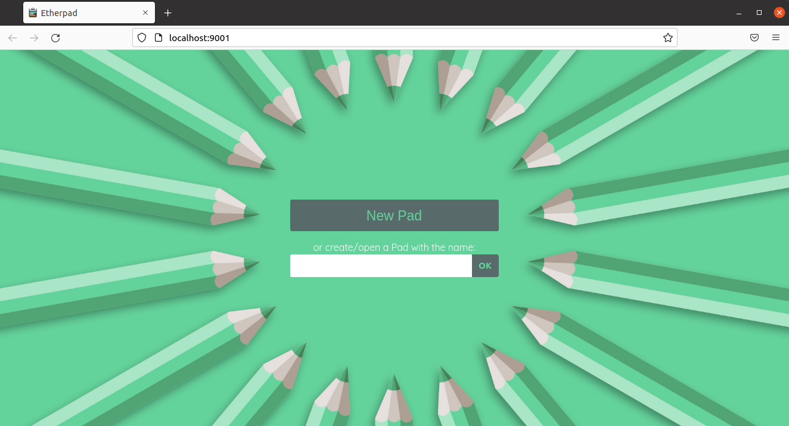
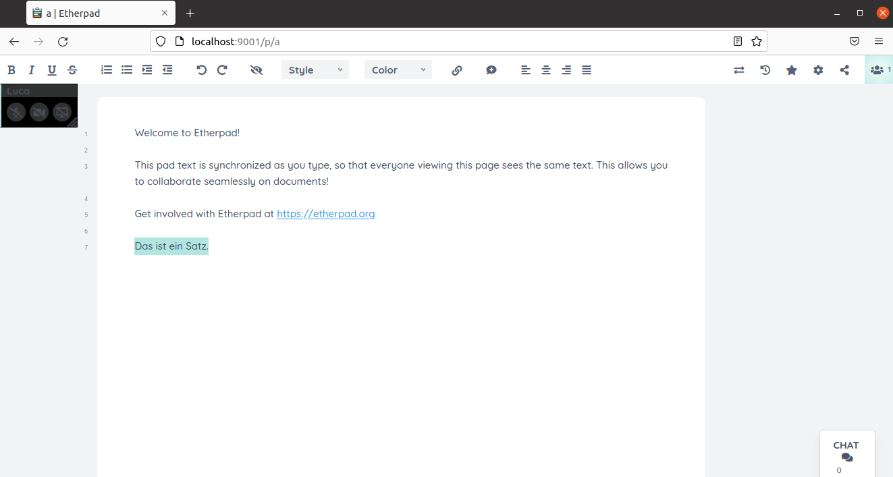
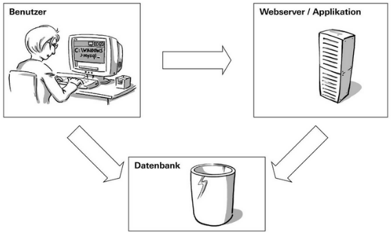
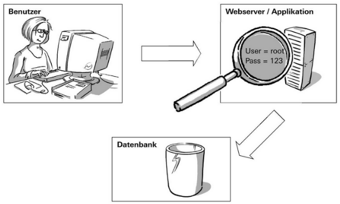
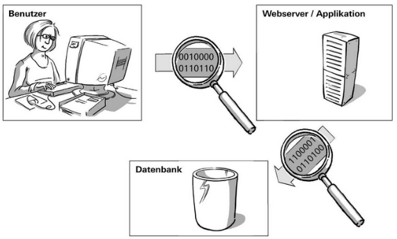
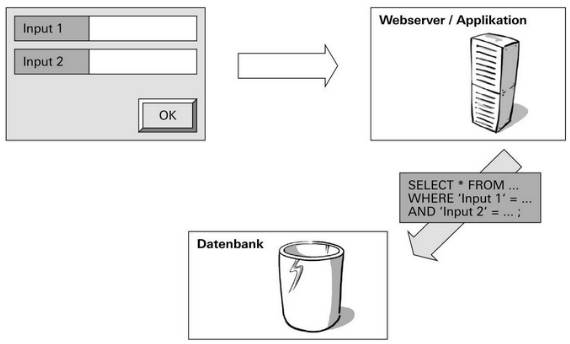

# Etherpad

## Installation

1. Infrastruktur vorbereiten:
```bash
curl -sL https://deb.nodesource.com/setup_14.x | sudo -E bash -
```

2. Pakete installieren:
```
sudo apt install -y nodejs
```

3. Applikation von GitHub klonen:
```bash
git clone --branch master https://github.com/ether/etherpad-lite.git
```

4. In das Etherpad Verzeichnis wechseln:
```bash
cd etherpad-lite
```

5. Sich in MySQL einloggen:
```bash
mysql -u root -p
```

6. Etherpad-Datenbank, Benutzer und Benutzerberechtigungen in MySQL erstellen:
```sql
CREATE DATABASE `etherpad_lite_db`;
CREATE USER 'etherpaduser'@'localhost' identified by 'vagrantM141!';
ALTER USER 'etherpaduser'@'localhost' IDENTIFIED WITH mysql_native_password BY 'vagrantM141!';
GRANT CREATE,ALTER,SELECT,INSERT,UPDATE,DELETE on `etherpad_lite_db`.* to 'etherpaduser'@'localhost';
```

7. Etherpad-Einstellungen von der Vorlage kopieren:
```bash
cp settings.json.template settings.json
```

8. Benutzername und Passwort für die Datenbank in settings.json anpassen:
  
> [!NOTE|style:callout]
> Diese Einstellung ist standardmässig auskommentiert.
  
```json
"dbType" : "mysql",
"dbSettings" : {
    "user"    : "etherpaduser",
    "port"    : "/var/run/mysqld/mysqld.sock",
    "password": "vagrantM141!",
    "database": "etherpad_lite_db",
    "charset" : "utf8mb4"
}
```

9. Etherpad-Plugins installieren:
```bash
npm install --no-save --legacy-peer-deps ep_headings2 ep_markdown ep_comments_page ep_align ep_font_color ep_webrtc ep_embedded_hyperlinks2
```

10. Etherpad starten:
```bash
src/bin/run.sh
```

## Testing 

### Applikation

Die Etherpad-Applikation kann über folgende URL geöffnet werden: [http://localhost:9001](http://localhost:9001)

Wobei als erstes ein neues Pad erstellt oder über einen Namen ein anderes Pad geöffnet werden kann.



So sieht dann eine Etherpad-Seite aus:



### Datenbank

In der Datenbank wurde nun eine Tabelle *store* erstellt.

```sql
USE etherpad_lite_db;
DESCRIBE store;
```

Ausgabe:
```
+-------+--------------+------+-----+---------+-------+
| Field | Type         | Null | Key | Default | Extra |
+-------+--------------+------+-----+---------+-------+
| key   | varchar(100) | NO   | PRI | NULL    |       |
| value | longtext     | NO   |     | NULL    |       |
+-------+--------------+------+-----+---------+-------+
```

Die Daten der erstellten Etherpad-Seite wird in der Tabelle *store* gespeichert:

```
SELECT * FROM store;
```

Ausgabe:

```
+-------------------------------------------------+--------------------------------------------------------------------------------------------------------------------------------------------------------------------------------------------------------------------------------------------------------------------------------------------------------------------------------------------------------------------------------------------------------------------------------------------------------------------------------------------------------------------------------------------------------------------------------------------------------------------------------------------------------------+

| key                                             | value                                                                                                                                                                                                                                                                                                                                                                                                                                                                                                                                                                                                                                                        |

+-------------------------------------------------+--------------------------------------------------------------------------------------------------------------------------------------------------------------------------------------------------------------------------------------------------------------------------------------------------------------------------------------------------------------------------------------------------------------------------------------------------------------------------------------------------------------------------------------------------------------------------------------------------------------------------------------------------------------+

| MYSQL_MIGRATION_LEVEL                           | 1                                                                                                                                                                                                                                                                                                                                                                                                                                                                                                                                                                                                                                                            |

| globalAuthor:a.SVranijXNqDVYEDj                 | {"colorId":"#b1e7e0","name":"Luca","timestamp":1648034630245,"padIDs":{"a":1}}                                                                                                                                                                                                                                                                                                                                                                                                                                                                                                                                                                               |

| pad2readonly:a                                  | "r.f916f46ac5f8eead4cea9d970f2f1fbf"                                                                                                                                                                                                                                                                                                                                                                                                                                                                                                                                                                                                                         |

| pad:a                                           | {"atext":{"text":"Welcome to Etherpad!\n\nThis pad text is synchronized as you type, so that everyone viewing this page sees the same text. This allows you to collaborate seamlessly on documents!\n\nGet involved with Etherpad at https://etherpad.org\n\nDas ist ein Satz.\n","attribs":"|5+6c*0|1+1*0+h|1+1"},"pool":{"numToAttrib":{"0":["author","a.SVranijXNqDVYEDj"]},"nextNum":1},"head":14,"chatHead":-1,"publicStatus":false,"savedRevisions":[]}                                                                                                                                                                                                |

| pad:a:revs:0                                    | {"changeset":"Z:1>6c|5+6c$Welcome to Etherpad!\n\nThis pad text is synchronized as you type, so that everyone viewing this page sees the same text. This allows you to collaborate seamlessly on documents!\n\nGet involved with Etherpad at https://etherpad.org\n","meta":{"author":"","timestamp":1648034598948,"pool":{"numToAttrib":{},"attribToNum":{},"nextNum":0},"atext":{"text":"Welcome to Etherpad!\n\nThis pad text is synchronized as you type, so that everyone viewing this page sees the same text. This allows you to collaborate seamlessly on documents!\n\nGet involved with Etherpad at https://etherpad.org\n\n","attribs":"|6+6d"}}} |

| pad:a:revs:1                                    | {"changeset":"Z:6d>1|5=6c*0|1+1$\n","meta":{"author":"a.SVranijXNqDVYEDj","timestamp":1648034605798}}                                                                                                                                                                                                                                                                                                                                                                                                                                                                                                                                                        |

| pad:a:revs:10                                   | {"changeset":"Z:6j>4|6=6d=5*0+4$st e","meta":{"author":"a.SVranijXNqDVYEDj","timestamp":1648034610338}}                                                                                                                                                                                                                                                                                                                                                                                                                                                                                                                                                      |

| pad:a:revs:11                                   | {"changeset":"Z:6n>3|6=6d=9*0+3$in ","meta":{"author":"a.SVranijXNqDVYEDj","timestamp":1648034610850}}                                                                                                                                                                                                                                                                                                                                                                                                                                                                                                                                                       |

| pad:a:revs:12                                   | {"changeset":"Z:6q>2|6=6d=c*0+2$Sa","meta":{"author":"a.SVranijXNqDVYEDj","timestamp":1648034611351}}                                                                                                                                                                                                                                                                                                                                                                                                                                                                                                                                                        |

| pad:a:revs:13                                   | {"changeset":"Z:6s>2|6=6d=e*0+2$tz","meta":{"author":"a.SVranijXNqDVYEDj","timestamp":1648034611859}}                                                                                                                                                                                                                                                                                                                                                                                                                                                                                                                                                        |

| pad:a:revs:14                                   | {"changeset":"Z:6u>1|6=6d=g*0+1$.","meta":{"author":"a.SVranijXNqDVYEDj","timestamp":1648034612366}}                                                                                                                                                                                                                                                                                                                                                                                                                                                                                                                                                         |

| pad:a:revs:2                                    | {"changeset":"Z:6e>1|6=6d*0+1$I","meta":{"author":"a.SVranijXNqDVYEDj","timestamp":1648034606298}}                                                                                                                                                                                                                                                                                                                                                                                                                                                                                                                                                           |

| pad:a:revs:3                                    | {"changeset":"Z:6f>4|6=6d=1*0+4$ch b","meta":{"author":"a.SVranijXNqDVYEDj","timestamp":1648034606820}}                                                                                                                                                                                                                                                                                                                                                                                                                                                                                                                                                      |

| pad:a:revs:4                                    | {"changeset":"Z:6j>3|6=6d=5*0+3$in ","meta":{"author":"a.SVranijXNqDVYEDj","timestamp":1648034607315}}                                                                                                                                                                                                                                                                                                                                                                                                                                                                                                                                                       |

| pad:a:revs:5                                    | {"changeset":"Z:6m<3|6=6d=5-3$","meta":{"author":"a.SVranijXNqDVYEDj","timestamp":1648034607821}}                                                                                                                                                                                                                                                                                                                                                                                                                                                                                                                                                            |

| pad:a:revs:6                                    | {"changeset":"Z:6j<3|6=6d=2-3$","meta":{"author":"a.SVranijXNqDVYEDj","timestamp":1648034608325}}                                                                                                                                                                                                                                                                                                                                                                                                                                                                                                                                                            |

| pad:a:revs:7                                    | {"changeset":"Z:6g<2|6=6d-2$","meta":{"author":"a.SVranijXNqDVYEDj","timestamp":1648034608844}}                                                                                                                                                                                                                                                                                                                                                                                                                                                                                                                                                              |

| pad:a:revs:8                                    | {"changeset":"Z:6e>1|6=6d*0+1$D","meta":{"author":"a.SVranijXNqDVYEDj","timestamp":1648034609329}}                                                                                                                                                                                                                                                                                                                                                                                                                                                                                                                                                           |

| pad:a:revs:9                                    | {"changeset":"Z:6f>4|6=6d=1*0+4$as i","meta":{"author":"a.SVranijXNqDVYEDj","timestamp":1648034609838}}                                                                                                                                                                                                                                                                                                                                                                                                                                                                                                                                                      |

| readonly2pad:r.f916f46ac5f8eead4cea9d970f2f1fbf | "a"                                                                                                                                                                                                                                                                                                                                                                                                                                                                                                                                                                                                                                                          |

| sessionstorage:EsopW8GrA0KCM8PXJ1bdA3tmJmRRSgvn | {"cookie":{"path":"/","_expires":null,"originalMaxAge":null,"httpOnly":true,"sameSite":"Lax","secure":false}}                                                                                                                                                                                                                                                                                                                                                                                                                                                                                                                                                |

| token2author:t.H4h6nQ7JgvRVM11ICNFd             | "a.SVranijXNqDVYEDj"                                                                                                                                                                                                                                                                                                                                                                                                                                                                                                                                                                                                                                         |

+-------------------------------------------------+--------------------------------------------------------------------------------------------------------------------------------------------------------------------------------------------------------------------------------------------------------------------------------------------------------------------------------------------------------------------------------------------------------------------------------------------------------------------------------------------------------------------------------------------------------------------------------------------------------------------------------------------------------------+
```

## Security-Angriffsvektoren

**Aufgabe:**
Diskutieren Sie die Security-Angriffsvektoren anhand der Applikation Etherpad.  
Beispiel: "Angriffsvektor auf die Datenbank" <- Wie müsste die Applikation für einen Produktiv-Betrieb genutzt werden

1. **Missbrauch von Benutzerkonten**  
   Benutzer könnten versuchen eine direkte Verbindung mit einer Datenbank herzustellen.

    **Gegenmassnahmen:**
    * Zugriffsberechtigungen nur restriktiv auf Datenbanken und Tabellen vergeben.
    * Zugriff auf das DBMS nur über die IP-Adresse des Applikationsservers erlauben.
    * Netzwerksegmentierung / DMZ
  


1. **Applikation ausspähen**  
   Die Datenbank Benutzerinformationen sind oft bei Applikationen irgendwo im Code oder in einer Konfigurations-Datei gespeichert. Diese müssen auch vom Zugriff geschützt werden.

    **Gegenmassnahmen:**
    * File-Berechtigung auf dem Applikationsserver
  


1. **Datenverkehr ausspähen**  
   Es ist möglich den Datenverkehr zwischen Benutzer und Applikationsserver, aber auch zwischen Applikationsserver und Datenbank ausschnüffeln.

    **Gegenmassnahmen:**
    * Verbindung verschlüsseln:
      * HTTPS zwischen Client und Applikationsserver.
      * SSH zwischen Applikationsserver und Datenbank.
  


1. **SQL-Injections**  
   Auch eine Gefahr sind SQL-Injections. Dabei könnten andere SQL-Befehle als Eingaben übermittelt werden, die dann vom SQL-Server ausgeführt werden.

    **Gegenmassnahmen:**
    * Gute Input-Validierung auf Applikationsebene
    * Prepared-Statements nutzen
  

