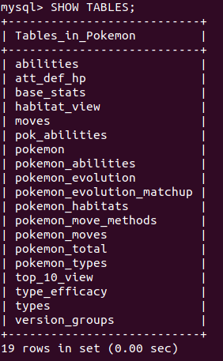

# Import / Export

> [!NOTE|style:callout]
> Sollte beim Import/Export folgender Fehler auftauchen:  
> **mysqldump: Got error: 1290: The MySQL server is running with the --secure-file-priv option so it cannot execute this statement when executing 'SELECT INTO OUTFILE'**  
> bedeutet es, dass kein Zugriff vom MySQL-Server auf ein bestimmtes Verzeichnis besteht.
>
> Es gibt zwei Möglichkeiten, um diesen Fehler zu beheben:  
> 1. Man startet den Server mit ohne die "secure-file-priv"-Option  
> 2. Man speichert einfach immer alle Files im Verzeichnis /var/lib/mysql-files/

## SQL-Datei

### Import

Mit folgenden Befehlen, lassen sich SQL-Skripte in MySQL importieren:

**Lokal:**

```
mysql -u USERNAME -pPASSWORD DBNAME < SQLFILE.sql
```

**Remote:**

```
mysql -u USERNAME -pPASSWORD DBNAME -h HOSTIP < SQLFILE.sql
```

### Export

Mit folgenden Befehlen, lassen sich MySQL Datenbanken und/oder Tabellen in ein SQL-Skript exportieren:

**Lokal:**

```
# Allgemein
mysqldump [options] db_name [tbl_name ...] > dump.sql

# Datenbanken angeben
mysqldump [options] --databases db_name ... > dump.sql

# ...oder einfach alle zusammen
mysqldump [options] --all-databases > dump.sql
```

**Remote:**

```
# Allgemein
mysqldump -h HOSTIP [options] db_name [tbl_name ...] > dump.sql

# Datenbanken angeben
mysqldump -h HOSTIP [options] --databases db_name ... > dump.sql

# ...oder einfach alle zusammen
mysqldump -h HOSTIP [options] --all-databases > dump.sql
```

## CSV-Datei

### Import

Für den Import einer CSV-Datei gibt es zwei Möglichkeiten.

Mit dem SQL-Befehl:

```sql
LOAD DATA INFILE '/tmp/data.csv' 
INTO TABLE country  
FIELDS TERMINATED BY ',' 
ENCLOSED BY '"'
LINES TERMINATED BY '\n'
IGNORE 1 ROWS
```

oder mit dem Import-Befehl:

```
mysqlimport --ignore-lines=1 \ # Header überspringen
            --fields-terminated-by=, \ # Feld-Begrenzungen: Komma oder Semikolons
            --local -u root -p Database \ # Zugriff auf die DB
            TableName.csv # Filename
```

### Export

#### SELECT-Export

Mit dieser Variante lassen sich die Resultate einer SELECT-Abfrage in eine CSV-Datei exportieren:

```sql
-- SELECT-Abfrage wie gewöhnlich
SELECT 
    orderNumber, status, orderDate, requiredDate, comments
FROM
    orders
WHERE
    status = 'Cancelled'

-- Export in eine CSV-Datei
INTO OUTFILE '/tmp/cancelled_orders.csv' -- Arbeiten Sie hier mit dem tmp-Verzeichnis, arbeiten Sie mit absoluten Pfaden
FIELDS ENCLOSED BY '"'  -- Jedes Feld wird mit "" eingefasst
TERMINATED BY ';' -- Feld wird mit einem Semikolon beendet
LINES TERMINATED BY '\n'; -- Zeilenendings nach Linux-Style (\r\n für Windows)
```

#### Mysqldump

Mit folgenden Befehlen, lassen sich MySQL Datenbanken und/oder Tabellen in eine CSV-Datei exportieren:

**Ganze Datenbank:**

```
mysqldump DBNAME --fields-terminated-by ',' \
--fields-enclosed-by '"' --fields-escaped-by '\' \
--no-create-info --tab /var/lib/mysql-files/
```

**Einzelne Tabelle:**

```
mysqldump DBNAME TABLENAME --fields-terminated-by ',' \
--fields-enclosed-by '"' --fields-escaped-by '\' \
--no-create-info --tab /var/lib/mysql-files/
```

## Übungen

### Aufgabe 1 - SQL Import

**Aufgabe:**  
Importieren Sie den SQL-Dump in Ihr DBMS und kontrollieren Sie, ob der Import erfolgreich war.

1. Neue Datenbank erstellen:
```sql
CREATE DATABASE Pokemon;
```

2. SQL-Skript importieren:
```
mysql -u USERNAME -pPASSWORD DBNAME < script.sql
```

3. Datenbank auswählen:
```sql
USE Pokemon;
```

4. Alle Tabellen anzeigen:
```sql
SHOW TABLES;
```

**Ausgabe:**

Diese Tabellen wurden durch das SQL-Skript importiert.



### Aufgabe 2 - CSV Export

**Aufgabe:**  
Exportieren Sie eine CSV-Datei aus allen Pokémon, die einen "fire-punch" als Move durchführen können.

1. Datenbank auswählen:
```sql
USE Pokemon;
```

2. Das ist die SELECT-Abfrage, die alle Pokémon mit dem move "fire-punch" anzeigt:
```sql
SELECT DISTINCT pokemon.pok_name FROM pokemon
INNER JOIN pokemon_moves ON pokemon.pok_id = pokemon_moves.pok_id
INNER JOIN moves ON pokemon_moves.move_id = moves.move_id
WHERE moves.move_name = 'fire-punch';
```

3. Für den Export in eine CSV-Datei kann also folgender Befehl ausgeführt werden:
```sql
SELECT DISTINCT pokemon.pok_name FROM pokemon
INNER JOIN pokemon_moves ON pokemon.pok_id = pokemon_moves.pok_id
INNER JOIN moves ON pokemon_moves.move_id = moves.move_id
WHERE moves.move_name = 'fire-punch'
INTO OUTFILE '/var/lib/mysql-files/pokemon_with_fire-punch.csv'
FIELDS ENCLOSED BY '"'
TERMINATED BY ';'
LINES TERMINATED BY '\n';
```

4. Überprüfen, indem man die CSV-Datei ausgibt:
```
vagrant@m141vm:~$ sudo cat /var/lib/mysql-files/pokemon_with_fire-punch.csv
"charmander"
"charmeleon"
"charizard"
"nidoqueen"
"nidoking"
"clefairy"
"clefable"
"jigglypuff"
"wigglytuff"
"mankey"
"primeape"
"abra"
"kadabra"
"alakazam"
"machop"
"machoke"
"machamp"
"geodude"
"graveler"
"golem"
"grimer"
"muk"
"gastly"
"haunter"
"gengar"
"drowzee"
"hypno"
"cubone"
"marowak"
"hitmonchan"
"lickitung"
"rhydon"
"chansey"
"kangaskhan"
"mr-mime"
"electabuzz"
"magmar"
"snorlax"
"dragonite"
"mewtwo"
"mew"
"typhlosion"
"sentret"
"furret"
"flaaffy"
"ampharos"
"sudowoodo"
"aipom"
"snubbull"
"granbull"
"teddiursa"
"ursaring"
"elekid"
"magby"
"miltank"
"blissey"
"tyranitar"
"combusken"
"blaziken"
"lombre"
"ludicolo"
"ralts"
"kirlia"
"gardevoir"
"slakoth"
"vigoroth"
"slaking"
"whismur"
"loudred"
"exploud"
"makuhita"
"hariyama"
"nosepass"
"sableye"
"aggron"
"meditite"
"medicham"
"gulpin"
"swalot"
"grumpig"
"spinda"
"flygon"
"zangoose"
"kecleon"
"dusclops"
"regirock"
"groudon"
"jirachi"
"deoxys-normal"
"chimchar"
"monferno"
"infernape"
"cranidos"
"rampardos"
"ambipom"
"buneary"
"lopunny"
"munchlax"
"lickilicky"
"rhyperior"
"electivire"
"magmortar"
"gallade"
"probopass"
"dusknoir"
"uxie"
"mesprit"
"azelf"
"regigigas"
"victini"
"pignite"
"emboar"
"watchog"
"pansear"
"simisear"
"audino"
"timburr"
"gurdurr"
"conkeldurr"
"throh"
"sawk"
"darumaka"
"darmanitan-standard"
"scraggy"
"scrafty"
```
