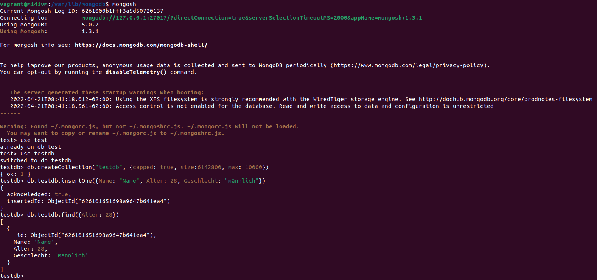

# MongoDB Installation/Konfiguration

## Allgemein

* Vor- und Nachteile von NoSQL-Datenbanken (respektive MongoDB)
* Anwendungen von MongoDB
* Hersteller und Lizenzen zu MongoDB

NoSQL = Not only SQL -> Nicht-relationales DBMS

Speichert Einträge nicht in Zeilen und Spalten, sondern in DOkumente, welche in BSON beschrieben werden. Diese Informaionen können dann als JSON ausgegeben werden.

Vorteile: flexibel, Dokumente können andere DOkumente enthalten, gute Such-Performance durch indexierung

Wann nutzen?
- Unstrukturierte Daten
- komplexe datenstrukturen

Ebay
Sega
Bosch
etc.

Hersteller (eine Firma)

Lizenz:
GNU APGL v3.0 (opensource)
https://www.mongodb.com/community/licensing

https://www.mongodb.com/why-use-mongodb


## Installation

1. Key für den Update-Link installieren. Danach sollte die Meldung "OK" erscheinen.

```bash
wget -qO - https://www.mongodb.org/static/pgp/server-5.0.asc | sudo apt-key add -
```

2. Source erfassen:

```bash
echo "deb [ arch=amd64,arm64 ] https://repo.mongodb.org/apt/ubuntu focal/mongodb-org/5.0 multiverse" | sudo tee /etc/apt/sources.list.d/mongodb-org-5.0.list
```

3. Updates durchführen:

```
sudo apt update
sudo apt upgrade
```

4. MongoDB installieren:

```
sudo apt-get install -y mongodb-org
```

## Konfiguration

Konfigurations-Datei

/etc/mongod.conf


Datenbank erstellen
use testdb

Collection erstellen:
db.createCollection("testdb", {capped: true, size:6142800, max: 10000})

Document erstellen
db.testdb.insertOne({Name: "Name", Alter: 28, Geschlecht: "männlich"})

Document suchen
db.testdb.find({Alter: 28})


